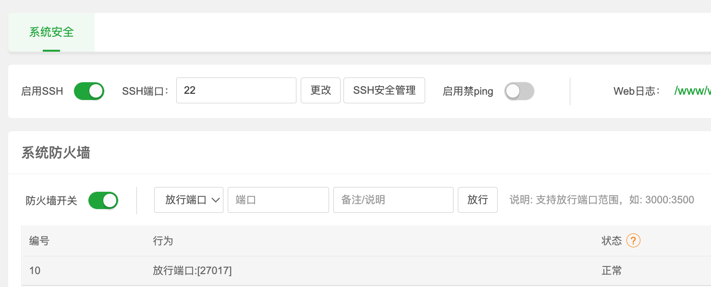
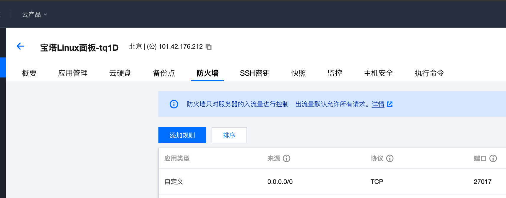

# 1. MongoDB

## 1. 数据库基础

### 1. 关系型数据库

MongoDB中的记录是一个文档，它是由字段和值对组成的数据结构。MongoDB文档类似于JSON对象。字段的值可以包括其他文档，数组和文档数组。

### 2. windows 安装


### 3. Linux 安装

#### 1. 环境准备

> CentOS 7
>
> MongoDB 3.4.9 

下载地址：https://fastdl.mongodb.org/linux/mongodb-linux-x86_64-3.4.9.tgz

将下载的文件放到/opt目录下

#### 2. 解压

解压下载到的tgz文件,并给文件夹重命名为mongodb，然后创建db、logs目录分别用来存放数据和日志

```bash
```

#### 3. 配置

https://mp.weixin.qq.com/s?__biz=MzI1NDY0MTkzNQ==&mid=2247484233&idx=1&sn=bcdc1b207261f0203d6fee80fb60c2dc&chksm=e9c35129deb4d83f1564c24fc6ff12378d98462baa35f9465bdad2c474f83d09e176817c947b&scene=178&cur_album_id=1320464036546379777#rd


## 2. 数据库结构

### 1. 数据库

MongoDB 中多个文档组成集合，多个集合组成数据库。

一个MongoDB 实例可以承载多个数据库。它们之间可以看作相互独立，每个数据库都有独立的权限控制。在磁盘上，不同的数据库存放在不同的文件中。

MongoDB 中存在以下系统数据库。

Admin 数据库：一个权限数据库，如果创建用户的时候将该用户添加到admin 数据库中，那么该用户就自动继承了所有数据库的权限。
Local 数据库：这个数据库永远不会被复制，可以用来存储本地单台服务器的任意集合。
Config 数据库：当MongoDB 使用分片模式时，config 数据库在内部使用，用于保存分片的信息。


### 2.集合

MongoDB将文档存储在集合中。集合类似于关系数据库中的表


### 3. 文档

MongoDB中的记录是一个文档，它是由字段和值对组成的数据结构，多个键及其关联的值有序地放在一起就构成了文档。


文档中的值不仅可以是双引号中的字符串，也可以是其他的数据类型，例如，整型、布尔型等，也可以是另外一个文档，即文档可以嵌套。

但是文档中的键类型只能是字符串。


### 4. 字段

一个Document包含一组field（字段），每一个字段都是一个`key/value pair`。


### 5. 视图


## 3. 数据库操作

### 1. 数据库操作

#### 1. 显示当前数据库

在 `shell` 中，`db`是指您当前的数据库。键入`db`以显示当前数据库。

```bash
$ db
```

该操作应返回的是默认数据库

#### 2. 切换数据库

要切换数据库，请键入 `use <db>`

```bash
$ use examples
```

切换之前您无需创建数据库。当您第一次在数据库中存储数据时（例如在数据库中创建第一个集合）

#### 3. 显示所有数据库 

```bash
$ show dbs
```


### 2. 集合操作

#### 1. 隐示创建集合

如果不存在集合，则在您第一次为该集合存储数据时，MongoDB会创建该集合，这样，您可以切换到不存在的数据库并在 shell 中执行以下操作

```bash
$ use myNewDB
$ db.myNewCollection1.insertOne( { x: 1 } )
```

`insertOne` 操作将同时创建数据库`myNewDB`和集合`myNewCollection1`（如果它们尚不存在）

#### 2. 显示创建集合

[`db.createCollection()`](https://docs.mongodb.com/v4.2/reference/method/db.createCollection/#db.createCollection)


### 3. 增删改查

#### 1. 插入

在MongoDB中，我们插入的每一条记录都是一个json字符串，这个json字符串我们称作**文档**，多个文档可以组成一个集合

我们每次插入一条数据系统都会自动帮我们插入一个`_id`键，这个键的值不可以重复，它可以是任何类型的，我们也可以手动的插入，默认情况下它的数据类型是ObjectId，由于MongoDB在设计之初就是用作分布式数据库，所以使用ObjectId可以避免不同数据库中`_id`的重复

> insert

插入一条或者多条数据,需要带有允许插入多条的参数，这个方法目前官方已经不推荐

```bash
$ db.user.insert({ id:1,name:"jack",age:73 })
```

> insertOne

```bash
$ db.user.insertOne({
             name: 'admin',
             password: '123456'
         })
```

> insertMany

```bash
db.user.insertMany([
    {
        name: 'admin',
        password: '123456',
        data: new Date()
    },
    {
        name: '123',
        password: '234dsfg',
        data: new Date()
    }
])
```

#### 2. 查找

> find

无条件查找:将该集合(Collection)中所有的数据一次性返回

```bash
$ db.user.find()
```

> findOne

条件查找一条数据,默认当前Collection中的第一条数据，只返回一条数据

```bash
$ db.user.findOne()
```

> 正则表达式

```bash
$ db.user.find({name: /admin/})
```

#### 3. 删

>  remove

无条件删除数据,这里要注意了,这是删除所有数据,清空整个集合数据Collection

>deleteOne 

传入要删除的那个字段查询条件，删除一条

> deleteMany

删除多条数据

#### 4.修改

> updateOne	

根据条件修改一条数据的内容,如出现多条,只修改最高前的数据

```bash
$ db.user.updateOne({name: 'admin'}, {$set: {name: '123'}})
```

> updateMany

根据条件修改所有数据的内容,多条修改


## 4. 安全

上面我们所做的所有的操作都没有涉及到用户，我们在用Oracle、MySQL或者MSSQL时都有用户名密码需要登录才可以操作，MongoDB中当然也有，但是需要我们手动添加。

> 需要注意

1. MongoDB中的账号是在某一个库里边进行设置的，我们在哪一个库里边进行设置，就要在哪一个库里边进行验证。

2. 创建用户时，我们需要指定用户名、用户密码和用户角色，用户角色表示了该用户的权限。

3. 启用访问控制时，确认你已经有一个具有`userAdmin`或者`userAdminAnyDatabase`角色的用户在admin数据库中。这个用户能管理用户和角色，例如：创建用户、授予或者撤销用户的角色、创建或者修改角色。

### 1. 启用访问控制

在MongoDB部署时启用访问控制可以加强身份验证，要求用户表明自己的身份。当访问一个在部署时开启了访问控制的MongoDB时，用户只能执行由其角色决定的操作。

#### 1. 启动mongod

没开启访问控制时启动独立的mongod实例

```bash
$ mongod --port 27017 --dbpath /var/lib/mongodb
```

#### 2. 连接 mongo 实例

打开一个新的终端并且使用mongo shell连接到mongod实例

```bash
$ mongo --port
```

#### 3. 创建用户管理员

通过mongo shell 在admin数据库中增加一个有`userAdminAnyDatabase` 角色的用户。包括此用户需要的其他角色。例如，下面在admin数据库中创建用户myUserAdmin，此用户有`userAdminAnyDatabase`和`readWriteAnyDatabase` 角色。

```bash
$ use admin
$ db.creatUser(
    {
        user: "myUserAdmin",
        pwd: passwordPrompt, // 或者输入明文密码
        roles: [ { role: "userAdminAnyDatabase", db: "admin" }, "readWriteAnyDatabase" ]
    }
)
```

尽管用户将向此数据库进行身份认证，但用户可以在其他数据库中具有角色；即用户的身份认证数据库不会限制用户的权限。

#### 4. 重启MongoDB实例

关闭mongod 实例

```bash
$ db.adminCommand({shutdown: 1})
```

退出mongo shell

```bash
$ mongod --auth --port 27017 --dbpath /var/lib/mongodb
```

#### 5. 连接后进行身份认证

```bash
$ mongo --port 27017
```

在这个mongo shell 中，切换到认证数据库，然后使用 `db.auth()`方法进行身份认证

```bash
$ use admin
$ db.auth("myUserAdmin",  "abc123")
```

#### 6. 创建其他用户

一旦身份验证为用户管理员，就能使用`db.createUser()`来创建其他用户。你可以将任务内置角色或用户自定义的角色分配给用户。

下面的操作将用户myTester添加到test数据库，该用户在test数据库具有readWrite角色，在reporting 数据库具有read角色。

```bash
$ use test
$ db.createUser(
  {
    user: "myTester",
    pwd: "xyz123",
    roles: [ { role: "readWrite", db: "test" },
             { role: "read", db: "reporting" } ]
  }
)
```

#### 7. 登陆

开启mongo shell时，使用选项：`-u 、-p 和 --authenticationDatabase` 命令行选项

```bash
$ mongo --port 27017 -u "myUserAdmin" --authenticationDatabase "admin" -p
```


### 2. 用户权限

| 值 | 含义 |
| ---- | ---- |
| read | 允许用户读取指定数据库 |
| readWrite | 允许用户读写指定数据库 |
| dbAdmin | 允许用户在指定数据库中执行管理函数，如索引创建、删除，查看统计或访问system.profile |
| userAdmin | 允许用户向system.users集合写入，可以找指定数据库里创建、删除和管理用户 |
| clusterAdmin | 只在admin数据库中可用，赋予用户所有分片和复制集相关函数的管理权限 |
| readAnyDatabase | 只在admin数据库中可用，赋予用户所有数据库的读权限 |
| readWriteAnyDatabase | 只在admin数据库中可用，赋予用户所有数据库的读写权限 |
| userAdminAnyDatabase | 只在admin数据库中可用，赋予用户所有数据库的userAdmin权限 |
| dbAdminAnyDatabase | 只在admin数据库中可用，赋予用户所有数据库的dbAdmin权限 |
| root | 只在admin数据库中可用。超级账号，超级权限 |


## @ 宝塔使用 mongodb

##3 1. 在宝塔的软件商店中安装mongodb

### 2. 修改mongodb配置

`bindIp` 由127.0.0.1改为`0.0.0.0`，放开ip限制

`authorization` 默认disabled，如需要权限验证改为`enabled`（注意保留冒号后的空格）

### 3. 宝塔放开 27017 端口



### 4. 阿里云服务器，网络与安全-安全组-配置规则，放开 27017 端口



### 5. 配置用户名密码

通过宝塔终端链接mongodb

```bash
$ cd /www/server/mongodb/bin
$ mongo
```

切换到admin数据库，设置管理员账号密码

```bash
$ use admin 
$ db.createUser({user:'root',pwd:'123456',roles:['root']})
```

验证是否添加成功，db.auth(用户名，用户密码)

```bash
$ db.auth('root', '123456')
```

为某个数据库，创建角色

```bash
$ use mydata 
$ db.createUser({user:'username',pwd:'123456',roles:['readWrite']})
```

验证

```bash
$ db.auth('username', '123456')
```


[一篇文章带你解决 MongoDB 连接 localhost 和 127.0.0.1 可以连接，但是改成具体的IP地址就无法连接](https://blog.csdn.net/nanhuaibeian/article/details/108223568)


# 2. MySql

