# CSS

`W3C`官方网站: https://www.w3.org/TR/?tag=css

`MDN` 网站: https://developer.mozilla.org/zh-CN/docs/Web/CSS

> `css` 是为网页添加样式的代码

`CSS`表示层叠样式表, `Cascading Style Sheet`，又称为又称串样式列表、级联样式表、串接样式表、阶层式样式表

## 1. 初识

### 1. css 介绍

`CSS `也不是真正的编程语言，甚至不是标记语言, 它是一门样式表语言, 是一种计算机语言，但是不算是一种编程语言

> 作用

- 实现内容与样式的分离，便于团队开发
- 样式复用，便于网站的后期维护
- 页面的精确控制，让页面更精美

> 美化方式

为`HTML`添加各种各样的样式，比如颜色、字体、大小、下划线等等

对`HTML`进行布局，按照某种结构显示（`CSS`进行布局 – `浮动`、`flex`、`grid`）

### 2. 使用方式

> `外链式CSS`

是将`css`编写一个独立的文件中，并且通过`<link>`元素引入进来

```html
<link href="css文件地址" type="text/css" rel="stylesheet" />
```

> `导入式CSS`

可以在`style`元素或者`CSS`文件中使用`@import`导入其他的`CSS`文件

如果`style`标签中及存在`导入式CSS`, 又存在`嵌入式CSS`, 那么导入时`CSS`的`@import`语法必须在第一行出现, 而且后面需要添加分号`;`

```css
/* 推荐加上 url 函数的方式*/
@import url('CSS文件地址');
```

可以将多个样式合并引入

> `嵌入式CSS`

将`CSS`放在`HTML`文件`<head>`元素里的`<style>`元素之中。

```css
<style>
	h1 {
  		font-size: 24px;
	}
    p {
  		font-size: 12px;
	}
</style>
```

> `内联式css`

`CSS`样式之间用分号`;`隔开，建议每条`CSS`样式后面都加上分号`;`

```html
<div style="color: red; font-szie: 24px;"></div>
```

### 3. 书写规范

> 基础语法

```css
/* 规则 */
css属性名: css属性值;

/* 举例 */
h1 {
  font-size: 24px;
}
```

> `css` 注释

```css
h1 {
  /*font-size: 24px;*/
}
```

### 4. CSS 历史

早期的网页都是通过`HTML`来编写的，但是我们希望`HTML`页面可以更加丰富, 这个时候就增加了很多具备特殊样式的元素：比如`i`、`strong`、`del`等等, 后来也有不同的浏览器实现各自的样式语言，但是没有统一的规划

`1994`年，哈肯·维姆·莱和伯特·波斯合作设计`CSS`，在`1996`年的时候发布了`CSS1`

`1997年初`，`W3C`组织才专门成立了`CSS`的工作组，`1998年5月`发布了`CSS2`

在2006~2009非常流行 `“DIV+CSS`”布局的方式来替代所有的`html`标签

从 `CSS3 `开始，规范的范围显着增加，不同 `CSS 模块`的进展开始出现很大差异，因此每个模块单独开发和发布建议变得更加有效。每一个“`modules`”都有于`CSS2`中额外增加的功能以及向后兼容。

直到`2011年6月7日`，`CSS 3 Color Module`终于发布为`W3C Recommendation`, 第一个 `CSS`模块发布

所以说 `CSS3` 并不是一个完整的版本, 而是多个模块分开进行更新的

## 2. 属性

### 1. 文本属性

| 属性              | 作用                               | 属性                                                         | 补充                                                         |
| ----------------- | ---------------------------------- | ------------------------------------------------------------ | ------------------------------------------------------------ |
| `text-align`      | 设置内容的水平对其方式             | `left  `靠左对齐(默认)	<br>`center `水平居中	<br/>`right  `靠右 | 对块状元素有效                                               |
| `vertical-align`  | 置内容的垂直对其方式               | `top  `顶部对其	<br/>`middle `垂直居中<br/>`bottom `底部  | 对内联元素和表格的单元格元素有效.                            |
| `line-height`     | 设置行高(一行的高度)               |                                                              | 经常讲行高设置为和元素等高,实现单行文本的垂直居中效果.       |
| `text-transform`  | 设置英文的大小写转换方式           | `none  `不做修改(默认值)<br/>	`capitalize  `首字母大写<br/>	`uppercase `全部变为大写字母<br/>	`lowercase `全部变为小写字母 | 实际开发中用`JavaScript`代码转化的更多                       |
| `letter-spacing`  | 设置字母之间的距离                 |                                                              | 汉字作为字符处理,该属性对其生效.                             |
| `word-spacing`    | 设置单词之间的距离                 |                                                              |                                                              |
| `text-indent`     | 设置元素内部第一行和左侧的缩进距离 | 用于设置第一行内容的缩进                                     | `text-indent: 2em;` 刚好是缩进2个文字                        |
| `white-space`     | 设置元素对于空白的处理方式         | `normal `正常处理方式(默认值)<br/>	`pre `显示源代码中的格式,遇到边界不换行<br/>	`nowrap `强制内容不换行(软回车),除非遇到br标签<br/>	`pre-wrap` 显示源代码中的格式,遇到边界换行<br/>	`pre-line`  保持换行字符显示,但是空白字符不显示 |                                                              |
| `text-decoration` | 设置文本修饰属性                   | `none  `没有修饰线<br/>	 `underline  `下划线<br/>	 `overline   `上划线<br/>	 `line-through `贯穿线/删除线 | 取值为 `none`的时候无任何装饰, 可以去除`a`元素默认的下划线, `a`元素有下划线的本质是被添加了`text-decoration`属性 |

> `text-align` 设置行内`inline`元素的对齐方式, 定义行内`inline`元素（例如`文字`, `图片`）如何相对它的块父元素对齐

属性与值:

`left`：左对齐

`right`：右对齐

`center`：正中间显示

`justify`：两端对齐

> `justify` 单独使用时不会生效, 一般使用场景很少, 会使得左右预留的空间消失, 达到两端对齐, 但是对最后一行无效

```html
<style>
  div {
    width: 400px;
    background: black;
    text-align: justify;
    color: white
  }
</style>

<div>
  `text-align` 设置行内`inline`元素的对齐方式, 定义行内`inline`元素（例如`文字`, `图片`）如何相对它的块父元素对齐
</div>
```

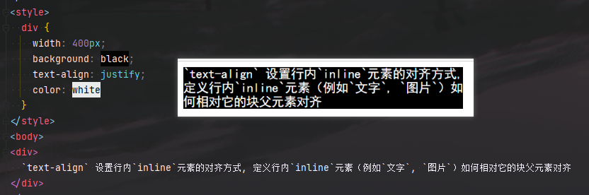

```html
<style>
  div {
    width: 400px;
    background: black;
    text-align: right;
    color: white;
  }
</style>

<div>
  `text-align` 设置行内`inline`元素的对齐方式, 定义行内`inline`元素（例如`文字`, `图片`）如何相对它的块父元素对齐
</div>
```

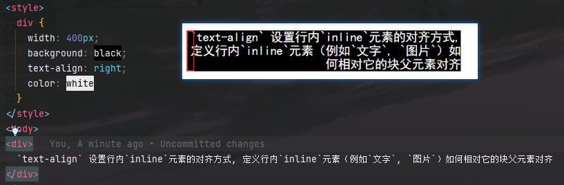

但是可以使用`text-align-last`使得最后的一行样式生效

```css
text-align-last: justify;
```

> `line-height`

行高可以先简单理解为一行文字所占据的高度

行高的严格定义是：两行文字基线（`baseline`）之间的间距

基线（`baseline`）：与小写字母`x`最底部对齐的线, 基线的高度永远等于一行的行高 

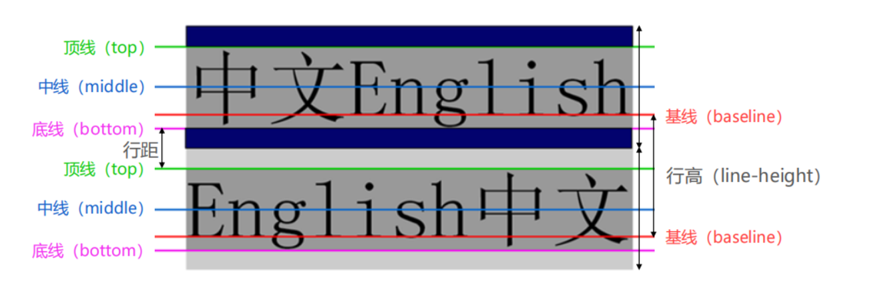

可以用于设置一行文字的内容垂直居中, 让`line-height`等同于`height`

> `font`

`font `属性可以用来作为 `font-style`,` font-variant`,` font-weight`, `font-size`, `line-height `和 `font-family` 属性的简写

`font-style、font-variant、font-weight`可以随意调换顺序，也可以省略

`font-size`、`font-family`不可以调换顺序，不可以省略

`/line-height`可以省略，如果不省略，必须跟在`font-size`后面

### 2. 字体属性

| 属性           | 作用                         |
| -------------- | ---------------------------- |
| `font-size`    | 设置字体的大小               |
| `font-family`  | 设置字体的类型               |
| `font-weight`  | 设置字体是否是粗体           |
| `font-style`   | 设置字体是否是斜体           |
| `font-variant` | 设置字体是否变为小型大写字母 |
| `font`         | 设置字体                     |

> `font-size`决定文字的大小

浏览器默认字体 `16px`

- 具体数值+单位

比如`100px`

也可以使用`em`单位(不推荐)：`1em`代表`100%`，`2em`代表`200%`，`0.5em`代表`50%`

- 百分比

基于父元素的`font-size`计算，比如`50%`表示等于父元素`font-size`的`一半`

> `font-family`用于设置文字的字体名称

可以设置1个或者多个字体名称; 

浏览器会选择列表中第一个该计算机上有安装的字体; 

或者是通过 `@font-face` 指定的可以直接下载的字体。

```css
body {
  font-family: "Adobe 宋体 Std L", serif;
}
```

 `Unicode` 编码以及`多个不连续的英文单词`需要使用 `""` 包裹

> `font-weight`

◼ `100 | 200 | 300 | 400 | 500 | 600 | 700 | 800 | 900` ：每一个数字表示一个重量

◼ `normal`：等于`400 `

◼ `bold`：等于`700`

`strong`、`b`、`h1~h6`等标签的`font-weight`默认就是`bold`

> `font-variant`

◼ `normal`：常规显示

◼ `small-caps`：将小写字母替换为缩小过的大写字母

### 3. 颜色属性

`color`属性设置前景色, 不仅仅是文本的颜色

### 4. 背景属性

#### 1. background-image

> **`background-image`** 属性用于为一个元素设置一个或者多个背景图像。

默认情况下，背景图像放置在元素的左上角，并在垂直和水平方向重复。

在绘制时，图像以 `z 方向`堆叠的方式进行。

先指定的图像会在之后指定的图像上面绘制。因此指定的第一个图像“最接近用户”。( `三维 z轴`观测 )

```css
background-image: url("../../media/examples/star.png"),
                  url("../../media/examples/lizard.png");
```

然后元素的边框`border` 会在它们之上被绘制，而 `background-color`会在它们之下绘制,官方网站推荐设置  `background-image` 的时候加上对 `background-color` 的设置

当然,最有意思的一个地方在于,可以同时设置多张背景图片,并且同时为他们分别设置他们的样式

```css
body {
  background-image: url(https://image.flaticon.com/icons/svg/748/748122.svg), 
      			   url(https://images.unsplash.com/photo-1478719059408-592965723cbc?ixlib=rb-1.2.1&auto=format&fit=crop&w=2212&q=80);
  background-position: center, top;
  background-repeat: repeat, no-repeat;
  background-size: contain, cover;

```

> `background-image`的属性值模式就是用来给它加 “特技” 的。

它的值模式有

1.   `url()模式`

2.   `linear-gradient()模式   `

大多数人最基本的只知道给他传入几个颜色值，他就会依次渲染出这几个颜色渐变,但是在 `<css揭秘> `这本书中可以发现 这个属性`linear-gradient() `其实是有很多细节的

- 第一个参数: 代表的是是方向

- 第二个参数: 代表的是颜色 以及 长度 和 终点

  - ```css
    linear-gradient:(渐变轴的位置（可设置成角度(顺时针)如45deg，或to + [left \ right \ top \bottom] ）， 颜色列表，每个颜色后边可加一个终点位置（可以是百分比或者是沿着渐变轴的长度值）)
    ```


3.   `repeating-linear-gradient()`模式   
4.   `radial-gradient()`模式
5.   `repeating-radial-gradient()`模式
6.   `none特殊值`

-   多值模式多余部分的`background-image`并不会启用。
-   值个数少的多值模式会按照原来的值顺序来循环这个多值以达到需要的多值个数为止。

#### 2. background-repeat

使背景图像在水平和度垂直方向上重复。

1.   `repeat`：默认值代表水平和垂直都平铺                            

2.   `no-repeat` 代表不平铺                           

3.   `repeat-x` 水平平铺                            

4.   `repeat-y `垂直平铺

#### 3. background-position

默认在0 0 或者说是在 left top,此时背景图片将被定位于对象不包括补丁( padding )的内容区域的左上角。

第一个值：水平位置 给具体的px值代表距离左边多少                            

第二个值：垂直位置 给具体的px值代表距离上边多少                            

还可以给百分比,代表图片的百分比要重叠在盒子的百分比那个位置上                                                            

水平方向：`left center right  `                              

垂直方向：`top center bottom`

该属性定位不受对象的补丁属性( `padding `)设置影响。

#### 4. background-attachment

在我看来，背景图片的附着点有三类，分别是浏览器的可视区域、背景容器本身区域和背景容器的内容区域。具体来说，`background-attachment`的值也就有三种，即：

`scroll`：背景图片附着在背景容器上，它是相对于背景容器（元素）固定，它会随着背景容器的滚动，而不是随着它的内容滚动（也可以看成是对元素边框固定）。

`fixed`： 背景图片附着在浏览器的可视区域。因为浏览器的可视区域不具备滚动的性格，所以它是不滚动的。

`local`：这是`CSS3`新增的属性值。背景图片附着在背景容器的内容区域。它会随着内容的滚动而滚动。

有时我们想在背景上添加一些文字，但有的图片太亮，导致字看不清楚，所以这里我们就需要让背景图叠加一些暗色来突出文字效果。

```css
body {
  background-image: 
    linear-gradient(4deg, rgba(38,8,31,0.75) 30%, rgba(213,49,127,0.3) 45%, rgba(232,120,12,0.3) 100%),
    url("https://images.unsplash.com/photo-1503803548695-c2a7b4a5b875?ixlib=rb-1.2.1&auto=format&fit=crop&w=2250&q=80");
  background-size: cover;
  background-repeat: no-repeat;
  background-attachment: fixed;
  background-position: center
}
```

使用`background-image`与 `background-clip` `color` ，可以实现背景图像对文字的优美效果。

```css
h1 {
  background-image: url("");
  background-clip: text;
  -webkit-background-clip: text;
  color: transparent;
}
```

#### 5. background-size

**`length`**，该属性值是设置背景图像的宽度和高度的，第一个值是宽度，第二个值是设置高度的。如果只设置第一个值，那么第二个值会自动转换为 “`auto`”;

**`percentage `**该属性是以父元素的百分比来设置图片的宽度和高度的，第一个值是宽度，第二个值是高度。如果只设置一个值，那么第二个值会被设置为 “`auto`”;

**`cover`：** 有一部分没显示，覆盖的意思，代表图片一定要覆盖盒子,缩放后图片一定会大于等于盒子                                                

只要有一边缩放到了盒子内就停止缩放                                       

**`contain`：**没变形，完全显示了，包含的意思，代表图片一定要被盒子包含，缩放后图片一定小于等于盒子                                                

要两边都缩放到盒子内才停止缩放

> 补充

`img`属于`html`的标签，而`background-image`属于`css样式`，所以浏览器在解析时，会优先加载`img`标签，之后才会加载`background-image`，对于比较重要的图像，如`logo`，可使用`img`标签进行导入，这样会优先显示出来。

如果一个指定的图像无法被绘制 (比如，被指定的 `URI `所表示的文件无法被加载)，浏览器会将此情况等同于其值被设为 `none`。

#### 6. 使用场景

##### 1. 背景适配

```css
body {
  background-image: url('');
  background-repeat: no-repeat;
  background-position: center;
  background-attachment: fixed;
  background-size: cover;
  -webkit-background-size: cover;
  -moz-background-size: cover;
  -o-background-size: cover;
}
```

案例演示

```css
body {
  margin: 0;
  padding: 0;
  background-image: url('./assets/img/1.jpg');
  background-repeat: no-repeat;
  background-position: center;
  background-attachment: fixed;
  background-size: cover;
  -webkit-background-size: cover;
  -moz-background-size: cover;
  -o-background-size: cover;
}
```

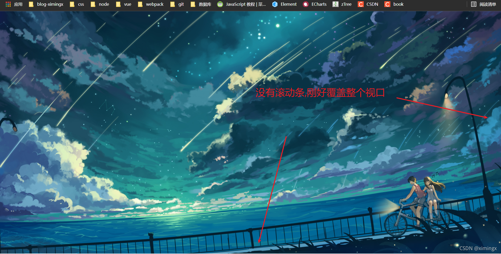

##### 2. 背景叠加

```css
body {
  background-image: url('./assets/img/7.png'),
      url('./assets/img/2.jpg');
}
```

案例演示

```css
body {
  width: 100vw;
  height: 100vh;
  margin: 0;
  padding: 0;
  background-image: url('./assets/img/7.png'),url('./assets/img/2.jpg');
  background-repeat: repeat,no-repeat;
  background-position: 0 0,center center;
  background-size: 4px 4px,cover;
}
```

![[外链图片转存失败,源站可能有防盗链机制,建议将图片保存下来直接上传(img-DvrOcHPU-1636795283603)(D:/start/image-20211113151011712.png)]](assets/image/3-CSS/202205240914474-2015531.png)

##### 3. 背景分割

```css
clip-path: polygon(0 30vh,100vw 30vh,100vw 70vh,0 70vh);
```

案例演示: 

```vue
<template>
  <div id="app">
    <div id="left">

    </div>
    <div id="center">

    </div>
    <div id="right">

    </div>
  </div>
</template>
```

```css
body {
  width: 100vw;
  height: 100vh;
  margin: 0;
  padding: 0;
  position:relative;
}
#left {
  width: 100vw;
  height: 100vh;
  margin: 0;
  padding: 0;
  position: absolute;
  background-image: url('./assets/img/5.jpg');
  background-size: cover;
  background-repeat: no-repeat;
  clip-path: polygon(0 0,100vw 0,100vw 30vh,0 30vh);
}
#center {
  width: 100vw;
  height: 100vh;
  margin: 0;
  padding: 0;
  position: absolute;
  background-image: url('./assets/img/3.jpg');
  background-size: cover;
  background-repeat: no-repeat;
  clip-path: polygon(0 30vh,100vw 30vh,100vw 70vh,0 70vh);
}
#right {
  width: 100vw;
  height: 100vh;
  margin: 0;
  padding: 0;
  position: absolute;
  background-image: url('./assets/img/1.jpg');
  background-size: cover;
  background-repeat: no-repeat;
  clip-path: polygon(0 70vh,100vw 70vh,100vw 100vh,0 100vh);
}
```

![[外链图片转存失败,源站可能有防盗链机制,建议将图片保存下来直接上传(img-mnnGPLTy-1636795283604)(D:/start/image-20211113152312104.png)]](assets/image/3-CSS/202205240915668-2015525.png)

##### 4.渐变色

```css
background-image: linear-gradient(45deg, rgba(251, 194, 235, 0.64) 0%, rgba(49, 106, 199, 0.12) 100%),
url('./assets/img/1.jpg');
```

案例演示

```css
body {
  background-image: linear-gradient(45deg, rgba(251, 194, 235, 0.64) 0%, rgba(49, 106, 199, 0.12) 100%),
  url('./assets/img/1.jpg');
  background-repeat: no-repeat;
  background-position: center;
  background-attachment: fixed;
  background-size: cover;
  -webkit-background-size: cover;
  -moz-background-size: cover;
  -o-background-size: cover;
}
```

![[外链图片转存失败,源站可能有防盗链机制,建议将图片保存下来直接上传(img-8w95miyC-1636795283606)(D:/start/image-20211113153138009.png)]](assets/image/3-CSS/202205240915784-2015521.png)

##### 5. 文字添加背景

```css
background-image: url("./assets/img/4.jpg");
color: transparent;
-webkit-background-clip: text;
```

案例演示

```css
body {
  display: flex;
  justify-content: center;
  align-items: center;
}
h1 {
  font-size: 100px;
  background-image: url("./assets/img/4.jpg");
  color: transparent;
  /* background-clip: text; */
  -webkit-background-clip: text;
}
```

![[图片)]](assets/image/3-CSS/202205240915893-2015517.png)


### 5. 书写模式

| 属性           | 值                                                           |
| -------------- | ------------------------------------------------------------ |
| `direction`    | `ltr  `文本流从左到右(默认值)<br/>`rtl  `文本流从右到左      |
| `unicode-bidi` | `normal `正常值(默认值)<br/>`bidi-override` 设置文本读进方向和`direction`的方向一致 |

### 6. 列表样式

| 属性                  | 值:                                                          |
| --------------------- | ------------------------------------------------------------ |
| `list-style-type`     | `none  `取消列表标识<br/>`decimal  `使用阿拉伯数字标识<br/>`disc  `使用实心圆标识 |
| `list-style-image`    | `list-style-image: url(图片地址)`;                           |
| `list-style-position` | `outside  `标识在内容外侧(默认值)<br/> `inside   `标识在内容里面 |
| `list-style`          | 所有列表样式值都可以使用,而且没有顺序限制.                   |

### 7. 表格属性

| 属性              | 值                                                           |
| ----------------- | ------------------------------------------------------------ |
| `table-layout`    | `auto  `根据内容多少来分配表格的宽度<br/>`fixed `根据实际情况来分配宽度(不根据内容,而是根据设定) |
| `border-collapse` | `separate   `单元格独立 ->每个单元格有自己独立的边框<br/>`collapse  `单元格合并->所有边框单元格共享. |
| `border-spacing`  | 格式1:  `border-spacing`: 值<br/>		单元格之间横向和纵向的间距都是制定的值<br/>格式2:  ` border-spacing`: 值1 值2;<br/>		单元格之间的横向间距是值1,纵向间距是指2 |
| `caption-side`    | `top   `描述在表格的顶部<br/>`bottom `描述在表格的底部       |
| `empty-cells`     | `hide `隐藏空单元格  <br/>`show `显示空单元格                |

### 8. 定位属性

| 属性       | 值                                                           |
| ---------- | ------------------------------------------------------------ |
| `static`   | 元素默认的定位方式就是静态定位                               |
| `absolute` | 绝对定位元素会使得当前元素脱离文档流,可以在任何范围内移动, 距离当前绝度定位元素外层最近的一个非静态定位元素作为参考点. |
| `relative` | 相对应为元素, 没有脱离文档流, 还在页面当中,可以移动, 相对定位的参考点是当前元素原来的位置(`static`时的位置) |
| `fixed`    | 固定位置                                                     |

| 属性      | 值                                                           |
| --------- | ------------------------------------------------------------ |
| `left`    | 设置定位元素距离定位参考点左侧的距离.                        |
| `top`     |                                                              |
| `right`   |                                                              |
| `bottom`  |                                                              |
| `z-index` | 设置定位元素的层级关系,所有元素的默认`z-index的值时0`; 在相同定位的情况下,谁的`z-index`值越大,显示越考上! |

### 9. 布局属性

`display `属性  设置元素的显示方式

	值: none 不显示元素也不占用物理空间
		inline 显示为行内元素
		block  显示为块状元素
		
		inline-block  显示为行内块状元素
			行内块状元素特征:既可以设置宽高,也可以在一行共存.
	
		list-item  显示为li列表标签的样式
		table  显示为table标签的样式,作为块元素显示
		inline-table 显示table标签的样式,但是作为内联元素显示
		table-row 显示为tr标签的样式
		table-cell 显示为td标签的样式
	
	注意:display仅改变元素的显示效果,对用于的视觉改变,不会改变标签的意义,也不可以使用显示效果对应标签都而元素.

`visibility `属性  设置元素显示与否

	值:
		inherit  继承(默认值)  显示与否由父元素的显示决定
		visible  显示
		hidden  隐藏元素  占用物理空间,需要注意和display:none的区别
		collapse  专门用于表格行和单元格的隐藏设置属性.  IE6以下不支持

`overflow-y`属性 设置元素垂直方向溢出的处理方式

	值:auto 如果内容超过元素,则出现滚动条,不超出则不出现滚动条
	
	   scroll  一直存在滚动条,但是有没有滑块取决于内容的高度
	
	   hidden  对于超出高度的内容进行隐藏处理
	
		visible  对于超出的内容做显示处理(默认值)

`overflow-x`属性  设置元素水平方向溢出的处理方式

	值:auto 如果内容超过元素,则出现滚动条,不超出则不出现滚动条
	
	   scroll  一直存在滚动条,但是有没有滑块取决于内容的宽度
	
	   hidden  对于超出宽度的内容进行隐藏处理
	
		visible  对于超出的内容做显示处理(默认值)
	
	注意:正常情况下内容超过元素水平宽度会自动换行到下一行.
	
		不会换行的情况:
	
		1.如果内层包含的不是文字,而是其他图片,元素等内容,而且这些内容宽度超过外层元素
		2.连续的英文字符,没有空格和标点符号,会被浏览器当做一个完整的单词显示,不会强制换行
		3.设置内容显示效果为white-space:nowrap,强制不换行属性

`overflow`属性  设置元素内容溢出(同时设置水平和垂直方向)的处理方式
	

	值:auto 如果内容超过元素,则出现滚动条,不超出则不出现滚动条
	
	   scroll  一直存在滚动条,但是有没有滑块取决于内容的宽度/高度
	
	   hidden  对于超出宽度/高度的内容进行隐藏处理
	
		visible  对于超出的内容做显示处理(默认值)

`float`属性 设置元素的浮动方式

	值:  none  元素不浮动(默认值)
		left  左浮动
		right 右浮动
	
	注意:浮动属性和定位属性是不同的属性.
	
	浮动元素的特征是从元素原有的位置漂浮起来,可以进行左右漂浮,但是不能设置移动位置
	浮动元素不会脱离文档流,位置处于静态定位元素和决定定位之间.

`clear`属性  清除浮动属性

	值: none 不清除浮动(默认值)
		left 清除左浮动
		right 清除右浮动
		both 清除左右浮动(常用)


注意:浮动和清除浮动属性是在页面布局中最常用的属性.

	常用的浮动位置:水平导航,页面布局,文字环绕.

## 3. 选择器

开发中经常需要找到特定的网页元素进行设置样式, 我们可以通过` css选择器` 按照一定的规则选出符合条件的元素，为之添加`CSS样式`

> 选择器效率比较低，大概可以这么归类

- 通用选择器（`universal selector`） 
- 元素选择器（`type selectors`） 
- 类选择器（`class selectors`） 
- `id`选择器（`id selectors`） 
- 属性选择器（`attribute selectors`） 
- 组合（`combinators`） 
- 伪类（`pseudo-classes`） 
- 伪元素（`pseudo-elements`）

### 1. 通用选择器

所有的元素都会被选中,  使用时一般用于浏览器之间的样式重置操作或者配合关系选择器进行限定选取

```css
  * {
    margin: 0;
    padding: 0;
    list-style: none;
  }
```

一般用来给所有元素作一些通用性的设置, 会对所有的元素设置属性, 效率比较低，尽量不要使用

> `css reaset`

`normalize.css`

### 2. 元素选择器

直接使用`HTML标签`的名称作为选择器,就可以直接选中页面中同名的`HTML标签`, 统一添加样式.

```html
<div>选中</div>
<p>不选中</p>
<div>选中</div>
<style>
  /* 选中页面中所有的div元素 */
  div{
    color:red;
  }

</style>
```

### 3. 类选择器

通过为制定的标签添加`class`属性,并且定义一个属性值,在选取时使用`.自定义class值`就可以选中所有具有当前`class值`的标签.

```html
	<div class="red">选中</div>	
	<div class="green">不选中</div>	
	<span class="red">选中</span>	
	<style>
		/*选中页面中所有的具有class值为red的元素*/
		.red{
			color:red;
		}

	</style>
```

### 4. id选择器

通过为指定 的标签添加`id属性`并且定义一个`id值`. 一个`HTML`文档里面的`id值`是唯一的，不能重复

`id值`如果由多个单词组成，单词之间可以用中划线`-`、下划线`_`连接，也可以使用`驼峰标识`

最好不要用标签名作为`id值 `

```html
	<div class="red">不选中</div>	
	<div id="select">选中</div>	
	<span class="red">不选中</span>	
	<style>
		/*选中页面中所有的具有id值为select的元素*/
		#select{
			color:red;
		}

	</style>
```

### 5. 属性选择器

属性选择器的标志性符号是 `[]`。

- 拥有某一个`att`属性 `[att]`
- `att`属性等于`value`值 `[att="val"] `

- `E[title]` 选中页面的`E元素`，并且E存在 `title `属性即可。
- `E[title="abc"]`选中页面的`E元素`，并且`E`需要带有`title`属性，且属性值完全等于`abc`。
- `E[attr~=val]`  选择具有 `att `属性且属性值为：用空格分隔的字词列表，其中一个等于 `val `的`E元素`。
- `E[attr|=val]` 表示要么是一个单独的属性值，要么这个属性值是以“`-`”分隔的。
- `E[title^="abc"]` 选中页面的`E`元素，并且`E`需要带有 `title 属性`,属性值以 `abc `开头。
- `E[title$="abc"]` 选中页面的`E`元素，并且`E`需要带有` title 属性`,属性值以 `abc `结尾。
- `E[title*="abc"]` 选中页面的`E`元素，并且`E`需要带有` title 属性`,属性值任意位置包含`abc`。

```css
  [title] {
    color: red;
  }

 /* 中间不能有空格 */ 
  p[title] {
    color: red;
  }

  p[title*="h1-title"] {
    color: red;
  }
```

### 5. 后代选择器

后代选择器是利用标签之间的嵌套关系进行元素的选取,可以很好的限制选取元素的范围.

选择器之间以空格分割

> 所有的后代(直接/间接的后代)  选择器之间以空格分割

```html
<div class="red">
  <span class="red">选中</span>
  <span id="select">选中</span>
</div>
<div class="green">选中</div>

<style>
  /*选中页面中所有的具有class值为red的元素*/
  div.red #select{
    color:red;
  }
</style>
```

> 直接子代选择器(必须是直接自带)

选择器之间以` >` 分割

```css
div > span {
  color: red;
}
```

### 6. 兄弟选择器

> 相邻兄弟选择器 `+`

若果第一个不是选择的元素, 不生效

> 普遍兄弟选择器 `~ `

对所有之后的兄弟选择

### 7. 交集选择器

交集选择器: 需要同时符合两个选择器条件, 在开发中通常为了精准的选择某一个元素

```css
div.box {
    
}
```

### 8. 并集选择器

如果多个选择器使用相同的`CSS`样式,那么我们可以进行`CSS`精简操作,使得`CSS属性`只书写一遍即可.将多个`css`使用逗号分隔即可

```html
	<div class="red">选中</div>	
	<div class="green">选中</div>	
	<span class="red">选中</span>	
	<span id="select">选中</span>	
	<style>
		/*选中页面中所有的.red、.green、#select元素*/
		.red,.green,#select{
			color:red;
		}

	</style>
```

### 9. 伪类选择器

伪类是选择器的一种，它用于选择处于特定状态的元素

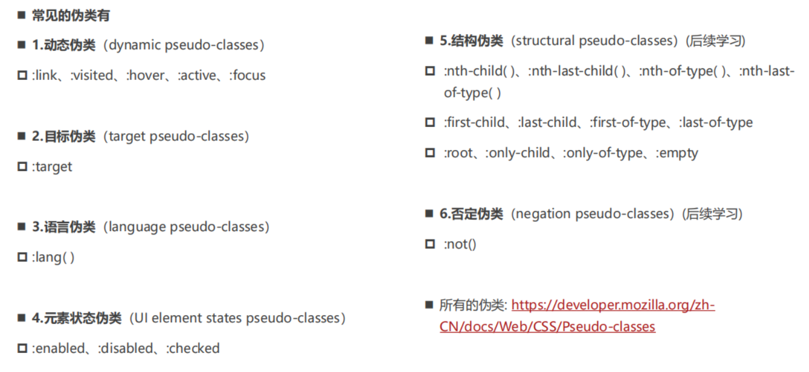

#### 1. 动态伪类

根据不同的状态显示不同的样式，一般多用于`<a></a>`标签

> 一般有四种状态：

`a:link ` 设置正常连接的颜色

`a:hover` 设置鼠标经过时的样式

`a:active` 设置鼠标点击时的样式

`a:visited `设置连接访问过后的状态.

> 使用注意

`:hover`必须放在`:link`和`:visited`后面才能完全生效

`:active`必须放在`:hover`后面才能完全生效

所以建议的编写顺序是 `:link`、`:visited`、`:hover`、`:active`

除了`a`元素，`:hover`、`:active`也能用在其他元素上

> ` :focus`指当前拥有输入焦点的元素

因为链接`a`元素可以被键盘的`Tab`键选中聚焦，所以`:focus`也适用于`a`元素

> 直接给`a`元素设置样式，相当于给`a`元素的所有动态伪类都设置了

相当于`a:link`、`a:visited`、`a:hover`、`a:active`、`a:focus`的`color`都是`red`

#### 2. 目标伪类

`:target` 与 `id` 有关

#### 3. 伪元素选择器

- `:first-letter` 为第一个字符的样式
- `:first-line` 为第一行添加样式
- `:before` 在元素内容的最前面添加的内容，需要配合`content`属性使用
- `:after` 在元素内容的最后面添加的内容，需要配合`content`属性使用

> 注意

为了区分伪元素和伪类，建议伪元素使用`2个冒`号，比如`::first-line`

> 扩大可点击区域

```css
.click {
	position: relative;
	/* [其余样式] */
}

.click ::before {
	content: '';
	position: absolute;
	top: -10px;
	right: -10px;
	bottom: -10px;
	left: -10px;
}
```

#### 4. 结构伪类选择器

伪类选择器的标志性符号是 `:`。

`CSS`中有一些伪类选择器，比如`:link`、`:active`、`:visited`、`:hover`，这些是动态伪类选择器。

`CSS3`又新增了其它的伪类选择器。即 `CSS3`中的**`结构伪类选择器`**

> `child`  按照第几个字元素


- `E:first-child` 匹配父元素的第一个子元素E。

- `E:last-child` 匹配父元素的最后一个子元素E。

- `E:nth-child(n)` 匹配父元素的第n个子元素E。注意，盒子的编号是从`1`开始算起，不是从`0`开始算起。

- `E:nth-child(odd)` 匹配奇数

- `E:nth-child(even)` 匹配偶数

- `E:nth-last-child(n)` 匹配父元素的倒数第n个子元素E。

> `type`  按照子元素类型


- `E:first-of-type` 匹配同类型中的第一个同级兄弟元素E。

- `E:last-of-type` 匹配同类型中的最后一个同级兄弟元素E。

- `E:nth-of-type(n)` 匹配同类型中的第n个同级兄弟元素E。

- `E:nth-last-of-type(n)` 匹配同类型中的倒数第n个同级兄弟元素E。

既然上面这几个选择器带有`type`，我们可以这样理解：先在同级里找到所有的E类型，然后根据 n 进行匹配。

`:nth-of-type()`用法跟`:nth-child()`类似, 不同点是`:nth-of-type()`计数时只计算同种类型的元素

> n 的使用

- 如果选择器写成`li:nth-child(2)`，则表示第2个 `li`。

- 如果选择器写成`li:nth-child(n)`，则表示所有的`li`。因为此时的 `n` 表示 0,1,2,3,4,5,6,7,8.....（当n小于1时无效，因为n = 0 也是不会选中的）

- 如果选择器写成`li:nth-child(2n)`，则表示所有的第偶数个 `li`。

- 如果选择器写成`li:nth-child(2n+1)`，则表示所有的第奇数个 `li`。

- 如果选择器写成`li:nth-child(-n+5)`，则表示前5个 `li`。

- 如果选择器写成`li:nth-last-child(-n+5)`，则表示最后5个 `li`。

- 如果选择器写成`li:nth-child(7n)`，则表示选中7的倍数。。

上面列举的选择器中，我们只要记住： `n` 表示 0,1,2,3,4,5,6,7,8..... （自然数）就很容易明白了。

> 下面的伪类偶尔会使用

`:root`根元素，就是HTML元素 

`:empty`代表里面完全空白的元素

#### 5. 否定伪类

> `:not()`的格式是`:not(x)`

`x`是一个简单选择器, 元素选择器、通用选择器、属性选择器、类选择器、id选择器、伪类（除否定伪类）

表示除x以外的元素

### 10. 优先级

#### 1. 优先级的六大分类

下面的优先级依次降低

> **`! important`** 

只需要在属性后面使用`! important`。它会覆盖页面内任何位置定义的元素样式。

不管别的权重是多少, 反正听他的

> 在`html`中给元素标签加`style`，即内联样式。该方法会造成`css`难以管理，所以不推荐使用。

```html
<h1 style="display: 'none';">隐藏</h1>
```

权重为` 1,0,0,0`

> 由一个或多个`id选择器`来定义

权重为 `0,1,0,0`

> 由一个或多个类选择器、属性选择器、伪类选择器定义。

权重为 `0,0,1,0`

> 由一个或多个标签选择器定义。

权重为 `0,0,0,1`

> 通配选择器

优先级最低, 但是会为所有的标签添加属性, 会造成性能的问题

权重为 `0,0,0,0`

> 总结

`! important` > `行内样式` >` id选择器` > `类选择器` > `标签选择器` `伪类选择器` > `通配选择器`

## 4. 属性的特性

### 1. 继承

如果一个属性具备继承性, 那么在该元素上设置后, 它的后代元素都可以继承这个属性

当然, 如果后代元素自己有设置该属性, 那么优先使用后代元素自己的属性(不管继承过来的属性权重多高)

常见的`font-size/font-family/font-weight/line-height/color/text-align`都具有继承性

> 强制继承 `inherit`

```html
<style>
  div {
    color: red;
    border: 1px solid gray;
  }
    
  div > p {
    /*强制继承*/
    border: inherit; 
  }
</style>

<div>
  <p>123</p>
</div>
```

> 最近的祖先样式比其他祖先样式优先级高。

```html
<div style="color: red">
    <div style="color: blue">
        <div class="son"></div>
        <!-- 颜色为 `blue` -->
    </div>
</div>
```

### 2. 层叠

对于一个元素来说, 相同一个属性我们可以通过不同的选择器给它进行多次设置, 属性会被一层层覆盖上去, 但是最终只有一个会生效

> 判断依据

- 选择器的权重, 权重大的生效, 根据权重可以判断出优先级

- 先后顺序, 权重相同时, 后面设置的生效

> 权重计算

按照经验，为了方便比较CSS属性的优先级，可以给CSS属性所处的环境定义一个权值

◼ `!important`：10000

◼ 内联样式：1000

◼ ` id`选择器：100

◼ 类选择器、属性选择器、伪类：10

◼ 元素选择器、伪元素：1 

◼ 通配符：0

> 权重值越大，优先级越高

权值从左到右依次比较, 如果相等, 则比较下一位, 如果最后一位也相等, 谁离得近, 则使用谁的样式

`1,0,22,12` 权值大于 `0,22,23,13`

```html
<head>        
		.red p{
            color: red ;    // 红色
        }
        .blue p{
            color: blue ;    // 蓝色
        }
</head>
<body>
<div class="red">
    <div class="blue">
        <p>我是什么颜色？</p>
    </div>
</div>

<div class="blue">
    <div class="red">
        <p>我是什么颜色？</p>
    </div>
</div>
</body>
```

最后面的颜色都是蓝色, 因为权值相等, `.blue p` 离代码近

但是需要注意的是, 权值的四个位不会互相影响

用一个夸张的例子解释

```html
    <style>
        #id p {
            color: red;
        }

        .class1 .class1 .class1 .class1 .class1 .class1 .class1 .class1 .class1 .class1 .class1 .class1 .class1 .class1 .class1 .class1 .class1 .class1 .class1 p {
            color: blue;
        }
    </style>


<div id="id" class="class1">
    <div class="class1">
        <div class="class1">
            <div class="class1">
                <div class="class1">
                    <div class="class1">
                        <div class="class1">
                            <div class="class1">
                                <div class="class1">
                                    <div class="class1">
                                        <div class="class1">
                                            <div class="class1">
                                                <div class="class1">
                                                    <div class="class1">
                                                        <div class="class1">
                                                            <div class="class1">
                                                                <div class="class1">
                                                                    <div class="class1">
                                                                        <div class="class1">
                                                                            <p>123</p>
                                                                        </div>
                                                                    </div>
                                                                </div>
                                                            </div>
                                                        </div>
                                                    </div>
                                                </div>
                                            </div>
                                        </div>
                                    </div>
                                </div>
                            </div>
                        </div>
                    </div>
                </div>
            </div>
        </div>
    </div>
</div>
```

`#id p ` 的权重是 `0,1,0,1`

`.class1 .class1 .class1 .class1 .class1 .class1 .class1 .class1 .class1 .class1 .class1 .class1 .class1 .class1 .class1 .class1 .class1 .class1 .class1 p` 的权重是 `0,0,19,1`

最后的结果是权重的第二位 `#id p `  大, 因为它的第二权重大

## 5. 元素显示方式

块级元素（`block-level elements`）: 独占父元素的一行

行内级元素（`inline-level elements`）:多个行内级元素可以在父元素的同一行中显示

`div`是块级元素, `span`是行内级元素, `div`之所以是块级元素仅仅是因为浏览器默认设置了`display`属性而已

### 1. display

`block`：让元素显示为块级元素

- 独占父元素的一行
- 可以随意设置宽高
- 高度默认由内容决定

`inline`：让元素显示为行内级元素

- 跟其他行内级元素在同一行显示; 
- 不可以随意设置宽高; 
- 宽高都由内容决定;

`inline-block`：让元素同时具备行内级、块级元素的特征

- 对外来说，它是一个行内级元素
- 对内来说，它是一个块级元素
- 特殊情况，`p`元素不能包含其他块级元素

`none`：隐藏元素

#### 1. inline-block 的间隙

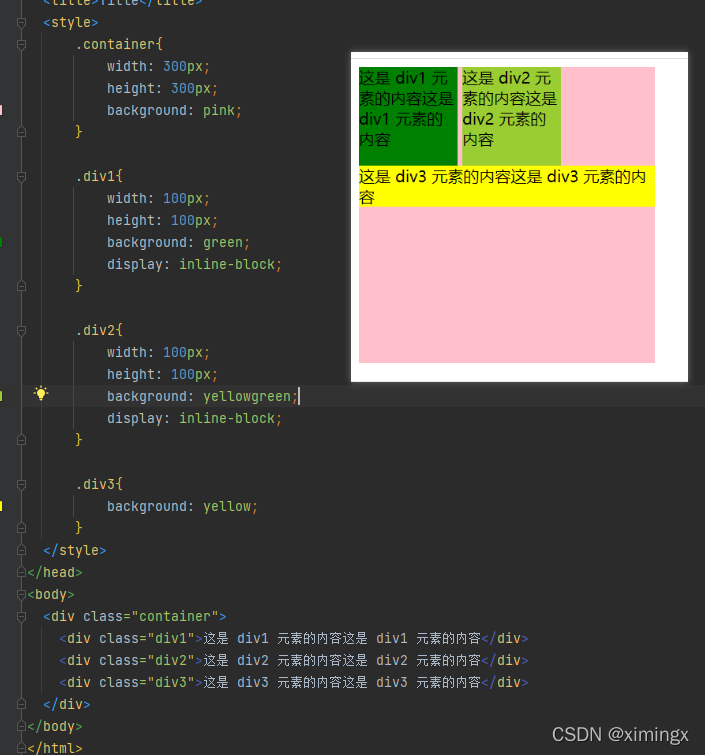

> 上面的代码，存在两个问题。

**问题一**：如果设置`div2`的宽度为`200px` 之后，`div2` 掉下来。

**问题二**：**`div1`和`div2`设置为 `inline-block`之后，这两个盒子之间存在了间隙**。 这是因为，此时的 `div1`和`div2` 已经被当成文本了。

> 间隙的几种解决办法：

办法1：设置父元素`container`的字体大小为0，即`font-size: 0`，然后设置子元素 `div1`、`div2`的字体`font-size: 12px`。

办法2：在写法上，去掉`div1`和`div2`之间的换行。改为：

```html
<div class="div1">div1的inline-block 属性</div><div class="div2">div2的inline-block 属性</div>
```

### 2. 设置元素的隐藏方式

◼ 方法一: `display`设置为`none`

元素不显示出来, 并且也不占据位置, 不占据任何空间

◼ 方法二: `visibility`设置为`hidden`

设置为`hidden`, 虽然元素不可见, 但是会占据元素应该占据的空间

默认为`visible`, 元素是可见的; 

◼ 方法三: `rgba`设置颜色, 将`a`的值设置为`0 `

`rgba`的`a`设置的是`alpha`值, 可以设置透明度, 不影响子元素

◼ 方法四: `opacity`设置透明度, 设置为`0 `

设置整个元素的透明度, 会影响所有的子元素


### 3. overflow

◼ `visible`：溢出的内容照样可见

◼ `hidden`：溢出的内容直接裁剪

◼ `scroll`：溢出的内容被裁剪，但可以通过滚动机制查看

◼ 会一直显示滚动条区域，滚动条区域占用的空间属于`width`、`height`

◼ `auto`：自动根据内容是否溢出来决定是否提供滚动机制


## 5. 盒子模型

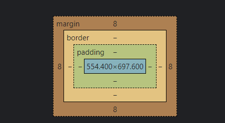

页面中的任何一个元素在显示和处理时都是以一个盒子的方式进行处理的.

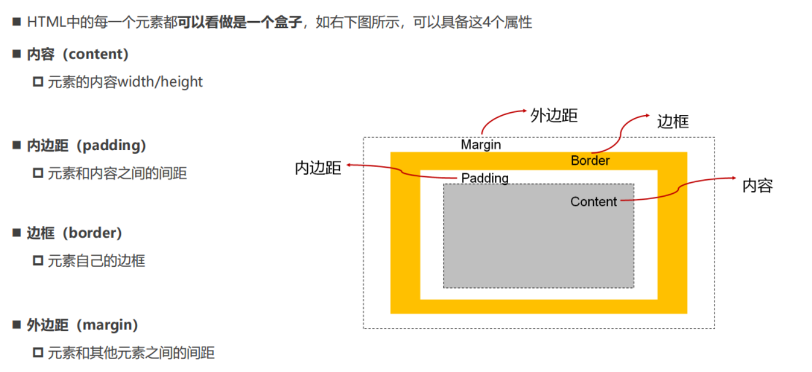

### 1. width height

宽度设置: `width`, 默认值 `auto`

高度设置: `height`

> 另外我们还可以设置如下属性: 

`min-width`：最小宽度，无论内容多少，宽度都大于或等于`min-width`

`max-width`：最大宽度，无论内容多少，宽度都小于或等于`max-width`

`min-height`：最小高度，无论内容多少，高度都大于或等于`min-height`

`max-height`：最大高度，无论内容多少，高度都小于或等于`max-height`

移动端适配时, 可以设置最大宽度和最小宽度; 

### 2. padding

`padding`属性 同时设置四个方向的内补白距离

> 缩写方式

格式1: `padding: 值`   同时设置四个方向的内补白为相同的值.

格式2: `padding: 值1 值2`  设置上下方向内补白为值1 , 左右方向内补白为值2.

格式3: `padding: 值1 值2 值3` 设置上方向内补白为值1, 左右内补白为值2, 下方向内补白为值3

格式4: `padding: 值1 值2 值3 值4`  上方向内补白值1, 右方向内补白值2, 下方向内补白值3 ,左方向内补白值4 (顺时针设置)

注意: `padding`属性的增加会导致元素整体宽高的增加.如果希望宽度高度不变,将`padding`属性的值从元素的宽度和高度的设置中减掉.

### 3. border

| 属性           | 作用                      | 值                                                           |
| -------------- | ------------------------- | ------------------------------------------------------------ |
| `border`       | 用于设置元素的边框        | 设置元素四个边的边框颜色,宽度和风格属性.                     |
| `border-width` | 同时设置4个边的边框的宽度 |                                                              |
| `border-style` | 同时设置4个边的边框风格   | `none `无边框<br/> `solid `实线边框<br/> `dashed` 虚线边框<br/> `double `双线边框<br/>`dotted `点状变量 |
| `border-color` | 同时设置4个边的边框颜色   |                                                              |

> `border-radius`

`border-radius`用于设置盒子的圆角

- 数值: 通常用来设置小的圆角, 比如`6px`;

- 百分比: 通常用来设置一定的弧度或者圆形;
  - 使用百分数定义圆形半径或椭圆的半长轴，半短轴。水平半轴相对于盒模型的宽度；垂直半轴相对于盒模型的高度。负值无效。

> `border`图形

`border`主要是用来给盒子增加边框的, 但是在开发中我们也可以利用边框的特性来实现一些形状

```css
.border-box {
  height: 90px;
  width: 90px;
  border: 45px solid transparent;
  border-top-color: darkcyan;
  box-sizing: border-box;
}
```

https://css-tricks.com/the-shapes-of-css/#top-of-site

### 4. margin

`margin`属性   同时设置四个方向的外间距

> 上下`margin`的传递

块级元素的顶部线和父元素的顶部线重叠，那么这个块级元素的`margin-top`值会传递给父元素

块级元素的底部线和父元素的底部线重写，并且父元素的高度是`auto`，那么这个块级元素的`margin-bottom`值会传递给父元素

> 上下`margin`的折叠,  两个值进行比较，取较大的值

垂直方向上相邻的2个`margin`（`margin-top`、`margin-bottom`）有可能会合并为1个`margin`，这种现象叫做`collapse`

水平方向上的`margin`（`margin-left`、`margin-right`）永远不会`collapse`

> 何防止出现传递问题

- 给父元素设置`padding-top` \ `padding-bottom`

- 给父元素设置`border`

- 触发`BFC`:  父元素设置`overflow`为`auto`

> 块级元素水平居中

```css
div {
    height: 100px;
    width: 100px;
    margin: 0 auto;
}
```

### 5. outline

`outline`表示元素的外轮廓, 不占用空间, 默认显示在 `border`的外面

> 属性

`outline-width`: 外轮廓的宽度

`outline-style`：取值跟`border`的样式一样，比如`solid`、`dotted`等 

`outline-color`: 外轮廓的颜色

`outline`：`outline-width`、`outline-style`、`outline-color`的简写属性，跟`border`用法类似

### 6. box-shadow

`box-shadow`属性可以设置一个或者多个阴影

> 属性值

第1个`<length>`：`offset-x`, 水平方向的偏移，正数往右偏移

第2个`<length>`：`offset-y`, 垂直方向的偏移，正数往下偏移

第3个`<length>`：`blur-radius`, 模糊半径

第4个`<length>`：`spread-radius`, 延伸半径

`<color>`：阴影的颜色，如果没有设置，就跟随`color`属性的颜色

`inset`：外框阴影变成内框阴影

### 7. text-shadow

`text-shadow`用法类似于`box-shadow`，用于给文字添加阴影效果

相当于`box-shadow`, 它没有`spread-radius`的值

### 8. 行内元素的注意事项

> 以下属性对行内级非替换元素不起作用

`width`、`height`、`margin-top`、`margin-bottom`

> 以下属性对行内级非替换元素的效果比较特殊

` padding-top`、`padding-bottom`、上下方向的`order`

### 9. box-sizing

`CSS3` 对盒模型做出了新的定义，即允许开发人员**指定盒子宽度和高度的计算方式**。

这就需要用到 `box-sizing`属性。它的属性值可以是：`content-box`、`border-box`。解释如下。

> `content-box`

`padding`、`border`都布置在`width`、`height`外边

元素的实际占用宽度 = `border + padding + width`

元素的实际占用高度 = `border + padding + height`

> `border-box`

` padding`、`border`都布置在`width`、`height`里边

元素的实际占用宽度 =`width`

元素的实际占用高度 = `height`

IE盒子模型是 `border-box`

## 6.  度量单位

> `px` 像素单位

相对单位
像素的大小由系统的分辨率决定, 像素的大小 = 物理屏幕的距离/分辨率

> `em `相对长度单位

所有未经调整的浏览器都符合: `1em=16px`

大小和一个汉字的大小相同, 相对于浏览器的默认字体尺寸

> `ex `相对长度单位

一个英文字母`x`的大小

> `cm `厘米

绝对单位, 就是现实中`1厘米`的大小

> `mm `毫米

绝对单位, 就是显示中1毫米的大小

> `in `英寸

绝对单位.
`1in = 2.54cm`

> `point `点

绝对单位.

`1in = 72pt`

> `pc `派卡

绝对单位

`1in = 6pc`

> **`rem`** 是`CSS3`新增的一个（`root em`）

相对单位

通过它既可以做到只修改根元素就成比例地调整所有字体大小，又可以避免字体大小逐层复合的连锁反应。
与 `em` 的区别在于使用 `rem` 为元素设定字体大小时，仍然是相对大小，但相对的只是`HTML根元素`。

> **`vm`** 视窗宽度

`1vm` 宽度为相对于视窗的宽度的百分之一

> **`vh`** 视窗高度

`1vh` 高度为相对于视窗的高度的百分之一

## 7. 布局

### 1. 标准流

**普通流**（标准流）

- **块级元素**会独占一行，**从上向下**顺序排列；
  - 常用元素：`div、hr、p、h1~h6、ul、ol、dl、form、table`
- **行内元素**会按照顺序，**从左到右**顺序排列，碰到父元素边缘则自动换行；
  - 常用元素：`span、a、i、em`等

### 2. 定位

> `position`

利用`position`可以对元素进行定位

◼ 默认值: 

`static`：默认值, 静态定位 

◼ 使用下面的值, 可以让元素变成 定位元素(positioned element) 

`relative`：相对定位 

`absolute`：绝对定位 

`fixed`：固定定位 

`sticky`：粘性定位

> `static`

元素按照`normal flow`布局

 `left` 、`right`、`top`、`bottom`没有任何作用

> `relative`

元素按照`normal flow`布局

可以通过 `left` 、`right`、`top`、`bottom`进行定位, 定位参照对象是元素自己原来的位置

在不影响其他元素位置的前提下，对当前元素位置进行微调

> `fixed`

元素脱离`normal flow`（脱离标准流、脱标）

可以通过 `left` 、`right`、`top`、`bottom`进行定位, 定位参照对象是视口, 当画布滚动时，固定不动

> `absolute`

元素脱离`normal flow`（脱离标准流、脱标）

可以通过`left` 、`right`、`top`、`bottom`进行定位, 定位参照对象是最邻近的定位祖先元素, 如果找不到这样的祖先元素（`position`值为`relative`、`absolute`、`fixed`的元素），参照对象是视口

如果希望子元素相对于父元素进行定位，又不希望父元素脱标，常用解决方案是,  父元素设置`position: relative`, 子元素设置`position: absolute`

宽度计算公式

- `定位参照对象的宽度 = left + right + margin-left + margin-right + 绝对定位元素的实际占用宽度`

- `定位参照对象的高度 = top + bottom + margin-top + margin-bottom + 绝对定位元素的实际占用高度`

> 将`position`设置为`absolute/fixed`元素的特点

1. 可以随意设置宽高
2. 默认宽高默认由内容决定 ， 包裹内容
3. 不再受标准流的约束 , 不再严格按照从上到下、从左到右排布 , 不再严格区分块级、行内级，行内块级的很多特性都会消失 

4. 不再给父元素汇报宽高数据 
5. 脱标元素内部默认还是按照标准流布局

> 如果希望绝对定位元素在定位参照对象中居中显示

1. `left: 0、right: 0、top: 0、bottom: 0、margin: auto`

2. 并且设置具体的宽高值

> `sticky`

它允许被定位的元素表现得像相对定位一样，直到它滚动到某个阈值点; 

当达到这个阈值点时, 就会变成固定(绝对)定位

`sticky`是相对于最近的滚动祖先包含滚动视口

> `z-index`

用来设置定位元素的层叠顺序， 仅对定位元素有效

`z-index越大`，层叠在越上面, `z-index`相等，写在后面的那个元素层叠在上面

### 3. 浮动

> `float` 的作用及历史

`float` 属性可以指定一个元素应沿其容器的左侧或右侧放置，允许文本和内联元素环绕它

`float` 属性最初只用于在一段文本内浮动图像, 实现文字环绕的效果; 

但是早期的`CSS标准`中并没有提供好的左右布局方案, 因此在一段时间里面它成为网页多列布局的最常用工具; 

> 可以通过`float`属性让元素产生浮动效果，`float`的常用取值

- `left`
- `right`
- `none`

> 浮动规则

- 元素一旦浮动后, 脱离标准流
  - 朝着向左或向右方向移动，直到自己的边界紧贴着包含块（一般是父元素）或者其他浮动元素的边界为止， 不能超出包含块的左（右）边界, 只能到达`contemt`部分	
    - 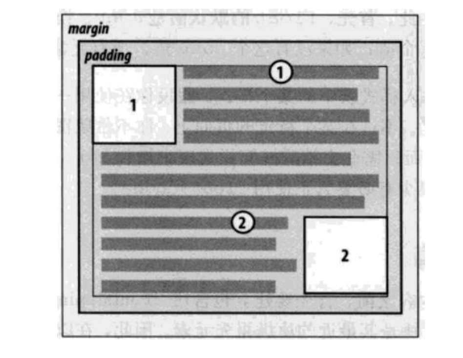
  - 绝对定位、浮动都会让元素脱离标准流，以达到灵活布局的效果， 定位元素会层叠在浮动元素上面
    - 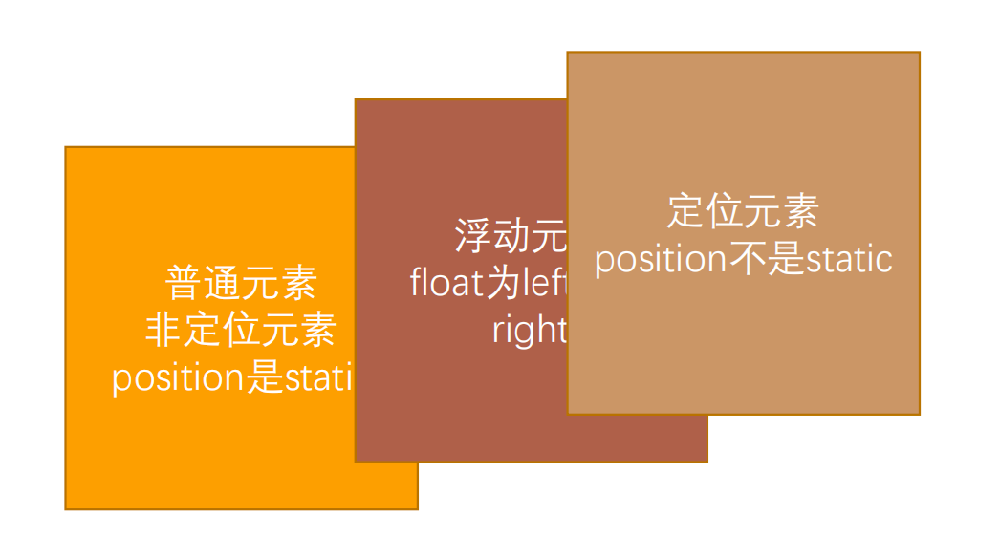
- 浮动元素之间不能层叠
  - 如果一个元素浮动，另一个浮动元素已经在那个位置了，后浮动的元素将紧贴着前一个浮动元素（左浮找左浮，右浮找右浮）
  - 如果水平方向剩余的空间不够显示浮动元素，浮动元素将向下移动，直到有充足的空间为止
- 浮动元素不能与`行内级内容`层叠，行内级内容将会被浮动元素推出
  - 允许文本和内联元素环绕
- `行内级元素`、`inline-block`元素浮动后，其顶部将与所在行的顶部对齐
  - 

> 浮动的问题

- 由于浮动元素脱离了标准流，变成了脱标元素，所以不再向父元素汇报高度
  - 父元素计算总高度时，就不会计算浮动子元素的高度，导致了高度坍塌的问题

> `clear`	

`clear` 属性可以指定一个元素是否必须移动(清除浮动后)到在它之前的浮动元素下面

- `left`：要求元素的顶部低于之前生成的所有左浮动元素的底部

- `right`：要求元素的顶部低于之前生成的所有右浮动元素的底部

- `both`：要求元素的顶部低于之前生成的所有浮动元素的底部

- `none`：默认值，无特殊要求

> 清浮动（清理浮动、清除浮动）

清浮动的目的是让父元素计算总高度的时候，把浮动子元素的高度算进去

- 给父元素设置固定高度

  - 扩展性不好（不推荐）

- 在父元素最后增加一个空的块级子元素，并且让它设置`clear: both`

  - 会增加很多无意义的空标签，维护麻烦
  - 违反了结构与样式分离的原则

- 给父元素添加一个伪元素

  - ```css
    .clear-fix::after {
      content: '';
      display: block;
      clear: both;
      visibility: hidden; /* 兼容 */
      height: 0; /* 兼容 */
    }
    
    .clear-fix {
      *zoom: 1; /* ie6/7兼容 */
    }
    ```

### 4. flex

> 定义与兼容问题

弹性盒子是一种用于按行或按列布局元素的`一维布局方法`， 元素可以膨胀以填充额外的空间, 收缩以适应更小的空间，目前特别在移动端可以说已经完全普及， 在PC端也几乎已经完全普及和使用, 只有非常少数的网站依然在用浮动来布局

> `flex container` 与  `flex item`

开启了 `flex` 布局的元素叫 `flex container`, `flex container` 里面的直接子元素叫做 `flex item`

> `flex container`中的子元素自动变成了`flex item`,  具备一些特点

- `flex item`的布局将受`flex container`属性的设置来进行控制和布局
- `flex item`不再严格区分块级元素和行内级元素
- `flex item`默认情况下是包裹内容的, 但是可以设置宽度和高度

> 设置 `flex layout` 的方式

```css
/* 设置 display 属性为 flex 或者 inline-flex 可以成为 flex container */
display: flex;
```

- `display: flex`： `flex container` 以 `block-level` 形式存在

- `display: inline-flex`： `flex container` 以 `inline-level` 形式存在

> `flex`布局的模型


> 应用在 `flex container` 上的` CSS` 属性


- `flex-direction`
- `flex-wrap`
- `flex-flow`
- `justify-content`
- `align-items`
- `align-content`

> `flex-direction`

`flex items` 默认都是沿着 `main axis`（主轴）从 `main start` 开始往 `main end` 方向排布

`flex-direction` 决定了 `main axis` 的方向，有 4 个取值		

- `row`
- `row-reverse`
- `column`
- `column-reverse`

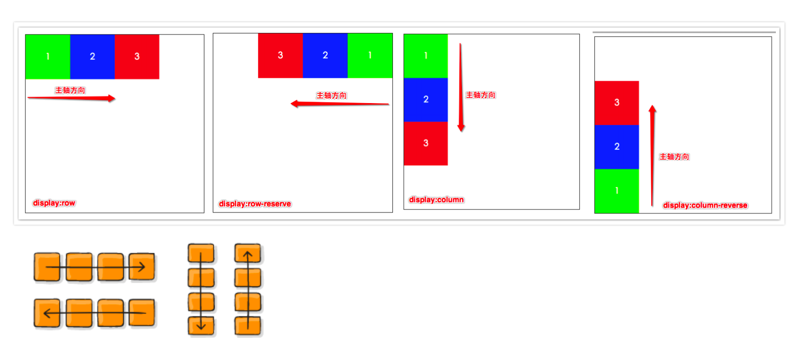

> `flex-wrap`

决定了 `flex container` 是单行还是多行

- `nowrap` 单行
- `wrap` 多行
- `wrap-reverse`  从`cross-end`开始显示, 延主轴排布

> `flex-flow`

是 `flex-direction` 和 `flex-wrap` 的简写, 顺序任何, 并且都可以省略;

> `justify-content`

`justify-content` 决定了 `flex items` 在 `main axis` 上的对齐方式

- `flex-start`（默认值）：与` main start` 对齐

- `flex-end`：与 `main end` 对齐

- `center`：居中对齐

- `space-between`： 
  - `flex items` 之间的距离相等
  - 与 `main start`、`main end`两端对齐

- `space-around`： 
  -  `flex items` 之间的距离相等
  -  `flex items` 与 `main start`、`main end` 之间的距离是 `flex items` 之间距离的一半

- `space-evenly`： 
  - `flex items` 之间的距离相等
  - `flex items` 与 `main start`、`main end` 之间的距离等于 `flex items` 之间的距离

> `align-items`

`align-items` 决定了单行 `flex items` 在 `cross axis` 上的对齐方式

  - `normal`：在弹性布局中，效果和`stretch`一样, 为默认值
  - `stretch`：当 `flex items` 在 `cross axis` 方向的 `size` 为 `auto` 时，会自动拉伸至填充 `flex container`
  - `flex-start`：与 `cross start` 对齐
  - `flex-end`：与 `cross end` 对齐
  - `center`：居中对齐
  - `baseline`：与基准线对齐

> `align-content`

`align-content` 决定了多行 `flex items` 在 `cross axis` 上的对齐方式

- `stretch（默认值）`：与 `align-items` 的 `stretch` 类似
- `flex-start`：与 `cross start` 对齐
- `flex-end`：与 `cross end` 对齐
- `center`：居中对齐
- `space-between`： 
  - `flex items` 之间的距离相等
  - 与 `cross start`、`cross end`两端对齐

- `space-around`： ✓ `flex items` 之间的距离相等
  -  `flex items` 与 `cross start`、`cross end` 之间的距离是 `flex items` 之间距离的一半

- `space-evenly`： ✓ `flex items` 之间的距离相等
  -  `flex items` 与 `cross start`、`cross end` 之间的距离 等于 `flex items` 之间的距离


> 应用在 `flex items` 上的 `CSS` 属性

- `flex-grow`
- `flex-basis`
- `flex-shrink`
- `order`

> `order`

`order` 决定了 `flex items` 的排布顺序

可以设置任意整数（正整数、负整数、0），值越小就越排在前面

> `align-self`

`flex items` 可以通过 `align-self` 覆盖 `flex container` 设置的 `align-items`

- `auto（默认值）`：遵从` flex container` 的 `align-items` 设置

- `stretch、flex-start、flex-end、center、baseline`，效果跟 `align-items` 一致

> `flex-grow`

`flex-grow` 决定了 `flex items` 如何扩展(拉伸/成长) , 可以设置任意非负数字（正小数、正整数、0），默认值是 0 , 当 `flex container` 在 `main axis` 方向上有剩余 `size` 时，`flex-grow` 属性才会有效

扩展的空间大小： `剩余size * flex-grow/ 所有item的 flex-grow`

`flex-grow` 支持 `transition` 动画过度， 可以用于制作折叠面版

```html
<style>
    body {
      margin: 0;
    }

    .container {
      display: flex;
      flex-direction: column;
      width: 100vw;
      height: 100vh;
    }

    .flex-item {
      line-height: 40px;
      text-align: center;
      color: #fff;
      background: #000;
      transition: flex-grow 0.5s;
    }

    .active {
      flex-grow: 1;
      background: turquoise;
    }
  </style>
</head>
<body>
<div class="container">
  <div class="flex-item active" onclick="chang(1)">1</div>
  <div class="flex-item" onclick="chang(2)">2</div>
  <div class="flex-item" onclick="chang(3)">3</div>
</div>
<script>
  function chang(index) {
    let item = document.getElementsByClassName('flex-item');
    for (let i = 0; i < item.length; i++) {
        item[i].classList.remove('active');
    }
    item[index - 1].classList.add('active');
  }
</script>
```

> `flex-shrink`

- `flex-shrink` 决定了 `flex items` 如何收缩(缩小) 
  - 可以设置任意非负数字（正小数、正整数、0），默认值是 1 
  - 当 `flex items` 在 `main axis` 方向上超过了 `flex container` 的 `size`，`flex-shrink` 属性才会有效
  - 0 表示不压缩， 数值表示 `超出部分 * flex-shrink / 所有item的flex-shrink`

> `flex-basis`

- `flex-basis` 用来设置 `flex items` 在 `main axis` 方向上的 `base size`
  - `auto`（默认值）、具体的宽度数值（100px） 

> `flex`

`flex` 是 `flex-grow` || `flex-shrink` || `flex-basis` 的简写,`flex` 属性可以指定1个，2个或3个值。

> 决定 `flex items` 最终 `base size` 的因素，从优先级高到低

- `max-width\max-height\min-width\min-height`
- `flex-basis`
- `width\height`
- 内容本身的 `size`

> 对于 `space-between` 排布问题的纪录

```html
  <style>
    .container {
      width: 400px;
      display: flex;
      background: #000;
      justify-content: space-between;
      flex-wrap: wrap;
    }

    .item {
      height: 120px;
      width: 120px;
      background: lightblue;
    }

    .ignore {
      width: 120px;
    }
  </style>

/* html */

  <div class="container">
    <div class="item item1">1</div>
    <div class="item item2">2</div>
    <div class="item item3">3</div>
    <div class="item item4">4</div>
    <div class="item item5">5</div>
    <i class="ignore"></i>
    <i class="ignore"></i>
  </div>
```

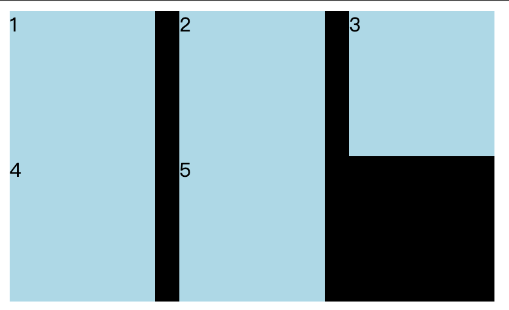

### 5. grid


## 8. 动画


### 1. transition

animation 的学习之前 其实需要顺便提一下 transition 

首先强调一下我认为他最大的不足

1.   过渡只关心元素的初始状态和结束状态，没有方法可以获取到元素在过渡中每一帧的状态

下面介绍一下他的四个属性以及简写

#### 1. ransition-property

不是所有属性都能过渡，只有属性具有一个中间点值才具备过渡效果 !!!

用于指定应用过渡的属性名称，可以指定多个属性名称，多个属性名称之间用`,` 分隔。

默认值为 `all` 也就是所有的元素都应用过渡效果。

```html
<template>
  <div id="test">
      
  </div>
</template>
<script>
export default {
  name: "Test"
}
</script>
<style scoped>
div{
  width: 200px;
  height: 200px;
  background-color: dodgerblue;
  transition-property: width, height;
}
div:hover {
  width: 400px;
  height: 400px;
}
</style>
```

![\[外链图片转存失败,源站可能有防盗链机制,建议将图片保存下来直接上传(img-s5i6WknW-1637112573576)(D:/start/image-20211117090918168.png)\]](https://img-blog.csdnimg.cn/c8dbe86dc78047d1afa06fc235549119.png?x-oss-process=image/watermark,type_ZHJvaWRzYW5zZmFsbGJhY2s,shadow_50,text_Q1NETiBAeGltaW5neA==,size_20,color_FFFFFF,t_70,g_se,x_16)


当鼠标悬浮上去的时候 , 他会立即变成这个样子,**过渡效果不会生效。因为没有设置 transition-duration 属性**,他会立即变成最后的结果

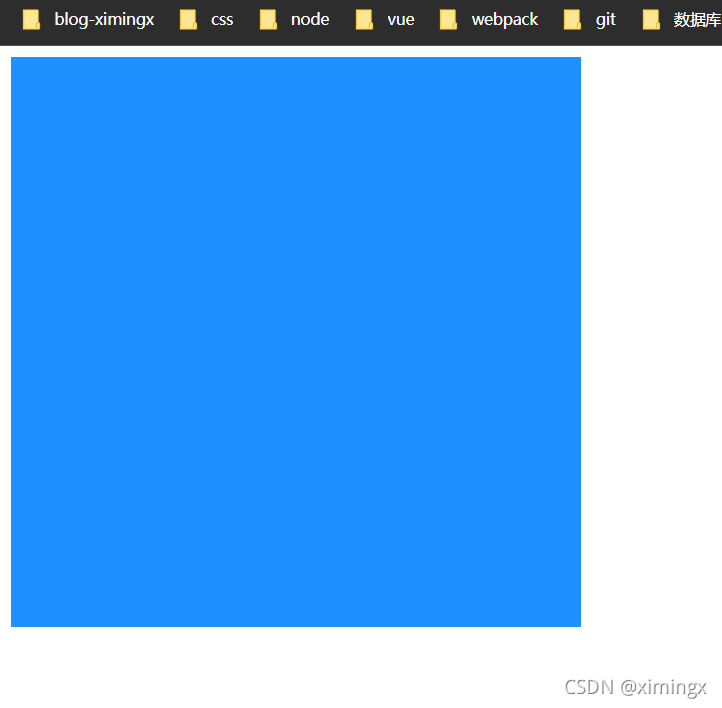

#### 2.  transition-duration

用于设置过渡的持续时间，属性值以秒`s`或毫秒`ms`为单位，默认值为0 , 为0时，表示变化是瞬时的，看不到过渡效果。

多个每个时长会被应用到由 `transition-property` 指定的对应属性上。

**如果指定的时长个数小于属性个数，那么时长列表会重复.如果时长列表更长，那么该列表会被裁减。**

#### 3.  transiton-timing-function

>   liner
>   ease-in
>   ease-out
>   ease-in-out
>   cubic-bezier

这里先提一下,下面 animation 里会有具体的解释

#### 4.  transition-delay

`transition-delay` 规定了在过渡效果开始作用之前需要等待的时间（延迟时间），值以秒（s）或毫秒（ms）为单位，表明动画过渡效果将在何时开始

**取值为正时会延迟一段时间来响应过渡效果；取值为负时会导致过渡立即开始。**

一个完整的案例

```css
div{
  width: 200px;
  height: 200px;
  background-color: ##000000;
  transition-property: width;
  transition-duration: 3s;
  transition-timing-function: linear;
  transition-delay: 0.5s;
}
div:hover {
  width: 400px;
}
```

#### 5. 简写属性

```css
transiton: 过渡属性 过渡所需要时间 过渡动画函数 过渡延迟时间；
```

#### 6.  transition 的不足

**transition的优点在于简单易用，但是它有几个很大的局限。**
（1）transition需要事件的触发，所以没法在网页加载时自动发生。
（2）transition是一次性的，不能重复发生，除非一再触发。
（3）transition只能定义开始状态和结束状态，不能定义中间状态，也就是说只有两个状态。
（4）一条transition规则，只能定义一个属性的变化，不能涉及多个属性。
CSS Animation就是为了解决这些问题而提出的,完美的解决了这些问题

#### 7. 一个简单的样式

```html
<!DOCTYPE html>
<html lang="en">
<head>
  <meta charset="UTF-8">
  <title>CSS 过渡</title>
  <style>
      body {
          margin: 0;
          padding: 0;
          background-color: #eeeeee;
      }

      .content {
          width: 800px;
          height: 320px;
          padding-left: 20px;
          margin: 80px auto;
      }

      .item {
          width: 230px;
          height: 300px;
          text-align: center;
          margin-right: 20px;
          background-color: #FFF;
          float: left;
          position: relative;
          top: 0;
          overflow: hidden; /* 让溢出的内容隐藏起来。意思是让下方的橙色方形先躲起来 */
          transition: all .5s; /* 从最初到鼠标悬停时的过渡 */
      }

      .item .desc {
          position: absolute;
          left: 0;
          bottom: -80px;
          width: 100%;
          height: 80px;
          background-color: #ff6700;
          transition: all .5s;
      }

      /* 鼠标悬停时，让 item 整体往上移动5px，且加一点阴影 */
      .item:hover {
          top: -5px;
          box-shadow: 0 0 15px #AAA;
      }

      /* 鼠标悬停时，让下方的橙色方形现身 */
      .item:hover .desc {
          bottom: 0;
      }
  </style>
</head>
<body>
<div class="content">
  <div class="item">
    <span class="desc"></span>
  </div>
</div>
</body>
</html>
```

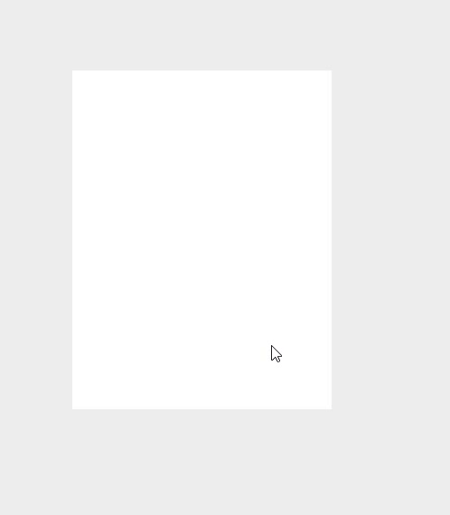


### 2. 2D 转换 (transfrom)

**转换**是 CSS3 中具有颠覆性的一个特征，可以实现元素的**位移、旋转、变形、缩放**，甚至支持矩阵方式。

转换再配合过渡和动画，可以取代大量早期只能靠 Flash 才可以实现的效果。

在 CSS3 当中，通过 `transform` 转换来实现 2D 转换或者 3D 转换。

- 2D转换包括：缩放、移动、旋转。

#### 1。 缩放：`scale`

格式：

```javascript
	transform: scale(x, y);

	transform: scale(2, 0.5);
```

参数解释： x：表示水平方向的缩放倍数。y：表示垂直方向的缩放倍数。如果只写一个值就是等比例缩放。

取值：大于1表示放大，小于1表示缩小。不能为百分比。

#### 2. 位移：translate

格式：


```javascript
	transform: translate(水平位移, 垂直位移);

	transform: translate(-50%, -50%);
```

参数解释：

- 参数为百分比，相对于自身移动。

- 正值：向右和向下。 负值：向左和向上。如果只写一个值，则表示水平移动。

#### 3.  旋转：rotate

格式：

```javascript
	transform: rotate(角度);

	transform: rotate(45deg);
```

参数解释：正值 顺时针；负值：逆时针。

rotate 旋转时，默认是以盒子的正中心为坐标原点的。如果想**改变旋转的坐标原点**，可以用`transform-origin`属性。格式如下：


```javascript
	transform-origin: 水平坐标 垂直坐标;

	transform-origin: 50px 50px;

	transform-origin: center bottom;   //旋转时，以盒子底部的中心为坐标原点
```

### 3. 3D 转换

#### 1 . 旋转：rotateX、rotateY、rotateZ

**3D坐标系（左手坐标系）**

**浏览器的这个平面，是X轴、Y轴；垂直于浏览器的平面，是Z轴。**

从上面这句话，我们也能看出：所有的3d旋转，对着正方向去看，都是顺时针旋转。

**格式：**

```javascript
	transform: rotateX(360deg);    //绕 X 轴旋转360度

	transform: rotateY(360deg);    //绕 Y 轴旋转360度

	transform: rotateZ(360deg);    //绕 Z 轴旋转360度

```

#### 2.  移动：translateX、translateY、translateZ

**格式：**

```javascript
	transform: translateX(100px);    //沿着 X 轴移动

	transform: translateY(360px);    //沿着 Y 轴移动

	transform: translateZ(360px);    //沿着 Z 轴移动

```

#### 3. 透视：perspective

电脑显示屏是一个 2D 平面，图像之所以具有立体感（3D效果），其实只是一种视觉呈现，通过透视可以实现此目的。

透视可以将一个2D平面，在转换的过程当中，呈现3D效果。但仅仅只是视觉呈现出 3d 效果，并不是正真的3d。

格式有两种写法：

- 作为一个属性，设置给父元素，作用于所有3D转换的子元素

- 作为 transform 属性的一个值，做用于元素自身。

格式举例：

```css
perspective: 500px;
```


### 4. animation

**CSS3的animation属性可以像Flash制作动画一样，通过控制关键帧来控制动画的每一步**，实现更为复杂的动画效果。ainimation实现动画效果主要由两部分组成：

制作动画分为两步：

1.  定义动画 @keyframes
2.  使用(调用)

#### 1. 定义动画

##### @keyframes(关键帧) 用于 定义动画

```css
@keyframes animation01 {
    0% {
        margin-top: 10px;
    }
    100% {
        margin-top: 20px;
    }
}
```

0%是动画的开始，100%是动画的完成。**中间可以插入任意百分比**
在 @keyframes 中规定某项CSS样式，就能创建由当前样式逐渐改为新样式的动画效果
**可以改变任意多的样式任意多的次数。**
或用关键词"from"和"to",等同于0%和100%

两者等同

```css
@keyframes animation01 {
    from {
        margin-top: 10px;
    }
    to {
        margin-top: 20px;
    }
}
```

**部分属性是不可以发生改变的,因为 “不连续”,属性间的变换没有中间值**

#### 2. 调用动画

要调用动画,必须要得给他添加一些必要的属性: 

##### 时间函数（animation-timing-function）

animation-timing-function 属性定义了动画的播放速度曲线。

|                               |                                                              |
| :---------------------------: | :----------------------------------------------------------: |
|              值               |                             描述                             |
|            linear             |                 动画从头到尾的速度是相同的。                 |
|             ease              |        默认。动画以低速开始，然后加快，在结束前变慢。        |
|            ease-in            |                       动画以低速开始。                       |
|           ease-out            |                       动画以低速结束。                       |
|          ease-in-out          |                    动画以低速开始和结束。                    |
|             steps             |              指定了时间函数中的间隔数量（步长）              |
| cubic-bezier(*n*,*n*,*n*,*n*) | 在 cubic-bezier 函数中自己的值。可能的值是从 0 到 1 的数值。 |

默认值，如果没有显示写调用的函数，则默认为ease。

**cubic-bezier(*n*,*n*,*n*,*n*)  是生成速度曲线的函数**  


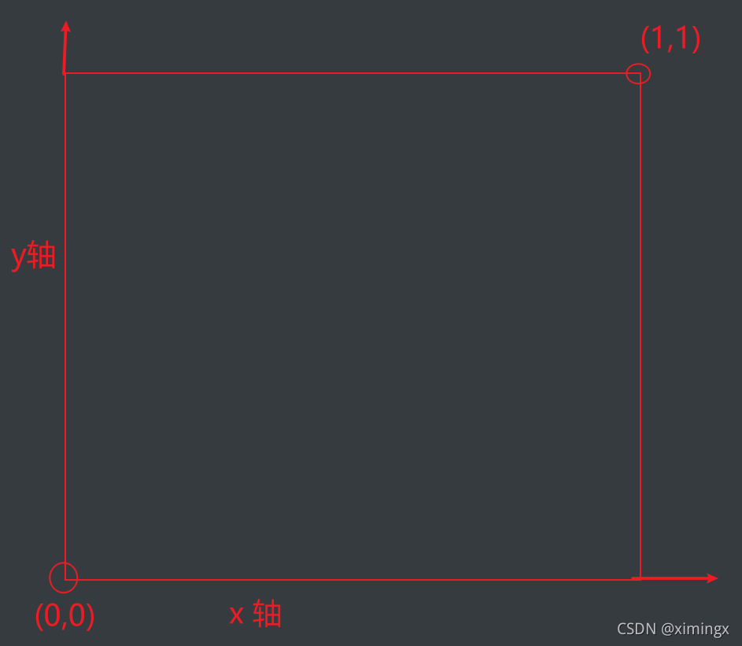


从上图中我们可以看到，cubic-bezier有四个点：
两个默认的，即：P0(0,0)，P3(1,1)；
**两个控制点，即 cubic-bezier 函数中传递的四个值,分别依次带入 P1(x1,y1)，P2(x2,y2)**
注：X轴的范围是0~1，超出cubic-bezier将失效，Y轴的取值没有规定，但是也不宜过大。
**我们只要调整两个控制点P1和P2的坐标，最后形成的曲线就是动画曲线。**

举例 cubic-bezier(0.25,0.1,0.25,1)

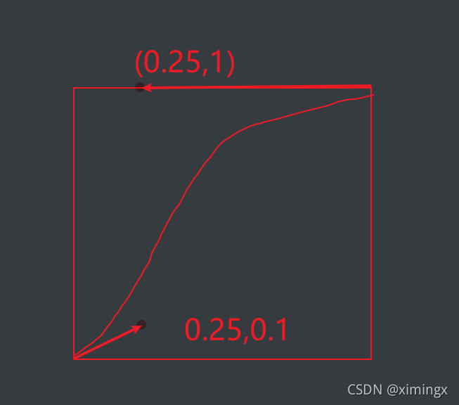


画的丑,下面不手画了

给大家一个地址: https://easings.net/

可以自己去看看 cubic-bezier( ) 函数的演示

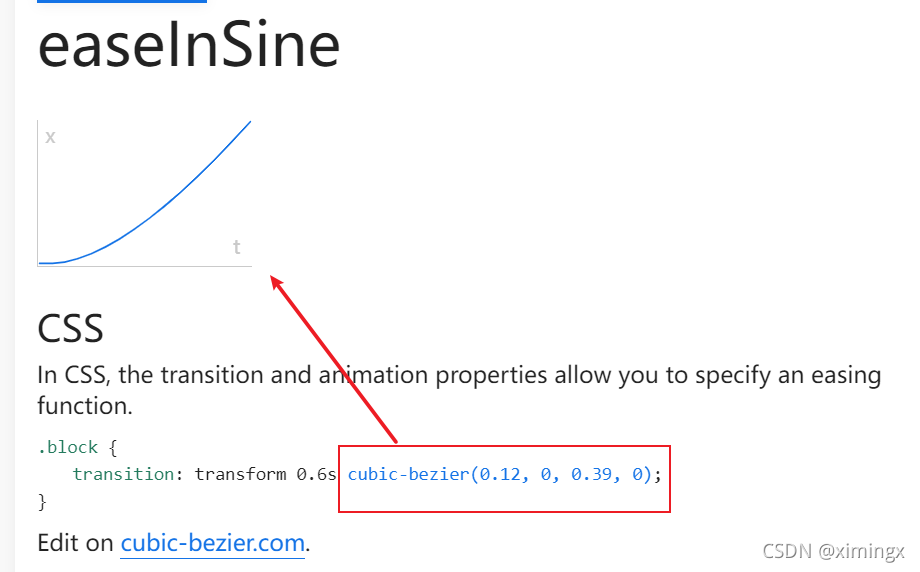


and cubic-bezier 可以自己随心所欲地绘制 cubic-bezier( ) 函数

https://cubic-bezier.com/##.17,.67,.83,.67

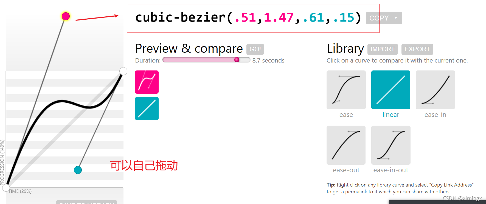


**而 steps 会一卡一卡的 生成我们的动画**

---

##### 动画方向（animation-direction）

animation-direction: normal 正序播放  终点=>起点
animation-direction: reverse 倒序播放  终点=>起点
animation-direction: alternate 交替播放  
animation-direction: alternate-reverse 反向交替播放  

---

##### 动画延迟（animation-delay）

animation-delay属性定义动画是从何时开始播放，即动画应用在元素上的到动画开始的这段时间的长度。默认值0s，表示动画在该元素上后立即开始执行。该值以秒(s)或者毫秒(ms)为单位。

---


##### 动画迭代次数（animation-iteration-count）

animation-iteration-count该属性就是定义我们的动画播放的次数。次数可以是1次或者无限循环。默认值只播放一次。

single-animation-iteration-count = infinite | number


---


##### 动画填充模式（animation-fill-mode）

animation-fill-mode是指给定动画播放前后应用元素的样式。

single-animation-fill-mode = none | forwards | backwards | both

animation-fill-mode: none 动画执行前后不改变任何样式
animation-fill-mode: forwards 保持目标动画最后一帧的样式
animation-fill-mode: backwards 保持目标动画第一帧的样式
animation-fill-mode: both 动画将会执行 forwards 和 backwards 执行的动作。


---


##### 动画播放状态（animation-timing-function）

animation-play-state: 定义动画是否运行或者暂停。可以确定查询它来确定动画是否运行。默认值为running

single-animation-timing-function = running | paused

running 动画正常播放
paused 动画暂停播放


---


##### 简写

```css
animation:动画名称 持续时间 运动曲线 何时开始 播放次数 是否反方向 动画起始或者结束的状态;
```

但是需要注意: 简写属性里面不包含 **animation- play-state**

#### 3.补充动画

##### 1. 按钮抖动动画

```js
<template>
  <div :class="{ shake: disabled }">
    <button @click="warnDisabled">Click me</button>
    <span v-if="disabled">This feature is disabled!</span>
  </div>
</template>

<script>
export default {
  name: 'ShakeButton',
  data() {
    return {
      disabled: false
    }
  },
  methods: {
    warnDisabled() {
      this.disabled = true
      setTimeout(() => {
        this.disabled = false
      }, 1500)
    }
  }
}
</script>

<style>
.shake {
  animation: shake 0.82s cubic-bezier(0.36, 0.07, 0.19, 0.97) both;
  transform: translate3d(0, 0, 0);
}

@keyframes shake {
  10%,
  90% {
    transform: translate3d(-1px, 0, 0);
  }

  20%,
  80% {
    transform: translate3d(2px, 0, 0);
  }

  30%,
  50%,
  70% {
    transform: translate3d(-4px, 0, 0);
  }

  40%,
  60% {
    transform: translate3d(4px, 0, 0);
  }
}
</style>
```

##### 2. 背景颜色随鼠标渐变

[演示地址](http://ximingx.com/TransitionColor22_3_24/index.html)

```js
<template>
  <div
      @mousemove="onMousemove"
      :style="{ backgroundColor: `hsl(${x}, 80%, 50%)` }"
      class="movearea"
  >
    <p>Move your mouse across this div...</p>
    <p>x: {{ x }}</p>
  </div>
</template>

<script>
export default {
  name: 'ShakeButton',
  data() {
    return {
      x: 0
    }
  },
  methods: {
    onMousemove(e) {
      this.x = e.clientX
    }
  }
}
</script>

<style>
* {
  padding: 0;
  margin: 0;
}
.movearea {
  width: 100vw;
  height: 100vh;
  transition: 0.3s background-color ease;
}
</style>
```


 


# less

> Less（代表 Leaner Style Sheets）是一个向后兼容的 CSS 语言扩展。Less.js 是一种将您的 Less 样式转换为 CSS 样式的 JavaScript 工具。


## 1.1  less 的安装

**首先需要安装 node 环境**

使用npm安装

```bash
npm install less -g
```

## 1.2 less用法

### 1.2.1 命令行用法

将 bootstrap.less 编译为 bootstrap.css

```bash
lessc bootstrap.less bootstrap.css
```

### 1.2.2 变量

```less
@width: 10px;
@height: @width + 10px;

#header {
  width: @width;
  height: @height;
}
```

输出

```css
#header {
  width: 10px;
  height: 20px;
}
```

### 1.2.3 混合

```less
.bordered {
  border-top: dotted 1px black;
  border-bottom: solid 2px black;
}
#menu a {
  color: #111;
  .bordered();
}

.post a {
  color: red;
  .bordered();
}
```

此时, 类的属性.bordered现在将同时出现在#menu a和.post a中。


### 1.2.4 嵌套

```less
#header {
  color: black;
  .navigation {
    font-size: 12px;
  }
  .logo {
    width: 300px;
  }
}
```


您还可以使用此方法将伪选择器与您的 mixin 捆绑在一起。这是经典的 clearfix hack，重写为 mixin（&代表当前选择器父级）：


```less
.clearfix {
  display: block;
  zoom: 1;

  &:after {
    content: " ";
    display: block;
    font-size: 0;
    height: 0;
    clear: both;
    visibility: hidden;
  }
}
```

诸如@mediaor之类的规则@supports可以以与选择器相同的方式嵌套。at 规则位于顶部，并且与同一规则集中的其他元素的相对顺序保持不变。

这称为冒泡。

```less
.component {
  width: 300px;
  @media (min-width: 768px) {
    width: 600px;
    @media  (min-resolution: 192dpi) {
      background-image: url(/img/retina2x.png);
    }
  }
  @media (min-width: 1280px) {
    width: 800px;
  }
}
```

输出：

```css
.component {
  width: 300px;
}
@media (min-width: 768px) {
  .component {
    width: 600px;
  }
}
@media (min-width: 768px) and (min-resolution: 192dpi) {
  .component {
    background-image: url(/img/retina2x.png);
  }
}
@media (min-width: 1280px) {
  .component {
    width: 800px;
  }
}
```

# Sass

## 2.1 Sass简介

大家都知道，js 中可以自定义变量，而`css` 仅仅是一个`标记语言`，`不是编程语言`，因此不可以自定义变量、不可以引用等等。

面对这些问题，我们现在来引入 `Sass`，简单的说，他是 css 的升级版

相比较于 `less`, `Sass`比Less的`功能更强大，也更复杂`。

### 2.1.1 Sass 的定义

Sass：英文是 Syntactically Awesome Stylesheets Sass。最早由 Hampton Catlin 开发和设计。 一种帮助你简化 CSS 工作流程的方式，帮助你更容易维护和开发 CSS 内容。

官网是：<https://sass-lang.com/>

Sass 是这个世界上最成熟、稳定和强大的专业级 CSS 扩展语言。

Sass专注的是怎样创建优雅的样式表，而不是内容。

### 2.1.2 Sass、Compass与CSS

**关系：**

- Less/Sass是语法、`Compass是框架`、CSS是目标。

Sass&Compass的好处：

- 写出更优秀的CSS。

- 解决CSS编写过程中的痛点问题，比如精灵图合图、属性的浏览器前缀处理等。

- 有效组织样式、图片、字体等项目元素。

## 2.2 Sass 的安装

### 2.2.1 安装Ruby（windows环境）

sass引擎是用`Ruby语言`开发的（但是两者的语法没有关系），因此在安装 Sass 前，需要先安装Ruby（mac下自带Ruby无需再安装Ruby）。

下面来讲一下 Windows 下的安装Sass的步骤。

下载地址：<http://rubyinstaller.org/>


选择你需要的版本

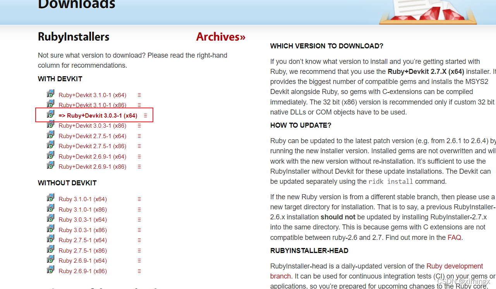
**不一定能下载成功 ~ ~ ~**

然后进行安装

安装时，记得勾选“环境变量”：

 **勾选 <font color="red">Add Ruby executables to your PATH</font>  !important;** 


安装完ruby之后，在命令行中输入`ruby -v`，查看ruby的的版本：

```bash
ruby -v
```

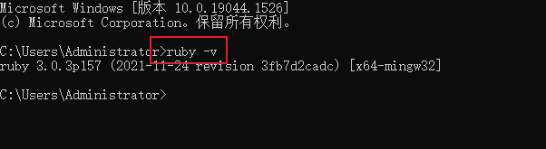

### 2.2.2  Sass的安装

安装完 ruby 之后，在开始菜单中，找到刚才我们安装的 ruby ，打开Start Command Prompt with Ruby。输入`gem install sass`安装Sass。

> Ruby 是使用 gem 来管理它的各种包（比如Sass）。我们安装好ruby之后，gem会自动安装上；**类似于，我们安装完node之后，npm也自动安装好了。**

输入如下命令安装Sass：

如果mac下输入这个命令时没有权限，则需要在前面加上 sudo

```bash
	gem install sass        
```

系统会自动安装上最新版本的Sass。

查看sass版本的命令为:

```bash
	sass -v
```

升级sass版本的命令为：

```bash
	gem update sass
```

你也可以运行帮助命令行来查看你需要的命令：

```bash
	sass -h
```

安装完sass之后，我们在main.scss中写一些代码，然后输入如下命令，就可以将`scss文件`转化为`css文件`：

```bash
	sass main.scss main.css
```


## 2.3  Compass 简介和安装

然而，真正的项目开发中，我们不一定是直接使用 sass 命令，而是使用 Compass。

官网是：<http://compass-style.org/>。

### Compass 安装

输入如下命令安装 Compass：

```bash
	gem isntall compass
```

输入如下命令查看版本：

```bash
	compass -v
```

compass可以直接用来搭建前端项目的样式部分，但并不是常用的方法。

通过 Compass 创建工程目录：


```bash
cd workspace
```

```bash
compass create CompassDemo
```

文件结构如下：

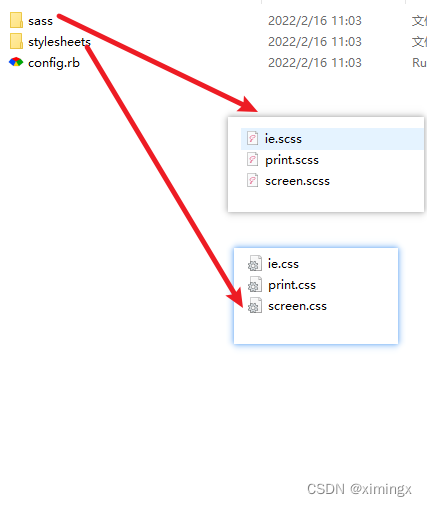
为了能够让文件实时编译，我们可以通过 copass watch 监听sass文件的变化：

```bash
	cd CompassDemo
```

```bash
	compass watch
```

当.scss文件改动时，会自动生成对应的.css文件。

## 2.4 Sass 语法

### 2.4.1 两种后缀名（两种语法）

sass 有两种后缀名文件：

（1）`.sass`：对空格敏感。不使用大括号和分号，所以每个属性之间是通过换行来分隔。

比如：

```sass
h1
	color: #000
	background: #fff
```

这种语法是类ruby的语法，和CSS的语法相比，相差较大。所以，在3.0版本中就引入了`.scss`的语法。


（2）`.scss`：是css语法的超集，可以使用大括号和分号。

比如：

```ccss
h1 {
	color: #000;
	background: #fff;
}
```

**注意：一个项目中可以混合使用两种语法，但是一个文件中不能同时使用两种语法。**

**两种格式之间的转换：**

我们在工程目录下新建`main.scss`，输入如下代码：

```scss
*{
    margin: 0;
    padding: 0;
}
```

然后输入如下命令，就可以将上面的`main.scss`转化为`main.sass`：

```bash
	sass-convert main.scss main.sass
```


打开生成的`main.sass`，内容如下：

```sass
*
  margin: 0
  padding: 0

```

### 2.4.2  变量语法

Sass 是通过`$`符号来声明变量。

（1）我们新建一个文件`_variables.scss`，这个文件专门用来存放变量，然后在其他的文件中引入`_variables.scss`即可。

因为这个文件只需要存储变量，并不需要它编译出对应的 css 文件，所以我们给文件名的前面加了**下划线**，意思是声明为**局部文件**。

我们在这个文件中，声明两个字体变量：

```css
$font1: sans-serif;

$font2: Arial, sans-serif;
```


（2）新建文件main.scss，在里面引入步骤（1）中的变量文件：

```scss
// 引入变量文件
@import "variables";    

.div1{
    font-family: $font1;
}

.div2{
    font-family: $font2;
}
```

基于 Sass 的既定规则：

- **没有文件后缀名时，Sass 会自动添加 .scss 或者 .sass 的后缀（具体要看已经存在哪个后缀的文件）。**

- 同一目录下，局部文件和非局部文件不能重名。

对应生成的main.css文件如下：

main.css

```css
/* line 9, ../sass/main.scss */
.div1 {
  font-family: Braggadocio, Arial, Verdana, Helvetica, sans-serif;
}

/* line 13, ../sass/main.scss */
.div2 {
  font-family: Arial, Verdana, Helvetica, sans-serif;
}

```


### 2.4.3 注释语法

单行注释：

```scss
//我是单行注释
```

块级注释：

```scss
/*
	我是块级注释
*/
```

二者的区别是：单行注释不会出现在自动生成的css文件中。

### 2.4.4 预处理 watch

**您还可以使用该 --watch标志查看单个文件或目录。**

watch 标志告诉 Sass 监视源文件的更改，并在每次保存 Sass 时重新编译CSS 。如果您想查看（而不是手动构建）您的input.scss文件，您只需将 watch 标志添加到您的命令中，如下所示：

```bash
sass --watch input.scss output.css
```

您可以通过使用文件夹路径作为输入和输出并用冒号分隔它们来监视和输出到目录。在这个例子中：

```bash
sass --watch app/sass:public/stylesheets
```

Sass 会监视文件夹中所有文件的更改，并将 app/sass 编译到 文件夹 public/stylesheets


### 2.4.5 嵌套

在编写HTML时，您可能已经注意到它具有清晰的嵌套和可视层次结构。另一方面，CSS没有。

```scss
nav {
  ul {
    margin: 0;
    padding: 0;
    list-style: none;
  }

  li { display: inline-block; }

  a {
    display: block;
    padding: 6px 12px;
    text-decoration: none;
  }
}
```


```css
CSS 输出
nav ul {
  margin: 0;
  padding: 0;
  list-style: none;
}
nav li {
  display: inline-block;
}
nav a {
  display: block;
  padding: 6px 12px;
  text-decoration: none;
}
```

### 2.4.6 模块

**@use您可以根据需要使用规则将其拆分。**

此规则将另一个 Sass 文件作为模块加载，这意味着您可以在 Sass 文件中使用基于文件名的命名空间来引用它的变量、mixins和函数。

```scss
// base.scss
$font-stack: Helvetica, sans-serif;
$primary-color: #333;
```

```scss
// styles.scss
@use 'base';

.inverse {
  background-color: base.$primary-color;
  color: white;
}
```

注意, @use 'base'在styles.scss文件中使用, 不需要包含文件base的扩展名。

### 2.4.7 扩展/继承

```scss
/* This CSS will print because %message-shared is extended. */
%message-shared {
  border: 1px solid #ccc;
  padding: 10px;
  color: #333;
}

// This CSS won't print because %equal-heights is never extended.
%equal-heights {
  display: flex;
  flex-wrap: wrap;
}

.message {
  @extend %message-shared;
}

.success {
  @extend %message-shared;
  border-color: green;
}

.error {
  @extend %message-shared;
  border-color: red;
}

.warning {
  @extend %message-shared;
  border-color: yellow;
}
```

上面的代码所做的是告诉.message, .success,.error和.warning表现得像%message-shared. 这意味着任何%message-shared出现的地方，.message, .success, .error, & .warning也会出现。

**避免在HTML 元素上编写多个类名。**

# @ 补充

## 1. link 的作用

> `link` 的两个作用

`link `最常用的作用是链接是 `css`

此外也可以被用来创建站点图标，比如 `favicon` 图标

> `link `的属性

- `href `: 此属性指定被链接资源的`URL`。

- `rel`：指定链接类型
  - `icon`：站点图标
  - `stylesheet`：`CSS`样式


```html
<link rel="icon" href="./image/1.jpg">
<link rel="stylesheet" href="./1.css">
```

除此之外`link`其他的属性查看 https://developer.mozilla.org/zh-CN/docs/Web/HTML/Link_types

> 性能优化 `DNS-prefetch`

`DNS-prefetch`  是尝试在请求资源之前解析域名。这可能是后面要加载的文件，也可能是用户尝试打开的链接目标。

`href `属性中指要跨域的域名

```html
<link rel="dns-prefetch" href="https://fonts.googleapis.com/"> 
```

当浏览器从（第三方）服务器请求资源时，必须先将该`跨域域名`解析为 `IP 地址`，然后浏览器才能发出请求。此过程称为 `DNS 解析`。

`DNS 缓存`可以帮助减少此延迟，而 `DNS 解析`可以导致请求增加明显的延迟。

当使用`link` 的  `rel` 为 `dns-prefetch` 时, 可帮助开发人员掩盖 `DNS 解析`延迟。对于打开了与许多第三方的连接的网站，此延迟可能会大大降低加载性能。

`dns-prefetch` 仅对跨域上的` DNS 查找`有效

> `link `解析 `css` 的时候不会阻塞 `DOM `树的生成, 但是, 通过`@import` 会造成一些影响

不推荐在 `html` 里使用 `@import` , 会导致先拿到资源, 再去解析

## 2. 进制转换

进位制是一种记数方式，亦称进位计数法或位值计数法

通俗理解：当数字达到某个值时，进一位

> 常见的进制

任何进制的第一位数都是从 `0` 开始

- `二进制`：当数字到`1`的时候，用一位已经表示不了了，那么就进一位
- `八进制`：当数字到`7`的时候，用一位已经表示不了了，那么就进一位
- `十进制` : 当数字到`9`的时候，用一位已经表示不了了，那么就进一位
- `十六进制`：当一个数字不能满足时， 十六进制采取使用字母来进行进制转换 `a(10)`、`b(11)`、`c(12) `、` d(13) `、` e(14) `、` f(15)`

> 如何表示二进制、八进制、十六进制

二进制（`0b`开头, `binary`）：其中的数字由`0、1`组成，可以回顾之前学习过的机器语言。

八进制（`0o`开头, `Octonary`）：其中的数字由`0~7`组成。

十六进制（`0x`开头, `hexadecimal`）：其中的数字由`0~9`和字母`a-f`组成（大小写都可以）

> 任何进制转换为十进制采用按权展开法

```js
eg: 10100.01(2) => (10) {
  1 * 2^4 + 1 * 2^2 + 1 * 2^(-2) 
}

eg: 604.01(7) => (10) {
  6 * 7^2 + 4 * 7^0 + 1 * 7^(-2)
}

eg: 678(9) => (10) {
  6 * 9^2 + 7 * 9^1 + 8 * 9^0 = 557
}
```

> 十进制转换任何进制使用短除法

```js
eg: 64(10) => (2) {
	2 64 0
  2 32 0
  2 16 0
  2 8 0
  2 4 0
  2 2 0
  2 1 1
} = 1000000

eg: 79(10) => (8) {
  8 79 7 
  8 9 1
  8 1 1
} = 117

eg: 678(10) => (16) {
  16 678 6
  16 42 A 
  16 2 2
} = 2A6
```

> 二进制 => 八进制 || 二进制 => 十六进制

```js
eg: 10 001 110(2) => (8) {
  2 1 6 
} = 216

eg: 1000 1110(2) => (16) {
  8 E
} = 8E

eg: 101 010 000(2) => (8) {
  5 2 0
} = 520
```

> 八进制 => 十六进制

```js
eg: 145(8) => (16) {
  1 * 8^2 + 4 * 8^1 + 5*8^0 = 101(10)
  16 101 5
  16 6 6
} = 65
```

## 3. CSS 颜色的表示方法

> 颜色关键字

是不区分大小写的标识符，它表示一个具体的颜色

```css
color: red;
color: blue;
```

颜色的具体表示, https://developer.mozilla.org/zh-CN/docs/Web/CSS/color_value#%E8%AF%AD%E6%B3%95

> `RGB` 颜色

`RGB`是一种色彩空间，通过`R`（`red`，红色）、`G`（`green`，绿色）、`B`（`blue`，蓝色）三原色来组成了不同的颜色, 也就是通过调整这三个颜色不同的比例，可以组合成其他的颜色

`RGB`各个原色的取值范围是 `0~255`

顺便补充黑色是最纯洁的颜色, 三色值为 `0,0,0`

> `RGB` 颜色的表示方法

- 方式一：十六进制符号：`#RRGGBB[AA]`
  - ``R（红）`、`G（绿）`、`B （蓝）`和`A （alpha）`是十六进制字符（`0–9、A–F`）；`A`是可选的。
    - 比如，`#ff0000`等价于`#ff0000ff`； 

- 方式二：十六进制符号缩写：`#RGB[A]`
  - 三位数符号（`#RGB`）是六位数形式（`#RRGGBB`）的减缩版。
    - 比如，`#f09`和`#ff0099`表示同一颜色。
  - 四位数符号（`#RGBA`）是八位数形式（`#RRGGBBAA`）的减缩版。
    - 比如，`#0f38`和`#00ff3388`表示相同颜色。

- 方式三：函数符：` rgba`
  - R（红）、G（绿）、B （蓝）可以是`<number>`（数字），或者`<percentage>`（百分比），`255`相当于`100%`。 

`A（alpha）`可以是`0`到`1`之间的数字，或者百分比，数字`1`相当于`100%`（完全不透明）。

## 4. 浏览器渲染

浏览器主要组件结构

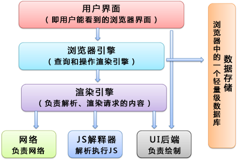

> 浏览器的渲染过程

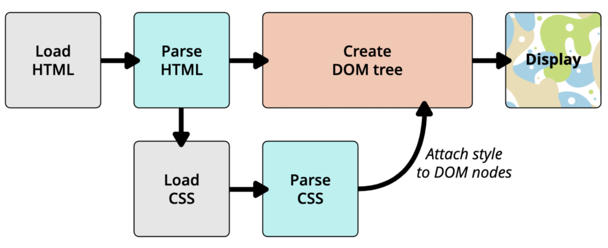

解析`HTML`生成`DOM`树。

解析`CSS`生成`CSSOM`规则树。

将`DOM`树与`CSSOM`规则树合并在一起生成渲染树。

遍历渲染树开始布局，计算每个节点的位置大小信息。

将渲染树每个节点绘制到屏幕。


> 构建`DOM`树

当浏览器接收到服务器响应来的`HTML`文档后，会遍历文档节点，生成`DOM`树。

需要注意的是，`DOM`树的生成过程中可能会被`CSS`和`JS`的加载执行阻塞。

> 构建`CSSOM`规则树

浏览器解析`CSS`文件并生成`CSS`规则树，每个`CSS`文件都被分析成一个`StyleSheet`对象，每个对象都包含`CSS`规则。`CSS`规则对象包含对应于`CSS`语法的选择器和声明对象以及其他对象。

> 渲染阻塞

当浏览器遇到一个 `script `标记时，`DOM `构建将暂停，直至脚本完成执行，然后继续构建`DOM`。每次去执行`JavaScript`脚本都会严重地阻塞`DOM`树的构建，如果`JavaScript`脚本还操作了`CSSOM`，而正好这个`CSSOM`还没有下载和构建，浏览器甚至会延迟脚本执行和构建`DOM`，直至完成其`CSSOM`的下载和构建。

> 构建渲染树

通过`DOM`树和`CSS`规则树我们便可以构建渲染树。浏览器会先从`DOM`树的根节点开始遍历每个可见节点。对每个可见节点，找到其适配的`CSS`样式规则并应用。

渲染树构建完成后，每个节点都是可见节点并且都含有其内容和对应规则的样式。这也是渲染树与`DOM`树的最大区别所在。渲染树是用于显示，那些不可见的元素当然就不会在这棵树中出现了。

除此之外，`display`等于`none`的也不会被显示在这棵树里头，但是`visibility`等于`hidden`的元素是会显示在这棵树里头的。

> 渲染树布局

布局阶段会从渲染树的根节点开始遍历，然后确定每个节点对象在页面上的确切大小与位置，布局阶段的输出是一个盒子模型，它会精确地捕获每个元素在屏幕内的确切位置与大小。

> 渲染树绘制

在绘制阶段，遍历渲染树，调用渲染器的`paint()`方法在屏幕上显示其内容。渲染树的绘制工作是由浏览器的`UI后端组件`完成的。

## 5. BFC

http://t.csdn.cn/HpIOd

> 块格式化上下文（`Block Formatting Context`，`BFC`） 是 `Web `页面的`可视 CSS 渲染`的一部分
>
> 是块级盒子的布局过程发生的区域
>
> 也是浮动元素与其他元素交互的区域
>
> 简单地说, `BFC`就是`css`布局的一个概念, 是页面中的一块渲染区域，有一套渲染规则，决定了其子元素如何布局，以及和其他元素之间的关系和作用。

`BFC`就是为元素提供一个独立的容器，在该容器里按照一定的规则进行布局排列，该容器内的元素不会影响外部的元素，同理，外部的元素也不会影响内部的元素

### 1. BFC 的创建条件

- 根元素（`<html>`）
- **浮动元素(`float` 值不为 `none`）.       (!important)**
- **绝对定位元素（`position`) 值为 `absolute` 或 `fixed`）       (!important)**
- **行内块元素（`display`) 值为 `inline-block`）       (!important)**
- 表格单元格（`display`) 值为 `table-cell`，HTML表格单元格默认值）
- 表格标题（``display`) 值为 `table-caption`，HTML表格标题默认值）
- 匿名表格单元格元素（`display`) 值为 `table`、`table-row`、 `table-row-group`、`table-header-group`、`table-footer-group`（分别是 HTML table、tr、tbody、thead、tfoot 的默认值）或 `inline-table`）
- **`overflow` 值不为 `visible`、`clip` 的块元素       (!important)**
- `display`) 值为 `flow-root` 的元素
- `contain`) 值为 `layout`、`content` 或 `paint` 的元素
- 弹性元素（`display`) 值为 `flex` 或 `inline-flex` 元素的直接子元素），如果它们本身既不是[`flex`](https://developer.mozilla.org/zh-CN/docs/Glossary/Flex_Container)、[`grid`](https://developer.mozilla.org/zh-CN/docs/Glossary/Grid_Container)也不是[`table`](https://developer.mozilla.org/zh-CN/docs/Web/CSS/CSS_Table)容器
- 网格元素（`display`) 值为 `grid` 或 `inline-grid` 元素的直接子元素），如果它们本身既不是[`flex`](https://developer.mozilla.org/zh-CN/docs/Glossary/Flex_Container)、[`grid`](https://developer.mozilla.org/zh-CN/docs/Glossary/Grid_Container)也不是[`table`](https://developer.mozilla.org/zh-CN/docs/Web/CSS/CSS_Table)容器
- 多列容器（`column-count`) 或 `column-width`) 值不为 `auto`，包括`column-count` 为 `1`）
- `column-span` 值为 `all` 的元素始终会创建一个新的 BFC，即使该元素没有包裹在一个多列容器中([规范变更](https://github.com/w3c/csswg-drafts/commit/a8634b96900279916bd6c505fda88dda71d8ec51), [Chrome bug](https://bugs.chromium.org/p/chromium/issues/detail?id=709362))

> 上面的只是为了让你看一眼, 但是不需要记忆呢么多没有用
>
> 一般常见的有

| 条件                                     | 解释       | 补充 |
| ---------------------------------------- | ---------- | ---- |
| 根元素                                   | 即HTML元素 |      |
| `float`的值不为`none`                    |            |      |
| `overflow`的值不为`visible`              |            |      |
| `display`的值为`inline-block`            |            |      |
| `position`的值为`absolute`或`fixed 　　` |            |      |

### 2. BFC  的作用

> 格式化上下文影响布局，通常，我们会为定位和清除浮动创建新的 `BFC`，而不是更改布局，因为它将：

- 包含内部浮动, 清除内部浮动
- 排除外部浮动
- 阻止[外边距重叠](https://developer.mozilla.org/zh-CN/docs/Web/CSS/CSS_Box_Model/Mastering_margin_collapsing)
- 可以阻止元素被浮动元素覆盖
- 自适应两栏布局

### 3. BFC 的布局规则

> 1. 内部的Box会在垂直方向，一个接一个地放置。


> 2. Box垂直方向的距离由`margin`决定。属于同一个`BFC`的两个相邻Box的`margin`会发生重叠


> 3. 每个元素的`margin box`的左边， 与包含块`border box`的左边相接触(对于从左往右的格式化，否则相反)。即使存在浮动也是如此。


> 4. `BFC`的区域不会与`float box`重叠。


> 5. `BFC`就是页面上的一个隔离的独立容器，容器里面的子元素不会影响到外面的元素。反之也如此。


> 6. 计算`BFC`的高度时，浮动元素也参与计算

## 7. css hack

`CSS hack`是通过加入一些特殊的符号，让不同的浏览器识别不同的符号，以达到应用不同的样式的目的。

但是需要注意的是

- `IE10`及以上版本已将条件注释特性移除，使用时需注意。
- 尽可能减少对`CSS Hack`的使用。*`Hack`有风险，使用需谨慎*
- 条件注释只有在`IE浏览器`下才能执行，这个代码在`非IE浏览下被当做注释视`而不见。

> 对浏览前的选择

```css
<!--[if <keywords>? IE <version>?]>
HTML代码块
<![endif]-->
```

`if条件 `共包含6种选择方式

| 关键字 | 含义                           |
| ------ | ------------------------------ |
| 空     | 指定是否IE或IE某个版本         |
| `gt`   | 选择大于指定版本的IE版本       |
| `gte`  | 选择大于或等于指定版本的IE版本 |
| `lt`   | 选择小于指定版本的IE版本       |
| `lte`  | 选择小于或等于指定版本的IE版本 |
| `!`    | 选择除指定版本外的所有IE版本   |

```css
/*小于对于 ie7 的版本*/
<!--[if lte IE 7]>
<style>
.test{color:red;}
</style>
<![endif]-->
```

>对属性的选择

```css
selector{<hack>?property:value<hack>?;}
```

不同的浏览前版本需要使用不同的 `hack` 关键字

| hack关键字 | hack生效的浏览前版本              |
| ---------- | --------------------------------- |
| `_`        | 选择`IE6及以下`。                 |
| `*`        | 选择`IE7及以下`。                 |
| `\9`       | 选择`IE6+`                        |
| `\0`       | 选择`IE8+`和`Opera15以下`的浏览器 |

```css
.test {
	color: #090\9; /* For IE8+ */
	*color: #f00;  /* For IE7 and earlier */
	_color: #ff0;  /* For IE6 and earlier */
}
```

> 对选择器的选择

```css
<hack> selector { 

}
```

| hack关键字 | hack生效的浏览前版本              |
| ---------- | --------------------------------- |
| `_`        | 选择`IE6及以下`。                 |
| `*`        | 选择`IE7及以下`。                 |
| `\9`       | 选择`IE6+`                        |
| `\0`       | 选择`IE8+`和`Opera15以下`的浏览器 |

```css
* html .test { color: #090; }       /* For IE6 and earlier */
* + html .test { color: #ff0; }     /* For IE7 */
.test:lang(zh-cmn-Hans) { color: #f00; }  /* For IE8+ and not IE */
.test:nth-child(1) { color: #0ff; } /* For IE9+ and not IE */
```

> 不推荐使用的原因

`CSS hack`是因为现有浏览器对标准的解析不同，为了兼容各浏览器，所采用的一种补救方法。

现在很多`hacks`已经抛弃了最初的原则，而滥用`hack`会导致浏览器更新之后产生更多的兼容性问题。因此，并不推荐使用`CSS hack`来解决兼容性问题。

## 8. Web字体

`font-family` 需要我们提供一个或多个字体种类名称，浏览器会在列表中搜寻，直到找到它所运行的系统上可用的字体

> 免费字体下载网站

https://www.fonts.net.cn/fonts-zh-1.html

http://iconfont.cn/webfont#!/webfont/index

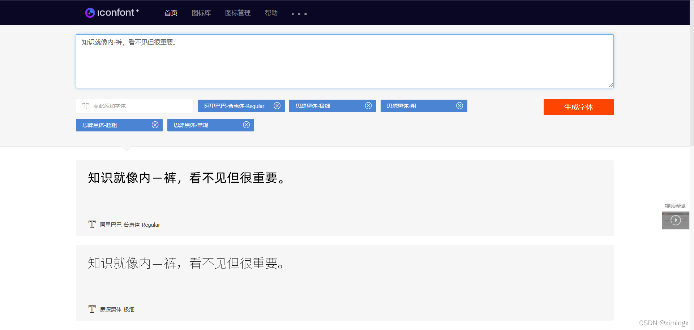

获取 `ttf` 格式的文件

> `web font`的使用流程

1. 将字体放到对应的目录中 
2. 通过`@font-face`来引入字体, 并且设置格式 
3. 使用字体

```css
  @font-face {
    font-family: "my-font";
    src: url(./fonts/font.ttf);
  }
  
  body {
    font-family: "my-font";
  }
```

> `web-fonts`的兼容性

```css
@font-face {
  font-family: "hyfont03";
  src: url("./fonts2/AaJianHaoTi.eot");
  src: url("./fonts2/AaJianHaoTi.eot?#iefix") format("embedded-opentype"), url("./fonts2/AaJianHaoTi.woff") format("woff"),
  url("./fonts2/AaJianHaoTi.ttf") format("truetype"),
  url("./fonts2/AaJianHaoTi.svg#uxfonteditor") format("svg");
  font-style: normal;
  font-weight: normal;
}

body {
  font-family: "hyfont03";
}
```

`url`指定资源的路径 

`format`用于帮助浏览器快速识别字体的格式

## 9. 字体图标

能把字体直接设计成图标的样子

> 好处

- 灵活性：本质其实是文字，可以很随意地改变颜色、产生阴影、透明效果、旋转等等

- 轻量级：一个字体图标要比一系列的图像要小，一旦字体加载了，图标就会马上渲染出来，减少了服务器请求

> 使用网站

1. 阿里`icons`（https://www.iconfont.cn/）


2. 搜索需要的图标

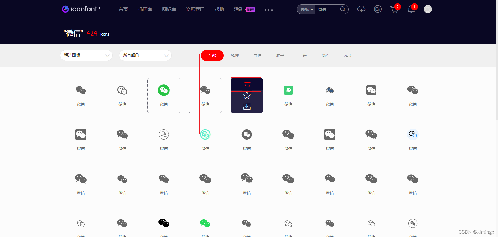

3. 添加到库, 然后打开收藏夹

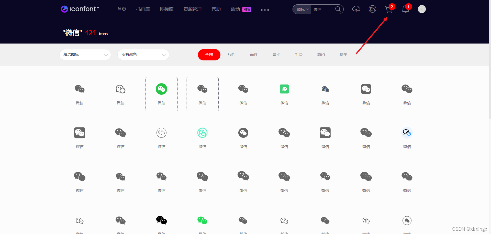

> 使用方式

第一步: 通过`link`引入`iconfont.css`文件

第二步: 使用字体图标

```html
<html>
<head>
  <title>Document</title>
  <link rel="stylesheet" href="./font/iconfont.css">
  <style>
    .icon {
      /* 自定义样式 */
      font-size: 48px;
    }
  </style>
</head>
<body>
  <i class="iconfont icon-zanting icon"></i>
  <i class="iconfont icon-dianzan icon"></i>
  <i class="iconfont icon-bofang icon"></i>
  <i class="iconfont icon-qingchu icon"></i>
</body>
</html>
```

## 10. 精灵图

是一种`CSS`图像合成技术，将各种小图片合并到一张图片上，然后利用`CSS`的背景定位来显示对应的图片部分

一个网页中往往会应用很多小的背景图像作为修饰，当网页中的图像过多时，服务器就会频繁地接收和发送请求图片，造成服务器请求压力过大，这将大大降低页面的加载速度

因此，为了有效地减少服务器接收和发送请求的次数，提高页面的加载速度，出现了 **CSS** 精灵技术

> 优点

 减少网页的http请求数量，加快网页响应速度，减轻服务器压力

> 获取精灵图位置的网站

http://www.spritecow.com/

> 使用方法

1. 移动背景图片位置，此时可以使用 `background-position`
2. 移动的距离就是这个目标图片的 **x** 和 **y** 坐标，注意网页中的坐标有所不同

## 11. cursor

`cursor`可以设置鼠标指针（光标）在元素上面时的显示样式

1. `auto`：浏览器根据上下文决定指针的显示样式，比如根据文本和非文本切换指针样式
2. `default`：由操作系统决定，一般就是一个小箭头
3. `pointer`：一只小手，鼠标指针挪动到链接上面默认就是这个样式
4. `text`：一条竖线，鼠标指针挪动到文本输入框上面默认就是这个样式
5. `none`：没有任何指针显示在元素上面

## 12. auto

`auto` 交给浏览器决定, 并不是居中的作用, 其实感觉我说了等于没说

## 13. ::-webkit-scrollbar

```css
::-webkit-scrollbar /*  滚动条整体部分 */
::-webkit-scrollbar-thumb  /*  滚动条里面的小方块，能向上向下移动（或往左往右移动，取决于是垂直滚动条还是水平滚动条） */
::-webkit-scrollbar-track  /*  滚动条的轨道（里面装有Thumb） */
::-webkit-scrollbar-button /*  滚动条的轨道的两端按钮，允许通过点击微调小方块的位置。 */
::-webkit-scrollbar-track-piece /*  内层轨道，滚动条中间部分（除去） */
::-webkit-scrollbar-corner /*  边角，即两个滚动条的交汇处 */
::-webkit-resizer /*  两个滚动条的交汇处上用于通过拖动调整元素大小的小控件 */
::-webkit-scrollbar {
		display: none; /*  上下滚动，不显示滚动条 */
}
```

## 14. 消除默认样式 CSS reset

比如下拉框这种比较复杂的元素，是自带默认样式的。如果没有这个默认样式，则该元素在页面上不会有任何表现，则必然增加一些工作量。同时，默认样式也会带来一些问题：比如，有些默认样式我们是不需要的；有些默认样式甚至无法去掉。如果我们不需要默认的样式，这里就需要引入一个概念：`CSS Reset`。

> 1. 常见的 `CSS Reset` 方案

- `CSS Tools: Reset CSS`。

  - 链接：<https://meyerweb.com/eric/tools/css/reset/>

- `雅虎的 CSS Reset`。

  - 链接：<https://yuilibrary.com/yui/docs/cssreset/

- 我们可以直接通过 `CDN` 的方式引入：

  - ```css
    <link rel="stylesheet" type="text/css" href="http://yui.yahooapis.com/3.18.1/build/cssreset/cssreset-min.css">
    ```

- 使用通配符

```css
*{
    margin: 0;
    padding: 0;
}

```

上面的几种 `css reset `的解决思路是：将所有的默认样式清零。

---

> 2. Normalize.css

```bash
$ https://github.com/necolas/normalize.css
```

但是，`Normalize.css` 的思路是：既然浏览器提供了这些默认样式，那它就是有意义的。既然不同浏览器的默认样式不一致，那么，`Normalize.css`就将这些默认样式设置为一致。

## 15. 文字移除显示省略号

> 1. 让文字只显示一行，超出显示省略号

```css
p {
      display: inline-block;
      width: 300px;
      /* 控制文本的换行 */
      white-space: nowrap;
  		/* 控制溢出隐藏 */
      overflow: hidden;
  		/* 对文本进行控制， 显示省略号 */
      text-overflow: ellipsis;
}
```

> 2. 多行文本, 显示 n 行,剩下的省略号替代

```css
    p {
      width: 300px;
      display: -webkit-box;
      overflow: hidden;  
      text-overflow: ellipsis;
      /* 最后显示的行数 */
      -webkit-line-clamp: 2;
      -webkit-box-orient: vertical;
    }
```

## 16. 切换照片， 切换背景颜色

封面背景图高斯模糊

- https://github.com/dabanlee/blurify

前端提取主色调， 做渐变处理

## 17. 平滑回到顶部滚动

对页面的某一个部分， 可以使用`scroll-behavior: smooth; `与` scrollTo` 结合使用

```css
:root {
  scroll-behavior: smooth;
}
```

## 18. 响应式设计布局大小

https://v.douyin.com/2x9geLa/

## 19.aspect-ratio

```html
<html>
<head>
  <style>
    .test {
      /*可以控制容器的宽高比*/
      aspect-ratio: 1/1;
    }
  </style>
</head>
<body>
  <div class="test">
    123
  </div>
</body>
</html>
```

## 20. vertical-align

**CSS** 的 **`vertical-align`** 属性使用场景：经常用于设置图片或者表单（行内块元素）和文字垂直对齐

功能：用于设置一个元素的垂直对齐方式，但是它只针对于行内元素或者行内块元素有效

| 值           | 描述                                   |
| ------------ | -------------------------------------- |
| **baseline** | 默认，元素放置在父元素的基线上         |
| **top**      | 把元素的顶端于行中最高元素的顶端对齐   |
| **middle**   | 把此元素放置在父元素的中部             |
| **bottom**   | 把元素的顶端与行中最低的元素的顶端对齐 |

> 图片、表单都属于行内块元素，默认的 **vertical-align** 是基线对齐, 所以会导致一些底部居中问题

**bug**：图片底侧会有一个空白间隙，原因是行内块元素会和文字的基线对齐

1. 给图片添加 `vertical-align: middle | top | bottom;` 等 （推荐）
2. 把图片转换为块级元素 `display: block;`


## 21. 表单域防止拖拽

给文本域添加 `resize: none;` 样式之后，就可以防止被拖拽


## @收藏网站

> 介绍一个实用的 `css `颜色渐变网站 `http://color.oulu.me/`

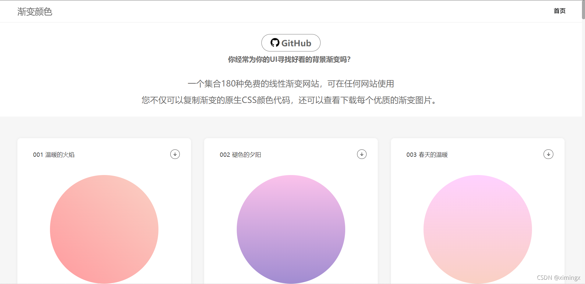


