# 1. 小程序

## 1. 学习小程序的准备

### 1. 基础知识了解

> 小程序的介绍

小程序是一种不需要下载安装即可使用的应用，它实现了触手可及的梦想，使用起来方便快捷，用完即走

疫情的来袭我们各地方都针对的上架了健康码、疫苗接种、健康宝、全民健康等等小程序，让用户简单的在小程序中操作为我们的防疫工作带来了很大的便捷

最初我们提到小程序时，往往指的是微信小程序, 但是目前小程序技术本身已经被各个平台所实现和支持

> 小程序的定位

小程序是介于原生`App`和手机`H5页面`之间的一个产品定位

小程序的主要开发语言是 `JavaScript` ，小程序的开发同普通的网页开发相比有很大的相似性， 但是网页开发渲染线程和脚本线程是互斥的，这也是为什么长时间的脚本运行可能会导致页面失去响应，而在小程序中，二者是分开的，分别运行在不同的线程中。

小程序的逻辑层和渲染层是分开的，逻辑层运行在 `JSCore` 中，并没有一个完整浏览器对象，因而缺少相关的`DOM API`和`BOM API`。这一区别导致了前端开发非常熟悉的一些库，例如 `jQuery`、 `Zepto` 等，在小程序中是无法运行的。

同时 `JSCore` 的环境同 `NodeJS` 环境也是不尽相同，所以一些 `NPM` 的包在小程序中也是无法运行的。

> 开发小程序的技术选型

- 原生小程序开发：

  - 微信小程序：https://developers.weixin.qq.com/miniprogram/dev/framework/
    - 主要技术包括：`WXML、WXSS、JavaScript`； 

  - 支付宝小程序：https://opendocs.alipay.com/mini/developer
    - 主要技术包括：`AXML、ACSS、JavaScript`； 

- 选择框架开发小程序：

  - `mpvue`： 
    - `pvue`是一个使用`Vue`开发小程序的前端框架，也是 支持 微信小程序、百度智能小程序，头条小程序 和 支付宝小程序；
    
    - 该框架在2018年之后就不再维护和更新了，所以目前已经被放弃；
    
  - `wepy`： 
    - `WePY` 是由腾讯开源的，一款让小程序支持组件化开发的框架，通过预编译的手段让开发者可以选择自己喜欢的开发风格去开发小程序。
    - 该框架目前维护的也较少，在前两年还有挺多的项目在使用，不推荐使用；
  - `uni-app`
    - 由`DCloud`团队开发和维护；
    - `uni-app` 是一个使用 `Vue` 开发所有前端应用的框架，开发者编写一套代码，可发布到`iOS、Android、Web`、以及各种小程序（微信/支付宝/百度/头条/飞书/QQ/快手/钉钉/淘宝）、快应用等多个平台。
    - `uni-app`目前是很多公司的技术选型，特别是希望适配`移动端App`的公司；
  - `trao`
    - 由京东团队开发和维护；
    - `taro` 是一个开放式 跨端 跨框架 解决方案，支持使用 `React/Vue/Nerv` 等框架来开发 微信 / 京东 / 百度 / 支付宝 / 字节跳动 / QQ / 飞书 小程序 / H5 / RN 等应用；
    - `taro`因为本身支持`React、Vue`的选择，给了我们更加灵活的选择空间；
  
    - 特别是在`Taro3.x`之后，支持`Vue3、React Hook`写法等；
  
  - 也有其他的技术选项来开发原生App：`ReactNative、Flutter`；

### 2. 账号申请

> https://mp.weixin.qq.com/cgi-bin/wx


在申请完账号之后，我们可以在菜单 “开发”-“开发设置” 看到小程序的 `AppID` 了 。

小程序的 `AppID` 相当于小程序平台的一个身份证，后续你会在很多地方要用到 `AppID` （注意这里要区别于服务号或订阅号的 `AppID`）。

### 3. 下载小程序开发工具

> https://developers.weixin.qq.com/miniprogram/dev/devtools/download.html

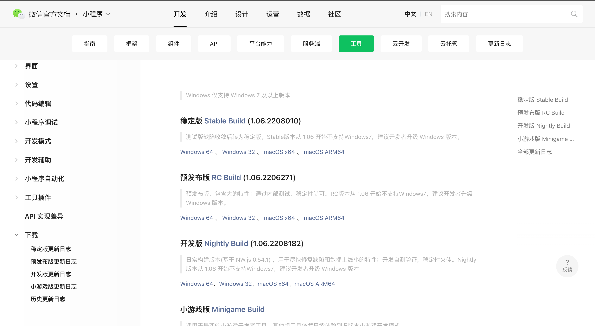

一般而言， 推荐使用稳定版

新建项目选择小程序项目，选择代码存放的硬盘路径，填入刚刚申请到的小程序的 AppID，勾选 "不使用云服务" 

## 2. 架构和配置

### 1. 小程序的架构模型

我们称微信客户端给小程序所提供的环境为宿主环境。小程序借助宿主环境提供的能力，可以完成许多普通网页无法完成的功能，宿主环境为了执行小程序的各种文件：`wxml文件、wxss文件、js文件`

> 双线程模型

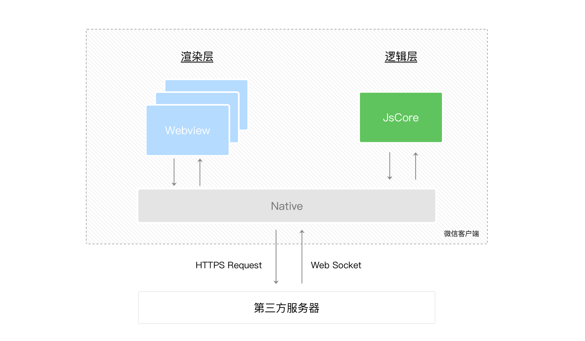

首先，我们来简单了解下小程序的运行环境。小程序的运行环境分成`渲染层`和`逻辑层`，其中 `WXML` 模板和 `WXSS` 样式工作在渲染层，`JS` 脚本工作在逻辑层。

小程序的渲染层和逻辑层分别由2个线程管理：`渲染层`的界面使用了`WebView` 进行渲染；`逻辑层`采用 `JsCore` 线程运行 `JS 脚本`。一个小程序存在多个界面，所以渲染层存在多个 `WebView` 线程，这两个线程的通信会经由微信客户端做中转，逻辑层发送网络请求也经由 `Native` 转发

### 2. 程序运行过程分析

> 程序加载

微信客户端在打开小程序之前，会把整个小程序的代码包下载到本地。

紧接着通过 `app.json` 的 `pages` 字段就可以知道你当前小程序的所有页面路径:

```json
{
  "pages":[
    "pages/index/index",
    "pages/logs/logs"
  ]
}
```

写在 `pages` 字段的第一个页面就是这个小程序的首页（打开小程序看到的第一个页面）。

于是微信客户端就把首页的代码装载进来，通过小程序底层的一些机制，就可以渲染出这个首页。

小程序启动之后，在 `app.js` 定义的 `App` 实例的 `onLaunch` 回调会被执行

```javascript
App({
  onLaunch: function () {
    // 小程序启动之后 触发
  }
})
```

整个小程序只有一个 `App 实例`

> 页面加载

微信客户端会先根据 `index.json` 配置生成一个界面，顶部的颜色和文字你都可以在这个 `json` 文件里边定义好。紧接着客户端就会装载这个页面的 `WXML` 结构和 `WXSS` 样式

```javascript
Page({
  data: { // 参与页面渲染的数据
    logs: []
  },
  onLoad: function () {
    // 页面渲染后 执行
  }
})
```

`Page` 是一个页面构造器，这个构造器就生成了一个页面。在生成页面的时候，小程序框架会把 `data` 数据和 `index.wxml` 一起渲染出最终的结构，于是就得到了你看到的小程序的样子。

在渲染完界面之后，页面实例就会收到一个 `onLoad` 的回调，你可以在这个回调处理你的逻辑。

### 3. 小程序开发的目录

小程序包含一个描述整体程序的 `app` 和多个描述各自页面的 `page`。

一个小程序主体部分由三个文件组成，必须放在项目的根目录，如下：

| 文件                                                         | 必需 | 作用             |
| :----------------------------------------------------------- | :--- | :--------------- |
| [app.js](https://developers.weixin.qq.com/miniprogram/dev/framework/app-service/app.html) | 是   | 小程序逻辑       |
| [app.json](https://developers.weixin.qq.com/miniprogram/dev/framework/config.html) | 是   | 小程序公共配置   |
| [app.wxss](https://developers.weixin.qq.com/miniprogram/dev/framework/view/wxss.html) | 否   | 小程序公共样式表 |

一个小程序页面由四个文件组成，分别是：

| 文件类型                                                     | 必需 | 作用       |
| :----------------------------------------------------------- | :--- | :--------- |
| [js](https://developers.weixin.qq.com/miniprogram/dev/framework/app-service/page.html) | 是   | 页面逻辑   |
| [wxml](https://developers.weixin.qq.com/miniprogram/dev/framework/view/wxml/) | 是   | 页面结构   |
| [json](https://developers.weixin.qq.com/miniprogram/dev/framework/config.html#页面配置) | 否   | 页面配置   |
| [wxss](https://developers.weixin.qq.com/miniprogram/dev/framework/view/wxss.html) | 否   | 页面样式表 |

### 4. 小程序的配置文件

小程序的很多开发需求被规定在了配置文件中

> 常见的配置文件

- `project.config.json`：项目配置文件, 比如项目名称、`appid`等；
  - https://developers.weixin.qq.com/miniprogram/dev/devtools/projectconfig.html

- `sitemap.json`：小程序搜索相关的；
  - https://developers.weixin.qq.com/miniprogram/dev/framework/sitemap.html

- `app.json`：全局配置；

- `page.json`：页面配置；

> `app.json`

`app.json` 是当前小程序的全局配置，包括了小程序的所有页面路径、界面表现、网络超时时间、底部 tab 等。项目里边的 `app.json` 配置内容如下：

```json
{
  "entryPagePath": "pages/index/index",
  "pages": [
    "pages/index/index",
    "pages/order/order",
    "pages/info/info"
  ],
  "window": {
    "backgroundTextStyle": "light",
    "navigationBarBackgroundColor": "#fff",
    "navigationBarTitleText": "Weixin",
    "navigationBarTextStyle": "black"
  },
  "tabBar": {
    "list": [
      {
        "pagePath": "pages/index/index",
        "text": "index",
        "iconPath": "assets/tabbar/20220627041202.png",
        "selectedIconPath": "assets/tabbar/blog5.png"
      },
      {
        "pagePath": "pages/order/order",
        "text": "order",
        "iconPath": "assets/tabbar/blog5.png",
        "selectedIconPath": "assets/tabbar/blog5.png"
      },
      {
        "pagePath": "pages/info/info",
        "text": "info",
        "iconPath": "assets/tabbar/icon-vip.78dceba1.png",
        "selectedIconPath": "assets/tabbar/blog5.png"
      }
    ],
    "position": "bottom"
  },
  "style": "v2",
  "sitemapLocation": "sitemap.json"
}
```

1. `pages`字段 —— 用于描述当前小程序所有页面路径，这是为了让微信客户端知道当前你的小程序页面定义在哪个目录。

2. `window`字段 —— 定义小程序所有页面的顶部背景颜色，文字颜色定义等。

3. `taBar` 底部栏， 底部 `tab` 栏的表现

4. `entryPagePath`, 指定小程序的默认启动路径（首页）

5. `style` 是使用组件库的样式选择

> `project.config.json`

通常大家在使用一个工具的时候，都会针对各自喜好做一些个性化配置，例如界面颜色、编译配置等等，当你换了另外一台电脑重新安装工具的时候，你还要重新配置。

考虑到这点，小程序开发者工具在每个项目的根目录都会生成一个 `project.config.json`，你在工具上做的任何配置都会写入到这个文件，当你重新安装工具或者换电脑工作时，你只要载入同一个项目的代码包，开发者工具就自动会帮你恢复到当时你开发项目时的个性化配置，其中会包括编辑器的颜色、代码上传时自动压缩等等一系列选项。

> `page.json`

这里的 `page.json` 其实用来表示 `pages/index` 目录下的 `index.json` 这类和小程序页面相关的配置。

如果你整个小程序的风格是蓝色调，那么你可以在 `app.json` 里边声明顶部颜色是蓝色即可。

实际情况可能不是这样，可能你小程序里边的每个页面都有不一样的色调来区分不同功能模块，因此我们提供了 `page.json`，让开发者可以独立定义每个页面的一些属性，例如刚刚说的顶部颜色、是否允许下拉刷新等等。

> `sitemap.json`

微信现已开放小程序内搜索，开发者可以通过 `sitemap.json` 配置，或者管理后台页面收录开关来配置其小程序页面是否允许微信索引。

当开发者允许微信索引时，微信会通过爬虫的形式，为小程序的页面内容建立索引。当用户的搜索词条触发该索引时，小程序的页面将可能展示在搜索结果中。 

## 3. 框架使用

整个小程序框架系统分为两部分：`逻辑层(App Service）`和 `视图层（View）`。

小程序提供了自己的视图层描述语言 `WXML` 和 `WXSS`，以及基于 `JavaScript` 的逻辑层框架，并在视图层与逻辑层间提供了数据传输和事件系统，让开发者能够专注于数据与逻辑。

小程序框架的逻辑层并非运行在浏览器中，因此 `JavaScript` 在 web 中一些能力都无法使用，如 `window`，`document` 等。

### 1. 响应的数据绑定

框架的核心是一个响应的数据绑定系统，可以让数据与视图非常简单地保持同步。当做数据修改的时候，只需要在逻辑层修改数据，视图层就会做相应的更新。

用户通过 `this.setData()`方法来进行对数据的修改

```js
// index.js
// 获取应用实例
const app = getApp()

Page({
  data: {
    // 事件绑定
    counter: 0,
  },
  increment() {
    this.setData({
      counter: this.data.counter + 1
    })
  },
  decrement() {
    this.setData({
      counter: this.data.counter - 1
    })
  }
})
```

### 2. 注册小程序

每个小程序都需要在 `app.js` 中调用 `App` 方法注册小程序实例，绑定生命周期回调函数、错误监听和页面不存在监听函数等。

```js
// app.js
App({
  onLaunch (options) {
    // 0. 获取 token
    const token = wx.getStorageSync('token')
    // 1. 判断小程序的进入场景
    // scene 可以判断登陆场景
    console.log(options);
    // mode: "default"
    // path: "pages/index/index"
    // query: {}
    // referrerInfo: {}
    // scene: 1001
    // shareTicket: undefined
    if(!token) {
      wx.setStorageSync('token', "123d312a343566tsdfda")
    }
    this.globalData.token = token
  },
  // 2. 监听生命周期函数，在生命周期中执行对应的业务逻辑，比如在某个生命周期函数中进行登录操作或者请求网络数据；
  onShow (options) {
    // 显示
  },
  onHide () {
    // 隐藏
  },
  onError (msg) {
    console.log(msg)
  },
  // 3. 因为App()实例只有一个，并且是全局共享的（单例对象）
  // 开发者可以添加任意的函数或数据变量到 Object 参数中，用 this 可以访问
  // 但是他不是响应式的
  globalData: {
    "token": "",
    "userinfo": {
      "name": "",
      "level": ""
    }
  }
})
```

整个小程序只有一个 `App` 实例，是全部页面共享的。开发者可以通过 `getApp` 方法获取到全局唯一的 `App` 实例，获取 `App` 上的数据或调用开发者注册在 `App` 上的函数。

### 3. 注册页面

对于小程序中的每个页面，都需要在页面对应的 `js` 文件中进行注册，指定页面的初始数据、生命周期回调、事件处理函数等。

简单的页面可以使用 `Page()` 进行构造。

- 在生命周期函数中发送网络请求，从服务器获取数据；

- 初始化一些数据，以方便被`wxml`引用展示；

- 监听`wxml`中的事件，绑定对应的事件函数；

- 其他一些监听（比如页面滚动、上拉刷新、下拉加载更多等）

```js
//index.js
Page({
  data: {
    text: "This is page data."
  },
  onLoad: function(options) {
    // 页面创建时执行
    // 发送网络请求
    wx.request({
      url: 'url',
    })
  },
  onShow: function() {
    // 页面出现在前台时执行
  },
  onReady: function() {
    // 页面首次渲染完毕时执行
  },
  onHide: function() {
    // 页面从前台变为后台时执行
  },
  onUnload: function() {
    // 页面销毁时执行
  },
  onPullDownRefresh: function() {
    // 触发下拉刷新时执行
  },
  onReachBottom: function() {
    // 页面触底时执行
  },
  onShareAppMessage: function () {
    // 页面被用户分享时执行
  },
  onPageScroll: function() {
    // 页面滚动时执行
  },
  onResize: function() {
    // 页面尺寸变化时执行
  },
  onTabItemTap(item) {
    // tab 点击时执行
    console.log(item.index)
    console.log(item.pagePath)
    console.log(item.text)
  },
  // 事件响应函数
  viewTap: function() {
    this.setData({
      text: 'Set some data for updating view.'
    }, function() {
      // this is setData callback
    })
  },
  // 自由数据
  customData: {
    hi: 'MINA'
  }
})
```

`Page` 构造器适用于简单的页面。但对于复杂的页面， `Page` 构造器可能并不好用。

此时，可以使用 `Component` 构造器来构造页面。 `Component` 构造器的主要区别是：方法需要放在 `methods: { }` 里面

```js
Component({
  data: {
    text: "This is page data."
  },
  methods: {
    onLoad: function(options) {
      // 页面创建时执行
    },
    onPullDownRefresh: function() {
      // 下拉刷新时执行
    },
    // 事件响应函数
    viewTap: function() {
      // ...
    }
  }
})
```

> 小程序页面的生命周期

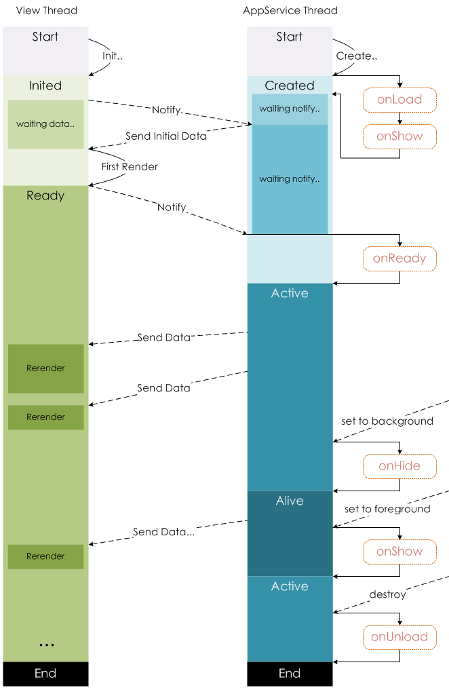

### 4. 模块化

可以将一些公共的代码抽离成为一个单独的 js 文件，作为一个模块。模块只有通过 [`module.exports`](https://developers.weixin.qq.com/miniprogram/dev/reference/api/module.html) 或者 `exports` 才能对外暴露接口。

- `exports` 是 [`module.exports`](https://developers.weixin.qq.com/miniprogram/dev/reference/api/module.html) 的一个引用，因此在模块里边随意更改 `exports` 的指向会造成未知的错误。所以更推荐开发者采用 `module.exports` 来暴露模块接口，除非你已经清晰知道这两者的关系。
- 小程序目前不支持直接引入 `node_modules` , 开发者需要使用到 `node_modules` 时候建议拷贝出相关的代码到小程序的目录中，或者使用小程序支持的`npm`功能。

```javascript
// common.js
function sayHello(name) {
  console.log(`Hello ${name} !`)
}
function sayGoodbye(name) {
  console.log(`Goodbye ${name} !`)
}

module.exports.sayHello = sayHello
exports.sayGoodbye = sayGoodbye
```

在需要使用这些模块的文件中，使用 `require` 将公共代码引入

```javascript
var common = require('common.js')
Page({
  helloMINA: function() {
    common.sayHello('MINA')
  },
  goodbyeMINA: function() {
    common.sayGoodbye('MINA')
  }
})
```

> 文件作用域

在 `JavaScript` 文件中声明的变量和函数只在该文件中有效；不同的文件中可以声明相同名字的变量和函数，不会互相影响。

通过全局函数 `getApp` 可以获取全局的应用实例，如果需要全局的数据可以在 `App()` 中设置，如：

```javascript
// app.js
App({
  globalData: 1
})
```

使用全局的应用实例数据的方式

```javascript
// a.js
// The localValue can only be used in file a.js.
var localValue = 'a'
// Get the app instance.
var app = getApp()
// Get the global data and change it.
app.globalData++
```

### 7 .第三方框架的使用

使用 `Vant` 组件库， 在使用 `npm` 安装好之后需要使用构建 `npm` 才可以使用

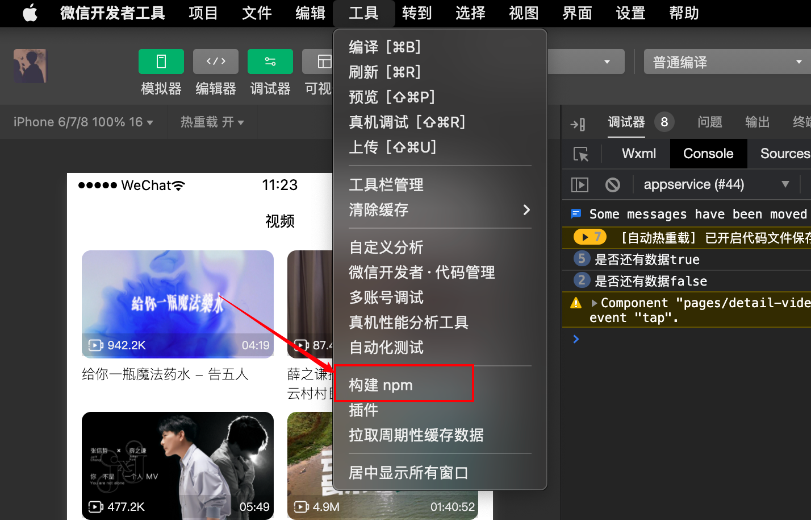

在构建完毕后， 会新增一个 `miniprogram_npm` 的文件夹

组件的使用， 按照 `vant` 组件库官方文档使用

## 4. 组件

### 1. text

文本内容， 具有行内级样式特点

| 属性          | 类型      | 默认值  | 必填 | 说明                                                  | 最低版本 |
| :------------ | :-------- | :------ | :--- | :---------------------------------------------------- | :------- |
| `user-select` | `boolean` | `false` | 否   | 文本是否可选，该属性会使文本节点显示为 `inline-block` | `2.12.1` |
| `decode`      | `boolean` | `false` | 否   | `是否解码`                                            |          |

### 2. progress

进度条。组件属性的长度单位默认为`px`，2.4.0起支持传入单位`rpx/px`

| 属性              | 类型          | 默认值    | 必填 | 说明                                                    | 最低版本                                                     |
| :---------------- | :------------ | :-------- | :--- | :------------------------------------------------------ | :----------------------------------------------------------- |
| `percent`         | `number`      |           | 否   | 百分比0~100                                             | [1.0.0](https://developers.weixin.qq.com/miniprogram/dev/framework/compatibility.html) |
| `show-info`       | `boolean`     | `false`   | 否   | 在进度条右侧显示百分比                                  | [1.0.0](https://developers.weixin.qq.com/miniprogram/dev/framework/compatibility.html) |
| border-radius     | number/string | 0         | 否   | 圆角大小                                                | [2.3.1](https://developers.weixin.qq.com/miniprogram/dev/framework/compatibility.html) |
| font-size         | number/string | 16        | 否   | 右侧百分比字体大小                                      | [2.3.1](https://developers.weixin.qq.com/miniprogram/dev/framework/compatibility.html) |
| stroke-width      | number/string | 6         | 否   | 进度条线的宽度                                          | [1.0.0](https://developers.weixin.qq.com/miniprogram/dev/framework/compatibility.html) |
| `color`           | `string`      | `#09BB07` | 否   | 进度条颜色（请使用activeColor）                         | [1.0.0](https://developers.weixin.qq.com/miniprogram/dev/framework/compatibility.html) |
| `activeColor`     | `string`      | `#09BB07` | 否   | 已选择的进度条的颜色                                    | [1.0.0](https://developers.weixin.qq.com/miniprogram/dev/framework/compatibility.html) |
| `backgroundColor` | `string`      | `#EBEBEB` | 否   | 未选择的进度条的颜色                                    | [1.0.0](https://developers.weixin.qq.com/miniprogram/dev/framework/compatibility.html) |
| active            | boolean       | false     | 否   | 进度条从左往右的动画                                    | [1.0.0](https://developers.weixin.qq.com/miniprogram/dev/framework/compatibility.html) |
| active-mode       | string        | backwards | 否   | backwards: 动画从头播；forwards：动画从上次结束点接着播 | [1.7.0](https://developers.weixin.qq.com/miniprogram/dev/framework/compatibility.html) |
| `duration`        | `number`      | `30`      | 否   | 进度增加1%所需毫秒数                                    | [2.8.2](https://developers.weixin.qq.com/miniprogram/dev/framework/compatibility.html) |
| bindactiveend     | eventhandle   |           | 否   | 动画完成事件                                            | [2.4.1](https://developers.weixin.qq.com/miniprogram/dev/framework/compatibility.html) |

### 3. button

默认样式： `dispaly: block;`

> 大小样式

| size | string | default   | 否       | 按钮的大小 |      |
| ---- | ------ | --------- | -------- | ---------- | ---- |
|      |        | `default` | 默认大小 |            |      |
|      |        | `mini`    | 小尺寸   |            |      |

> 默认颜色样式

| type | string | default        |
| :--- | :----- | :------------- |
|      |        | `primary` 绿色 |
|      |        | `default` 白色 |
|      |        | `warn` 红色    |

> 开放功能

| open-type | string |           |                                                              |
| --------- | ------ | --------- | ------------------------------------------------------------ |
|           |        | `contact` | 打开客服会话，如果用户在会话中点击消息卡片后返回小程序，可以从 `bindcontact` 回调中获得具体信息 |

> 镂空， 禁用， 加载效果

| plain    | boolean | false | 否   | 按钮是否镂空，背景色透明  | 1.0.0 |      |
| -------- | ------- | ----- | ---- | ------------------------- | ----- | ---- |
| disabled | boolean | false | 否   | 是否禁用                  | 1.0.0 |      |
| loading  | boolean | false | 否   | 名称前是否带 loading 图标 | 1.0.0 |      |

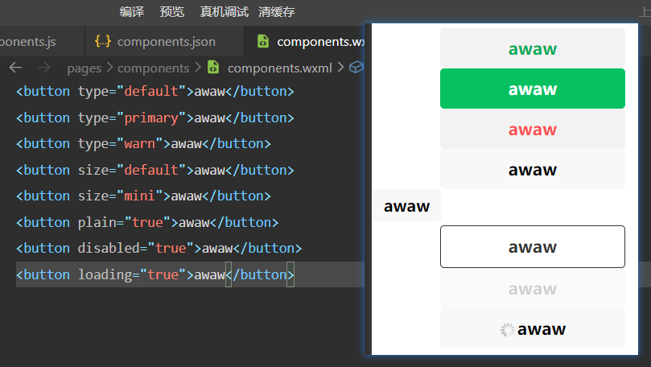

> 点击效果

| hover-class | string                 | button-hover | 否    | 指定按钮按下去的样式类。当 `hover-class="none"` 时，没有点击态效果 | [1.0.0](https://developers.weixin.qq.com/miniprogram/dev/framework/compatibility.html) |                                                              |
| ----------- | ---------------------- | ------------ | ----- | ------------------------------------------------------------ | ------------------------------------------------------------ | ------------------------------------------------------------ |
|             | hover-stop-propagation | boolean      | false | 否                                                           | 指定是否阻止本节点的祖先节点出现点击态                       | [1.5.0](https://developers.weixin.qq.com/miniprogram/dev/framework/compatibility.html) |
|             | hover-start-time       | number       | 20    | 否                                                           | 按住后多久出现点击态，单位毫秒                               | [1.0.0](https://developers.weixin.qq.com/miniprogram/dev/framework/compatibility.html) |
|             | hover-stay-time        | number       | 70    | 否                                                           | 手指松开后点击态保留时间，单位毫秒                           |                                                              |

但是需要注意 `getUserInfo` 无法获取用户信息

```html
<button bind:tap="getUserInfo">getUserInfo</button>
```

需要使用 `wx.getUserProfile` 来获得用户的信息 

```js
getUserInfo() {
  wx.getUserProfile({
      "desc": "用于完善会员资料",
      "success": (res) => {
          console.log(res);
      }
  })
},
```

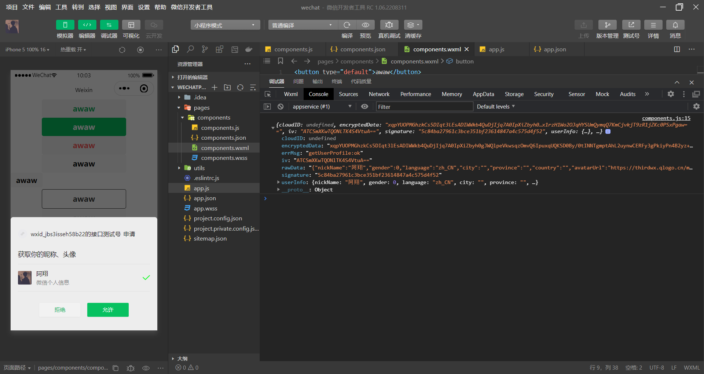

### 4. view

`display： block;`

| 属性                   | 类型    | 默认值 | 必填 | 说明                                                         | 最低版本 |
| :--------------------- | :------ | :----- | :--- | :----------------------------------------------------------- | :------- |
| `hover-class`          | string  | none   | 否   | 指定按下去的样式类。当 `hover-class="none"` 时，没有点击态效果 | 1.0.0    |
| hover-stop-propagation | boolean | false  | 否   | 指定是否阻止本节点的祖先节点出现点击态                       | 1.5.0    |
| hover-start-time       | number  | 50     | 否   | 按住后多久出现点击态，单位毫秒                               | 1.0.0    |
| hover-stay-time        | number  | 400    | 否   | 手指松开后点击态保留时间，单位毫秒                           | 1.0.0    |

### 5. image

图片。支持 JPG、PNG、SVG、WEBP、GIF 等格式，[2.3.0](https://developers.weixin.qq.com/miniprogram/dev/framework/compatibility.html) 起支持云文件ID。

| 属性   | 类型   | 默认值        | 必填 | 说明                 | 最低版本                                                     |
| :----- | :----- | :------------ | :--- | :------------------- | ------------------------------------------------------------ |
| `src`  | string |               | 否   | 图片资源地址         | [1.0.0](https://developers.weixin.qq.com/miniprogram/dev/framework/compatibility.html) |
| `mode` | string | `scaleToFill` | 否   | 图片裁剪、缩放的模式 | [1.0.0](https://developers.weixin.qq.com/miniprogram/dev/framework/compatibility.html) |

> `mode` 属性值

| `scaleToFill` | 缩放模式，不保持纵横比缩放图片，使图片的宽高完全拉伸至填满 `image` 元素 |
| ------------- | ------------------------------------------------------------ |
| aspectFit     | 缩放模式，保持纵横比缩放图片，使图片的长边能完全显示出来。也就是说，可以完整地将图片显示出来。 |
| aspectFill    | 缩放模式，保持纵横比缩放图片，只保证图片的短边能完全显示出来。也就是说，图片通常只在水平或垂直方向是完整的，另一个方向将会发生截取。 |
| `widthFix`    | `缩放模式，宽度不变，高度自动变化，保持原图宽高比不变`       |
| heightFix     | 缩放模式，高度不变，宽度自动变化，保持原图宽高比不变         |
| top           | 裁剪模式，不缩放图片，只显示图片的顶部区域                   |
| bottom        | 裁剪模式，不缩放图片，只显示图片的底部区域                   |
| center        | 裁剪模式，不缩放图片，只显示图片的中间区域                   |
| left          | 裁剪模式，不缩放图片，只显示图片的左边区域                   |
| right         | 裁剪模式，不缩放图片，只显示图片的右边区域                   |
| top left      | 裁剪模式，不缩放图片，只显示图片的左上边区域                 |
| top right     | 裁剪模式，不缩放图片，只显示图片的右上边区域                 |
| bottom left   | 裁剪模式，不缩放图片，只显示图片的左下边区域                 |
| bottom right  | 裁剪模式，不缩放图片，只显示图片的右下边区域                 |

> 选择本地图片展示

```html
<!-- pages/components/components.xml -->
<button bind:tap="onChooseImage">choose</button>
<image src="{{imhUrl}}"></image>
```

```js
// pages/components/components.js
Page({
  data: {
    imhUrl: ""
  },
  onChooseImage() {
    wx.chooseMedia({
        mediaType: ['image'],
        sourceType: ['album', 'camera'],
        camera: 'back',
        success: (res) => {
            let imgPath = res.tempFiles[0].tempFilePath;
            this.setData({
                imhUrl: imgPath
            })
        }
    })
  }
})
```

> 注意

`image`组件默认宽度`320px`、高度`240px`

### 6. scrollview

`scroll-view`可以实现局部滚动，常见属性如下

| 属性              | 类型            | 默认值  | 必填 | 说明                                                         |
| :---------------- | :-------------- | :------ | :--- | :----------------------------------------------------------- |
| `scroll-x`        | boolean         | `false` | 否   | 允许横向滚动                                                 |
| `scroll-y`        | boolean         | `false` | 否   | 允许纵向滚动                                                 |
| `upper-threshold` | `number/string` | 50      | 否   | 距顶部/左边多远时，触发 `scrolltoupper` 事件                 |
| `lower-threshold` | `number/strin`g | 50      | 否   | 距底部/右边多远时，触发 `scrolltolower` 事件                 |
| scroll-top        | number/string   |         | 否   | 设置竖向滚动条位置                                           |
| scroll-left       | number/string   |         | 否   | 设置横向滚动条位置                                           |
| `enable-flex`     | `boolean`       | `false` | 否   | 启用 `flexbox` 布局。开启后，当前节点声明了 `display: flex` 就会成为 `flex container`，并作用于其孩子节点。 |

实现滚动效果必须添加`scroll-x`或者`scroll-y`属性

垂直方向滚动必须设置`scroll-view`一个高度, 默认宽度为占据父元素的宽度

### 7. 组件的共同属性

| 属性           | 含义           |
| -------------- | -------------- |
| `id`           | 组件的唯一标识 |
| `class`        | 组建的样式类   |
| `style`        | 内联样式       |
| `hidden`       | 是否显示       |
| `data-*`       | 自定义属性     |
| `bind*/catch*` | 事件绑定       |

## 5. 核心语法

### 1. wxss

页面样式的三种写法： `行内样式、页面样式、全局样式`

优先级依次是：`行内样式 > 页面样式 > 全局样式`

支持的选择器有 `#id .class element 后代 ::before ::after`

#### 1. 新增尺寸 rpx

`rpx`: 可以根据屏幕宽度进行自适应。规定屏幕宽为`750rpx`。

如在 `iPhone6` 上，屏幕宽度为`375px`，共有`750个物理像素`，则`750rpx = 375px = 750物理像素`，`1rpx = 0.5px = 1物理像素`

 开发微信小程序时设计师可以用 `iPhone6` 作为视觉稿的标准。

#### 2. 样式导入

使用`@import`语句可以导入外联样式表，`@import`后跟需要导入的外联样式表的相对路径，用`;`表示语句结束。

```less
/** common.wxss **/
.small-p {
  padding:5px;
}


/** app.wxss **/
@import "common.wxss";
.middle-p {
  padding:15px;
}
```

#### 3. 微信小程序中使用 sass


#### 4. Media Query

有时，对于不同尺寸的显示区域，页面的布局会有所差异。此时可以使用 media query 来解决大多数问题。

```css
.my-class {
  width: 40px;
}

@media (min-width: 480px) {
  /* 仅在 480px 或更宽的屏幕上生效的样式规则 */
  .my-class {
    width: 200px;
  }
}
```

### 2. wxml

WXS（WeiXin Script）是小程序的一套脚本语言，结合 `WXML`，可以构建出页面的结构。

> 严格规范

- 类似于`HTML`代码：比如可以写成单标签，也可以写成双标签

- 必须有严格的闭合：没有闭合会导致编译错误

- 大小写敏感：`class`和`Class`是不同的属性

#### 1. Mustache语法

开发中, 界面上展示的数据并不是写死的, 而是会根据服务器返回的数据，或者用户的操作来进行改变

`小程序`和`Vue`一样, 提供了插值语法: `Mustache语法(双大括号)`

#### 2. 逻辑判断

`wx:if – wx:elif – wx:else`

当条件为`true`时, `view`组件会渲染出来

当条件为`false`时, `view`组件不会渲染出来

#### 3. hidden

`hidden`是所有的组件都默认拥有的属性； 

当`hidden`属性为`true`时, 组件会被隐藏； 

当`hidden`属性为`false`时, 组件会显示出来；

> `hidden`和`wx:if`的区别 

`hidden`控制隐藏和显示是控制是否添加`hidden`属性 

`wx:if`是控制组件是否渲染的

#### 4. 列表渲染

默认情况下，遍历后在`wxml`中可以使用一个变量`index`，保存的是当前遍历数据的下标值。

数组中对应某项的数据，使用变量名`item`获取

> `item/index`名称

默认情况下，`item` – `index`的名字是固定的

者当出现多层遍历时，名字会重复, 这个时候，我们可以指定`item`和`index`的名称

```html
<block wx:for="{{color}}" wx:for-item="books" wx:for-index="i">
    <view>{{books.name}}</view>
</block>
```

> `key`作用

这个其实和小程序内部也使用了虚拟`DOM`有关系（和`Vue`、`React`很相似）。

当某一层有很多相同的节点时，也就是列表节点时，我们希望插入、删除一个新的节点，可以更好的复用节点；

> `wx:key` 的值以两种形式提供

- 字符串，代表在 `for` 循环的 `array` 中 `item` 的某个 `property`，该 `property` 的值需要是列表中唯一的字符串或数字，且不能 动态改变。
- 保留关键字 `*this` 代表在 `for` 循环中的 `item` 本身，这种表示需要 `item` 本身是一个唯一的字符串或者数字。

#### 5. block

某些情况下，我们需要使用`wx:if` 或 `wx:for`时，可能需要包裹一组组件标签,  `<block/>`并不是一个组件，它仅仅是一个包装元素，不会在页面中做任何渲染，只接受控制属性。

将遍历和判断的属性放在`block`便签中，不影响普通属性的阅

读，提高代码的可读性。

#### 6. 双向绑定语法

在 WXML 中，普通的属性的绑定是单向的。

```html
<input value="{{value}}" />
```

如果使用 `this.setData({ value: 'leaf' }) 来更新 value` ，this.data.value 和输入框的中显示的值都会被更新为 leaf ；但如果用户修改了输入框里的值，却不会同时改变 this.data.value 。

如果需要在用户输入的同时改变 this.data.value ，需要借助简易双向绑定机制。此时，可以在对应项目之前加入 model: 前缀：

```html
<input model:value="{{value}}" />
```

这样，如果输入框的值被改变了， this.data.value 也会同时改变。同时， WXML 中所有绑定了 value 的位置也会被一同更新， 数据监听器 也会被正常触发。

#### 7. 节点信息

最常见的用法是使用这个接口来查询某个节点的当前位置，以及界面的滚动位置

```js
const query = wx.createSelectorQuery()
query.select('#the-id').boundingClientRect(function(res){
  res.top // #the-id 节点的上边界坐标（相对于显示区域）
})
query.selectViewport().scrollOffset(function(res){
  res.scrollTop // 显示区域的竖直滚动位置
})
query.exec()
```

#### 8. 横竖屏幕

##### 1. 在手机上启用屏幕旋转支持

从小程序基础库版本 [2.4.0](https://developers.weixin.qq.com/miniprogram/dev/framework/compatibility.html) 开始，小程序在手机上支持屏幕旋转。使小程序中的页面支持屏幕旋转的方法是：在 `app.json` 的 `window` 段中设置 `"pageOrientation": "auto"` ，或在页面 json 文件中配置 `"pageOrientation": "auto"` 。

以下是在单个页面 json 文件中启用屏幕旋转的示例。

```json
{
  "pageOrientation": "auto"
}
```

如果页面添加了上述声明，则在屏幕旋转时，这个页面将随之旋转，显示区域尺寸也会随着屏幕旋转而变化。

从小程序基础库版本 [2.5.0](https://developers.weixin.qq.com/miniprogram/dev/framework/compatibility.html) 开始， `pageOrientation` 还可以被设置为 `landscape` ，表示固定为横屏显示。

#### 9. 模版使用

```html
<!--wxml-->
<template name="staffName">
  <view>
    FirstName: {{firstName}}, LastName: {{lastName}}
  </view>
</template>

<template is="staffName" data="{{...staffA}}"></template>
<template is="staffName" data="{{...staffB}}"></template>
<template is="staffName" data="{{...staffC}}"></template>
```


```js
// page.js
Page({
  data: {
    staffA: {firstName: 'Hulk', lastName: 'Hu'},
    staffB: {firstName: 'Shang', lastName: 'You'},
    staffC: {firstName: 'Gideon', lastName: 'Lin'}
  }
})
```

#### 10. 可视化

##### 1. 第一步：在 WXML 中添加 canvas 组件

```html
<!-- 2d 类型的 canvas -->
<canvas id="myCanvas" type="2d" style="border: 1px solid; width: 300px; height: 150px;" />
```

首先需要在 WXML 中添加 [canvas 组件](https://developers.weixin.qq.com/miniprogram/dev/component/canvas.html)。

指定 `id="myCanvas"` 唯一标识一个 canvas，用于后续获取 [Canvas 对象](https://developers.weixin.qq.com/miniprogram/dev/api/canvas/Canvas.html)。

指定 `type` 用于定义画布类型，本例子使用 `type="2d"` 示例。

##### 2.  第二步：获取 Canvas 对象和渲染上下文

```js
wx.createSelectorQuery()
    .select('#myCanvas') // 在 WXML 中填入的 id
    .fields({ node: true, size: true })
    .exec((res) => {
        // Canvas 对象
        const canvas = res[0].node
        // 渲染上下文
        const ctx = canvas.getContext('2d')
    })
```

通过 [SelectorQuery](https://developers.weixin.qq.com/miniprogram/dev/api/wxml/SelectorQuery.html) 选择上一步的 canvas，可以获取到 [Canvas 对象](https://developers.weixin.qq.com/miniprogram/dev/api/canvas/Canvas.html)。

再通过 [Canvas.getContext](https://developers.weixin.qq.com/miniprogram/dev/api/canvas/Canvas.getContext.html)，我们可以获取到 [渲染上下文 RenderingContext](https://developers.weixin.qq.com/miniprogram/dev/api/canvas/RenderingContext.html)。

后续的画布操作与渲染操作，都需要通过这两个对象来实现。

##### 3. 第三步：初始化 Canvas

```js
wx.createSelectorQuery()
    .select('#myCanvas') // 在 WXML 中填入的 id
    .fields({ node: true, size: true })
    .exec((res) => {
        // Canvas 对象
        const canvas = res[0].node
        // 渲染上下文
        const ctx = canvas.getContext('2d')

        // Canvas 画布的实际绘制宽高
        const width = res[0].width
        const height = res[0].height

        // 初始化画布大小
        const dpr = wx.getWindowInfo().pixelRatio
        canvas.width = width * dpr
        canvas.height = height * dpr
        ctx.scale(dpr, dpr)
    })
```

canvas 的宽高分为渲染宽高和逻辑宽高：

- 渲染宽高为 canvas 画布在页面中所实际占用的宽高大小，即通过对节点进行 [boundingClientRect](https://developers.weixin.qq.com/miniprogram/dev/api/wxml/NodesRef.boundingClientRect.html) 请求获取到的大小。
- 逻辑宽高为 canvas 在渲染过程中的逻辑宽高大小，如绘制一个长方形与逻辑宽高相同，最终长方形会占满整个画布。逻辑宽高默认为 `300 * 150`。

不同的设备上，存在物理像素和逻辑像素不相等的情况，所以一般我们需要用 [wx.getWindowInfo](https://developers.weixin.qq.com/miniprogram/dev/api/base/system/wx.getWindowInfo.html) 获取设备的像素比，乘上 canvas 的渲染大小，作为画布的逻辑大小。

##### 4. 第四步：进行绘制

[在开发者工具中预览效果](https://developers.weixin.qq.com/s/smH8LGmn7Lz5)

```js
// 省略上面初始化步骤，已经获取到 canvas 对象和 ctx 渲染上下文

// 清空画布
ctx.clearRect(0, 0, width, height)

// 绘制红色正方形
ctx.fillStyle = 'rgb(200, 0, 0)';
ctx.fillRect(10, 10, 50, 50);

// 绘制蓝色半透明正方形
ctx.fillStyle = 'rgba(0, 0, 200, 0.5)';
ctx.fillRect(30, 30, 50, 50);
```

通过 [渲染上下文](https://developers.weixin.qq.com/miniprogram/dev/api/canvas/RenderingContext.html) 上的绘图 api，我们可以在画布上进行任意的绘制。

##### 5. 进阶使用

> 绘制图片

[在开发者工具中预览效果](https://developers.weixin.qq.com/s/2FHoZGmA7XzI)

```js
// 省略上面初始化步骤，已经获取到 canvas 对象和 ctx 渲染上下文

// 图片对象
const image = canvas.createImage()
// 图片加载完成回调
image.onload = () => {
    // 将图片绘制到 canvas 上
    ctx.drawImage(image, 0, 0)
}
// 设置图片src
image.src = 'https://open.weixin.qq.com/zh_CN/htmledition/res/assets/res-design-download/icon64_wx_logo.png'
```

通过 [Canvas.createImage](https://developers.weixin.qq.com/miniprogram/dev/api/canvas/Canvas.createImage.html) 我们可以创建图片对象并加载图片。当图片加载完成触发 `onload` 回调之后，使用 `ctx.drawImage` 即可将图片绘制到 canvas 上。

> 生成图片

[在开发者工具中预览效果](https://developers.weixin.qq.com/s/FPIGmGmT7fzB)

```js
// 省略上面初始化步骤，已经获取到 canvas 对象和 ctx 渲染上下文

// 绘制红色正方形
ctx.fillStyle = 'rgb(200, 0, 0)';
ctx.fillRect(10, 10, 50, 50);

// 绘制蓝色半透明正方形
ctx.fillStyle = 'rgba(0, 0, 200, 0.5)';
ctx.fillRect(30, 30, 50, 50);

// 生成图片
wx.canvasToTempFilePath({
    canvas,
    success: res => {
        // 生成的图片临时文件路径
        const tempFilePath = res.tempFilePath
    },
})
```

通过 [wx.canvasToTempFilePath](https://developers.weixin.qq.com/miniprogram/dev/api/canvas/wx.canvasToTempFilePath.html) 接口，可以将 canvas 上的内容生成图片临时文件。

> 帧动画

[在开发者工具中预览效果](https://developers.weixin.qq.com/s/fmIKNGmF7tzV)

```js
// 省略上面初始化步骤，已经获取到 canvas 对象和 ctx 渲染上下文

const startTime = Date.now()

// 帧渲染回调
const draw = () => {
  const time = Date.now()
  // 计算经过的时间
  const elapsed = time - startTime

  // 计算动画位置
  const n = Math.floor(elapsed / 3000)
  const m = elapsed % 3000
  const dx = (n % 2 ? 0 : 1) + (n % 2 ? 1 : -1) * (m < 2500 ? easeOutBounce(m / 2500) : 1)
  const x = (width - 50) * dx

  // 渲染
  ctx.clearRect(0, 0, width, height)
  ctx.fillStyle = 'rgb(200, 0, 0)';
  ctx.fillRect(x, height / 2 - 25, 50, 50);

  // 注册下一帧渲染
  canvas.requestAnimationFrame(draw)
}

draw()
```

通过 [Canvas.requestAnimationFrame](https://developers.weixin.qq.com/miniprogram/dev/api/canvas/Canvas.requestAnimationFrame.html) 可以注册动画帧回调，在回调内进行动画的逐帧绘制。

> 自定义字体

通过 [wx.loadFontFace](https://developers.weixin.qq.com/miniprogram/dev/api/ui/font/wx.loadFontFace.html) 可以为 Canvas 加载自定义字体。

[在开发者工具中预览效果](https://developers.weixin.qq.com/s/GAIwtGmB7Ez3)

> 录制视频

通过 [MediaRecorder](https://developers.weixin.qq.com/miniprogram/dev/api/media/media-recorder/MediaRecorder.html) 可以将 Canvas 内容录制为视频并保存。

[在开发者工具中预览效果](https://developers.weixin.qq.com/s/MCz3kPmC7zpa)

##### 6. WebGL

[在开发者工具中预览效果](https://developers.weixin.qq.com/s/9gIuqGmN7QzX)

```html
<canvas type="webgl" id="myCanvas" />
// 省略上面初始化步骤，已经获取到 canvas 对象

const gl = canvas.getContext('webgl') // 获取 webgl 渲染上下文
```

#### 11. 自定义tabbar

##### 1. 配置信息

- 在 `app.json` 中的 `tabBar` 项指定 `custom` 字段，同时其余 `tabBar` 相关配置也补充完整。
- 所有 tab 页的 json 里需声明 `usingComponents` 项，也可以在 `app.json` 全局开启。

```json
{
  "pages": [
    "pages/index/index",
    "pages/logs/logs"
  ],
  "tabBar": {
    "custom": true,
    "color": "#999999",
    "selectedColor": "#000000",
    "backgroundColor": "#ffffff",
    "list": [
      {
        "pagePath": "pages/index/index",
        "text": "首页"
      },
      {
        "pagePath": "pages/logs/logs",
        "text": "日志"
      }
    ]
  },
  "usingComponents": {
    "tabar": "custom-tab-bar/index"
  },
}
```

##### 2. 添加 tabBar 代码文件

在代码根目录下创建文件夹 `custom-tab-bar`

```text
custom-tab-bar/index.js
custom-tab-bar/index.json
custom-tab-bar/index.wxml
custom-tab-bar/index.wxss
```

##### 3. 编写 tabBar 代码

用自定义组件的方式编写即可，该自定义组件完全接管 tabBar 的渲染。另外，自定义组件新增 `getTabBar` 接口，可获取当前页面下的自定义 tabBar 组件实例。

```html
<view class="tab-container">
	<view bindtap="navTab" data-index="{{0}}">index</view>
	<view bindtap="navTab" data-index="{{1}}">log</view>
</view>
```


```js
Component({
  properties: {},
  data: {},
  methods: {
    navTab(e) {
      const value = e.currentTarget.dataset.index
      switch (value) {
        case 0:
        wx.switchTab({
          url: '/pages/index/index',
        })  
        break;
        case 1:
        wx.switchTab({
          url: '/pages/logs/logs',
        })
        break;
      }
    }
  }
});

```


```css
.tab-container {
	position: fixed;
	bottom: 0;
	left: 0;
	right: 0;
	display: flex;
	justify-content: space-evenly;
	align-items: center;
	height: 66px;
	background: #ccc;
}
```

#### 12. 自定义导航栏

`app.json`  中的部分配置

| 属性            | 类型   | 默认值  | 描述                                                         |
| --------------- | ------ | ------- | ------------------------------------------------------------ |
| navigationStyle | string | default | 导航栏样式，仅支持以下值： `default` 默认样式 `custom` 自定义导航栏，只保留右上角胶囊按钮。 |


### 3. wxs

`WXS`（`WeiXin Script`）是小程序的一套脚本语言，结合 `WXML`，可以构建出页面的结构。

官方：`WXS` 与 `JavaScript` 是不同的语言，有自己的语法，并不和 `JavaScript` 一致。（不过基本一致）

在`WXML`中是不能直接调用`Page/Component`中定义的函数的, 但是某些情况, 我们可以希望使用函数来处理`WXML`中的数据(类似于`Vue`中的过滤器)，这个时候就使用`WXS`了

#### 1. 两种写法

- 写在`<wxs>`标签中 

  - `wxml`

  - ```html
    <wxs module="format">
        // 不可以使用es6语法
        function formatPrice(price) {
            return "$" + price.toFixed(2);
        }
        // 必须使用 commonjs 规范
        module.exports = {
            formatPrice: formatPrice
        };
    </wxs>
    
    <view>{{ format.formatPrice(number) }}</view>
    ```

- 写在以`.wxs`结尾的文件中

  - `wxs`

  - ```js
    function formatPrice(price) {
        return "$" + price.toFixed(2);
    }
    
    module.exports = {
        formatPrice: formatPrice
    };
    ```

  - `wxml`

  - ```html
    <wxs module="format" src="/utils/format.wxs"></wxs>
    
    <view>{{ format.formatPrice(number) }}</view>
    ```

> 每一个 `.wxs` 文件和`<wxs>`标签都是一个单独的模块。

每个模块都有自己独立的作用域。即在一个模块里面定义的变量与函数，默认为私有的，对其他模块不可见；

一个模块要想对外暴露其内部的私有变量与函数，只能通过 `module.exports` 实现；

> 注意

1. WXS 不依赖于运行时的基础库版本，可以在所有版本的小程序中运行。
2. WXS 与 JavaScript 是不同的语言，有自己的语法，并不和 JavaScript 一致。
3. WXS 的运行环境和其他 JavaScript 代码是隔离的，WXS 中不能调用其他 JavaScript 文件中定义的函数，也不能调用小程序提供的API。
4. WXS 函数不能作为组件的事件回调。
5. 由于运行环境的差异，在 iOS 设备上小程序内的 WXS 会比 JavaScript 代码快 2 ~ 20 倍。在 android 设备上二者运行效率无差异。

### 4. 事件

小程序需要经常和用户进行某种交互，比如点击界面上的某个按钮或者区域，比如滑动了某个区域

事件是视图层到逻辑层的通讯方式； 

事件可以将用户的行为反馈到逻辑层进行处理； 

事件可以绑定在组件上，当触发事件时，就会执行逻辑层中对应的事件处理函数； 

事件对象可以携带额外信息，如 `id, dataset, touches`；

#### 1. 冒泡事件列表

WXML的冒泡事件列表：

| 类型               | 触发条件                                                     | 最低版本                                                     |
| :----------------- | :----------------------------------------------------------- | :----------------------------------------------------------- |
| touchstart         | 手指触摸动作开始                                             |                                                              |
| touchmove          | 手指触摸后移动                                               |                                                              |
| touchcancel        | 手指触摸动作被打断，如来电提醒，弹窗                         |                                                              |
| touchend           | 手指触摸动作结束                                             |                                                              |
| tap                | 手指触摸后马上离开                                           |                                                              |
| longpress          | 手指触摸后，超过350ms再离开，如果指定了事件回调函数并触发了这个事件，tap事件将不被触发 | [1.5.0](https://developers.weixin.qq.com/miniprogram/dev/framework/compatibility.html) |
| longtap            | 手指触摸后，超过350ms再离开（推荐使用 longpress 事件代替）   |                                                              |
| transitionend      | 会在 WXSS transition 或 wx.createAnimation 动画结束后触发    |                                                              |
| animationstart     | 会在一个 WXSS animation 动画开始时触发                       |                                                              |
| animationiteration | 会在一个 WXSS animation 一次迭代结束时触发                   |                                                              |
| animationend       | 会在一个 WXSS animation 动画完成时触发                       |                                                              |
| touchforcechange   | 在支持 3D Touch 的 iPhone 设备，重按时会触发                 | [1.9.90](https://developers.weixin.qq.com/miniprogram/dev/framework/compatibility.html) |

#### 2 事件的处理过程

事件是通过`bind/catch`这个属性绑定在组件上的（和普通的属性写法很相似, 以`key=“value”`形式）； 

`key`以`bind`或`catch`开头, 从1.5.0版本开始, 可以在`bind`和`catch`后加上一个冒号； 

 同时在当前页面的`Page构造器`中定义对应的事件处理函数, 如果没有对应的函数, 触发事件时会报错； 

比如当用户点击该`button`区域时，达到触发条件生成事件`tap`，该事件处理函数会被执行，同时还会收到一个事件对象 `event`。

#### 3. 事件对象 `event`

当某个事件触发时, 会产生一个事件对象, 并且这个对象被传入到回调函数中

> 事件参数的传递

- 格式：`data-属性的名称 `
- 获取：`event.currentTarget.dataset.属性的名称`

> 事件冒泡和事件捕获

当界面产生一个事件时，事件分为了捕获阶段和冒泡阶段

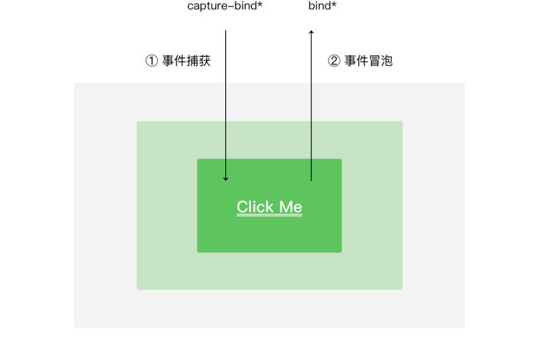

> `bind / catch`

`catch` 在捕获到事件之后会阻止事件继续传递, 而 `bind` 不会

#### 4. target currentTarget

target 触发事件的源组件。

| 属性                                                         | 类型   | 说明                                            |
| :----------------------------------------------------------- | :----- | :---------------------------------------------- |
| id                                                           | String | 事件源组件的id                                  |
| [dataset](https://developers.weixin.qq.com/miniprogram/dev/framework/view/wxml/event.html#dataset) | Object | 事件源组件上由`data-`开头的自定义属性组成的集合 |

currentTarget 事件绑定的当前组件。

| 属性                                                         | 类型   | 说明                                          |
| :----------------------------------------------------------- | :----- | :-------------------------------------------- |
| id                                                           | String | 当前组件的id                                  |
| [dataset](https://developers.weixin.qq.com/miniprogram/dev/framework/view/wxml/event.html#dataset) | Object | 当前组件上由`data-`开头的自定义属性组成的集合 |

#### 5. 动画

动画过程中，可以使用 `bindtransitionend` `bindanimationstart` `bindanimationiteration``bindanimationend` 来监听动画事件。

| 事件名             | 含义                                                         |
| :----------------- | :----------------------------------------------------------- |
| transitionend      | CSS 渐变结束或 [wx.createAnimation](https://developers.weixin.qq.com/miniprogram/dev/api/ui/animation/wx.createAnimation.html) 结束一个阶段 |
| animationstart     | CSS 动画开始                                                 |
| animationiteration | CSS 动画结束一个阶段                                         |
| animationend       | CSS 动画结束                                                 |

注意：这几个事件都不是冒泡事件，需要绑定在真正发生了动画的节点上才会生效。

同时，还可以使用 [wx.createAnimation](https://developers.weixin.qq.com/miniprogram/dev/api/ui/animation/wx.createAnimation.html) 接口来动态创建简易的动画效果。（新版小程序基础库中推荐使用下述的关键帧动画接口代替。）


## 6. 组件化开发

小程序在刚刚推出时是不支持组件化的, 也是为人诟病的一个点, 但是从`v1.6.3`开始, 小程序开始支持自定义组件开发, 也让我们更加方便的在程序中使用组件化.

### 1. 组件化的实现

类似于页面，自定义组件由 `json wxml wxss js` 4个文件组成

> 自定义组件的步骤

1. 首先需要在 `json` 文件中进行自定义组件声明（将`component` 字段设 为 `true` 可将这一组文件设为自定义组件）： 

```json
{
  "component": true
}
```

2. 在`wxml`中编写属于我们组件自己的模板 

```html
<!--x-show.wxml-->
<view>
    <view class="x-show-header">这是模板的标题</view>
    <view>这是模板的内容</view>
    <view>这是模板的底部</view>
</view>
```

3. 在`wxss`中编写属于我们组件自己的相关样式 

```css
/*x-show.wxss*/
.x-show-header {
    color: red;
    font-weight: bolder;
}
```

4. 在`js`文件中, 可以定义数据或组件内部的相关逻辑

   - 在自定义组件的 `js` 文件中，需要使用 `Component()` 来注册组件，并提供组件的属性定义、内部数据和自定义方法。

   - 组件的属性值和内部数据将被用于组件 `wxml` 的渲染，其中，属性值是可由组件外部传入的

```js
Component({
  properties: {
    // 这里定义了 innerText 属性，属性值可以在组件使用时指定
    innerText: {
      type: String,
      value: 'default value',
    }
  },
  data: {
    // 这里是一些组件内部数据
    someData: {}
  },
  methods: {
    // 这里是一个自定义方法
    customMethod: function(){}
  }
})
```

> 需要注意的细节

自定义组件也是可以引用自定义组件的，引用方法类似于页面引用自定义组件的方式（使用`usingComponents` 字段）

自定义组件和页面所在项目根目录名 不能以“`wx-`”为前缀，否则会报错。

如果在`app.json`的`usingComponents`声明某个组件，那么所有页面和组件可以直接使用该组件。

注意：在组件 wxss 中不应使用 ID 选择器、属性选择器和标签名选择器。

> 组件的使用

```json
{
  "usingComponents": {
    "x-show": "/components/x-show/x-show"
  }
}
```

现在需要使用的页面注册， 然后就可以直接使用了

```html
<x-show></x-show>
```

### 2. 组件的细节样式

> 组件之间的样式影响

组件内的`class`样式，只对组件`wxml`内的节点生效, 对于引用组件的`Page`页面不生效。

组件内不能使用`id选择器、属性选择器、标签选择器`， 会对外造成影响

外部使用`class`的样式，只对外部`wxml`的`class`生效，对组件内是不生效的

外部使用了`id选择器、属性选择器`不会对组件内产生影响

外部使用了`标签选择器`，会对组件内产生影响

> 如何`class`可以相互影响

在`Component`对象中，可以传入一个`options`属性，其中`options` 属性中有一个 `styleIsolation`属性。

```js
Component({
    options: {
        styleIsolation: 'isolated'
    }
});
```

`styleIsolation`有三个取值： 

- `isolated` 表示启用样式隔离，在自定义组件内外，使用 `class` 指定的样式将不会相互影响 

- `apply-shared` 表示页面 `wxss` 样式将影响到自定义组件，但自定义组件 `wxss` 中指定的样式不会影响页面

- `shared` 表示页面 `wxss` 样式将影响到自定义组件，自定义组件` wxss` 中指定的样式也会影响页面和其他设置 了

### 3. 组件通信

很多情况下，组件内展示的内容（数据、样式、标签），并不是在组件内写死的，而且可以由使用者来决定。

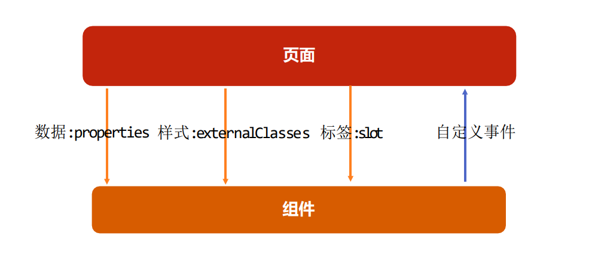

> `properties`

大部分情况下，组件只负责布局和样式，内容是由使用组件的对象决定的, 所以，我们经常需要从外部传递数据给我们的组件，让我们的组件来进行展示

```js
Component({
    properties: {
        title: {
            type: String,
            value: '标题'
        },
        content: {
            type: String,
            value: '内容'
        }
    },
    data: {},
    methods: {}
});
```

动态获取传递给组件的值

```html
<!--x-show.wxml-->
<view>
    <view>这是模板的标题 {{title}}</view>
    <view>这是模板的内容</view>
    <view>这是模板的底部</view>
</view>
```

使用组件

```html
<x-show title="awaw"></x-show>
```

> `externalClasses`

有时候，我们不希望将样式在组件内固定不变，而是外部可以决定样式

在`Component`对象中，定义`externalClasses`属性 

```js
Component({
    externalClasses: ['x-title-class'],
});
```

在组件内的`wxml`中使用`externalClasses`属性中的`class `

```html
<!--x-show.wxml-->
<view>
    <view class="x-show-header x-title-class">这是模板的标题</view>
    <view>这是模板的内容</view>
    <view>这是模板的底部</view>
</view>
```

在页面中传入对应的`class`，并且给这个`class`设置样式

```html
<x-show x-title-class="info">export https_proxy=http://127.0.0.1:33210</x-show>
```

> `自定义事件`

有时候是自定义组件内部发生了事件，需要告知使用者，这个时候可以使用自定义事件

```html
<!--x-show.wxml-->
<view>
    <view>这是模板的标题 {{title}}</view>
    <view bind:tap="onContentTap">这是模板的内容</view>
    <view>这是模板的底部</view>
</view>
```

组件内部 `this.triggerEvent` 传递事件

```js
Component({
    methods: {
        onContentTap() {
            this.triggerEvent('onContentTap', {
                clicked: 'content'
            })
        }
    }
});
```

接受方法

```html
<x-show bind:onContentTap="onContentTap"></x-show>
```

获取传递的值 `e.detail.clicked`

```js
// pages/components/components.js
Page({
    onContentTap(e) {
        console.log(e.detail.clicked)
    }
})
```

### 4. 组件插槽

在不确定外界想插入什么其他组件的前提下，我们可以在组件内预留插槽

默认情况下，一个组件的 wxml 中只能有一个 slot

> 小程序中， 插槽不能设置默认值

```html
<view class="my-slot">
  <view class="content">
     <slot></slot>
  </view>
  <view class="default">组件插槽默认值</view>
</view>
```


```css
.my-slot {
  background: #000;
  color: #fff;
}

.default {
  display: none;
}

.content:empty + .default {
  display: block;
}
```


```html
<my-slot>
  	<!-- 这部分内容将被放置在组件 <slot> 的位置上 -->
    <button>123</button>
</my-slot>
```

> 单个插槽的使用

使用 `slot` 占位

```html
<!--x-show.wxml-->
<view>
    <view>这是模板的标题</view>
    <slot></slot>
    <view>这是模板的底部</view>
</view>
```

组件中使用插槽

```html
<x-show>
    <view>
        <text>content</text>
        <view>content end</view>
    </view>
</x-show>
```

> 多个插槽的使用

有时候为了让组件更加灵活, 我们需要定义多个插槽, 需要使用多 slot 时，可以在组件 js 中声明启用。

```js
Component({
    options: {
        multipleSlots: true
    }
});
```

模板给插槽设置 `name` 

```html
<!--x-show.wxml-->
<view>
    <view>这是模板的标题</view>
    <slot name="first"></slot>
    <slot name="second"></slot>
    <slot name="third"></slot>
    <view>这是模板的底部</view>
</view>
```

给插槽使用 `slot`

```html
<x-show>
    <view slot="first">
        <view>content title</view>
    </view>
    <view slot="second">
        <text>content</text>
    </view>
    <view slot="third">
        <text>content end</text>
    </view>
</x-show>
```

### 5. 外面调用组件的方法

通过选择器获取组件实例， `selectComponen` 方法可以使在当前页面获取组建的实例， 从而调用组件的方法修改组件数据

```js
Page({
    onTabControl() {
        const component = this.selectComponent('#tab-control');
        // 调用组件实例的方法
        component.setD0ata({
            
        })
    }
}) 
```

### 6. behavior

页面可以引用 behaviors 。 behaviors 可以用来让多个页面有相同的数据字段和方法。具有混入， 将相同的 `js` 代码抽离的功能

```js
export const counterBehavior = Behavior({
  data: {
    counter: 0
  },
  methods: {
    increment() {
      this.setData({
        counter: this.data.counter + 1
      })
    }
  }
})
```


```js
import { counterBehavior } from "../../behavior/counter"
Component({
  behaviors: [counterBehavior]
})
```


```html
<view class="my-slot">
  <view>{{ counter }}</view>
  <button bind:tap="increment">incre</button>
</view>
```

### 7. 组件的生命周期

```js
Component({
  lifetimes: {
    created() {
			// 组件创建
    },
    attached() {
			// 添加到组件树中
    },
    ready() {
			// 组件渲染布局完成后
    },
    moved() {

    },
    detached() {
			// 组件树中移除
    },
    error(err) {
      
    }
  }
})
```

## 7. API

### 1. 网络请求

每个微信小程序需要事先设置通讯域名，小程序**只可以跟指定的域名进行网络通信**。包括普通 HTTPS 请求（[wx.request](https://developers.weixin.qq.com/miniprogram/dev/api/network/request/wx.request.html)）、上传文件（[wx.uploadFile](https://developers.weixin.qq.com/miniprogram/dev/api/network/upload/wx.uploadFile.html)）、下载文件（[wx.downloadFile](https://developers.weixin.qq.com/miniprogram/dev/api/network/download/wx.downloadFile.html)) 和 WebSocket 通信（[wx.connectSocket](https://developers.weixin.qq.com/miniprogram/dev/api/network/websocket/wx.connectSocket.html)）。

如使用[微信云托管](https://cloud.weixin.qq.com/cloudrun?utm_source=wxdoc&utm_content=network)作为后端服务，则可无需配置通讯域名（在小程序内通过[callContainer](https://developers.weixin.qq.com/miniprogram/dev/wxcloudrun/src/development/call/mini.html)和[connectContainer](https://developers.weixin.qq.com/miniprogram/dev/wxcloudrun/src/development/websocket/miniprogram.html)通过微信私有协议向云托管服务发起 HTTPS 调用和 WebSocket 通信）。

> `wx.request(Object object)`

| `url`        | string                    |      | 是   | 开发者服务器接口地址                                         |
| ------------ | ------------------------- | ---- | ---- | ------------------------------------------------------------ |
| `data`       | string/object/ArrayBuffer |      | 否   | 请求的参数                                                   |
| header       | Object                    |      | 否   | 设置请求的 header，header 中不能设置 Referer。 `content-type` 默认为 `application/json` |
| timeout      | number                    |      | 否   | 超时时间，单位为毫秒。默认值为 60000                         |
| method       | string                    | GET  | 否   | HTTP 请求方法                                                |
| dataType     |                           |      |      |                                                              |
| responseType |                           |      |      |                                                              |
| success      |                           |      |      | 成功回调                                                     |
| fail         |                           |      |      | 失败回调                                                     |

```js
Page({
  onLoad() {
    wx.request({
        url: 'https://www.easy-mock.com/mock/5c1dfd98e8bfa547414a5278/baixing/dabaojian',
        data: {},
        header: {
            'content-type': 'application/json' // 默认值
        },
      	success(res) {
        	console.log(res.data)
      	}
    })
  }
})
```

> 但是提前配置域名， 限定指定的域名进行网络通信

开发时可以使用

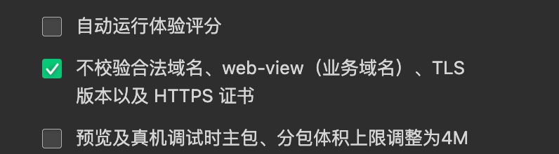

上线需要使用， 小程序登陆后台 - 开发管理 - 开发设置 - 服务器域名

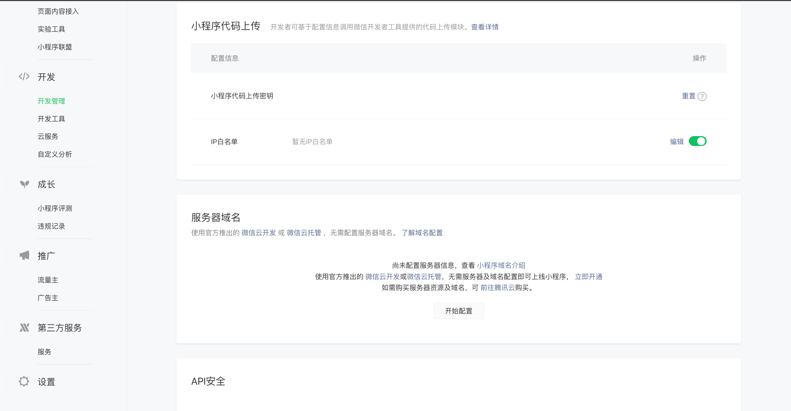

> 网络请求封装

`promise`

```js
module.exports = function request(options) {
  return new Promise((resolve, reject) => {
    wx.request({
      ...options,
      success: (res) => {
        resolve(res)
      },
      fail: reject
    })
  })
}
```

`class`

```js
class Request {
  constructor() {
    this.baseURL = 'http://ximingx.com:3000'
  }

  get(url, data) {
    return new Promise((resolve, reject) => {
      wx.request({
        method: 'get',
        url: this.baseURL + url,
        data: data,
        success: (res) => {
          resolve(res.data)
        },
        fail: (err) => {
          reject(err)
        }
      })
    })
  }

  post(url, data) {
    return new Promise((resolve, reject) => {
      wx.request({
        url: this.baseURL + url,
        method: 'post',
        data,
        success: (res) => {
          resolve(res.data)
        },
        fail: (err) => {
          reject(err)
        }
      })
    })
  }

  put(url, data) {
    return new Promise((resolve, reject) => {
      wx.request({
        url: this.baseURL + url,
        method: 'put',
        data,
        success: (res) => {
          resolve(res.data)
        },
        fail: (err) => {
          reject(err)
        }
      })
    })
  }

  delete(url, data) {
    return new Promise((resolve, reject) => {
      wx.request({
        url: this.baseURL + url,
        method: 'delete',
        data,
        success: (res) => {
          resolve(res.data)
        },
        fail: (err) => {
          reject(err)
        }
      })
    })
  }

  // 上传文件
  uploadFile(url, filePath, name, formData) {
    return new Promise((resolve, reject) => {
      wx.uploadFile({
        url: this.baseURL + url,
        filePath,
        name,
        formData,
        success: (res) => {
          resolve(res.data)
        },
        fail: (err) => {
          reject(err)
        }
      })
    })
  }

  // 下载文件
  downloadFile(url) {
    return new Promise((resolve, reject) => {
      wx.downloadFile({
        url: this.baseURL + url,
        success: (res) => {
          resolve(res.tempFilePath)
        },
        fail: (err) => {
          reject(err)
        }
      })
    })
  }
}

export default new Request()

// 使用
import Request from '../../services/index.js'
```

> DNS预解析域名

小程序一般会依赖一些网络请求（如逻辑层的wx.request、渲染层的图片等网络资源），优化请求速度将会提升用户体验，而网络请求耗时中就包括 DNS 解析。DNS预解析域名，是框架提供的一种在小程序**启动时**，提前解析业务域名的技术。

DNS域名配置请求「小程序后台 - 开发 - 开发设置 - 服务器域名」 中进行配置，配置时需要注意：

- 预解析域名无需填写协议头
- 预解析域名最多可添加 5 个
- 其他安全策略同服务器域名配置策略

### 2. 网页弹窗

```html
<button bind:tap="onShowToast">0 0 0</button>
<button bind:tap="onShowModel">0 0 0</button>
<button bind:tap="onShowAction">0 0 0</button>
<button bind:tap="onShowLoading">0 0 0</button>
```

> 一般用于网络请求加载过程中

```js
Page({
  onShowToast() {
    wx.showToast({
        title: '成功',
        icon: 'success',
        duration: 2000
    })
  },
  
  onShowModel() {
    wx.showModal({
        title: '提示',
        content: '这是一个模态弹窗',
        success (res) {
            if (res.confirm) {
                console.log('用户点击确定')
            } else if (res.cancel) {
                console.log('用户点击取消')
            }
        }
    })
  },
  
  onShowAction() {
    wx.showActionSheet({
        itemList: ['A', 'B', 'C'],
        success (res) {
            console.log(res.tapIndex)
        },
        fail (res) {
            console.log(res.errMsg)
        }
    })
  },
  
  onShowLoading() {
    wx.showLoading({
      title: 'title'
    })
    setTimeout(function () {
        // 结束加载图标
        wx.hideLoading()
    },1000)
  }
})
```

### 3. 设备信息位置信息

```js
// 获取用户手机基本信息
wx.getSystemInfo({
    success: function (res) {
        console.log(res);
    }
})

// 获取用户位置信息
wx.getLocation({
    success: function (res) 
        console.log(res);
    }
})
```

但是需要获取权限 `app.json`

```json
{
  "permission": {
    "scope.userLocation": {
      "desc": "你的位置信息将用于小程序位置接口的效果展示"
    }
  },
}
```

### 4. 小程序存储

```js
	  // 同步方法
		wx.setStorageSync('key', 'c3n7cf3802bvq2b7vqb')
		wx.getStorageSync('key')
		wx.removeStorageSync('key')
		wx.clearStorageSync()

    // 异步方法
    wx.setStorage({
      key: "books",
      data: [1, 2, 3],
      // 是否加密
      encrypt: true,
      success(res) {
        console.log(res)
      }
    })
```

### 5. 页面跳转


对于路由的触发方式以及页面生命周期函数如下：

| 路由方式   | 触发时机                                                     | 路由前页面 | 路由后页面         |
| :--------- | :----------------------------------------------------------- | :--------- | :----------------- |
| 初始化     | 小程序打开的第一个页面                                       |            | onLoad, onShow     |
| 打开新页面 | 调用 API [wx.navigateTo](https://developers.weixin.qq.com/miniprogram/dev/api/route/wx.navigateTo.html)  使用组件 [`<navigator open-type="navigateTo"/>`](https://developers.weixin.qq.com/miniprogram/dev/component/navigator.html) | onHide     | onLoad, onShow     |
| 页面重定向 | 调用 API [wx.redirectTo](https://developers.weixin.qq.com/miniprogram/dev/api/route/wx.redirectTo.html)  使用组件 [`<navigator open-type="redirectTo"/>`](https://developers.weixin.qq.com/miniprogram/dev/component/navigator.html) | onUnload   | onLoad, onShow     |
| 页面返回   | 调用 API [wx.navigateBack](https://developers.weixin.qq.com/miniprogram/dev/api/route/wx.navigateBack.html)  使用组件[`<navigator open-type="navigateBack"/>`](https://developers.weixin.qq.com/miniprogram/dev/component/navigator.html) 用户按左上角返回按钮 | onUnload   | onShow             |
| Tab 切换   | 调用 API [wx.switchTab](https://developers.weixin.qq.com/miniprogram/dev/api/route/wx.switchTab.html)  使用组件 [`<navigator open-type="switchTab"/>`](https://developers.weixin.qq.com/miniprogram/dev/component/navigator.html)  用户切换 Tab |            | 各种情况请参考下表 |
| 重启动     | 调用 API [wx.reLaunch](https://developers.weixin.qq.com/miniprogram/dev/api/route/wx.reLaunch.html)  使用组件 [`<navigator open-type="reLaunch"/>`](https://developers.weixin.qq.com/miniprogram/dev/component/navigator.html) | onUnload   | onLoad, onShow     |

- `navigateTo`, `redirectTo` 只能打开非 `tabBar` 页面。
- `switchTab` 只能打开 `tabBar` 页面。
- `reLaunch` 可以打开任意页面。
- 页面底部的 `tabBar` 由页面决定，即只要是定义为 `tabBar` 的页面，底部都有 `tabBar`。
- 调用页面路由带的参数可以在目标页面的`onLoad`中获取。

```js
    wx.navigateTo({
      // 需要先添加 / 表示根目录
      // 携带参数需要直接在后面拼接
      url: '/pages/order/order?name=ximingx&id=20201613118'
    })


		// 在新页面， 获取传递的参数		
		onLoad(options) {
      console.log(options.name, options.id)
    }
```

> 页面跳转后修改其他页面的数据

```js
// 方式一
// 获取跳转以后， 栈中所有的页面
const pages = getCurrentPages()
const prePage = pages[pages.length - 2 ]
prePage.setData({
  
})
```


```js
// 方式二
// 在新页面中触发 emit 事件
const eventChannel = this.getOpenerEventChannel()
eventChannel.emit("backEvent", {
  name: "ximingx"
})

// 跳转之前先定义返回数据的方法
wx.navigateTo({
      url: '/page/page1/page1',
      events: {
        backEvent(data) {
          this.setData({
            data: data 
          })
        }
      }
    })
```

### 6. 分享小程序

```js
onShareAppMessage(options) {
  return {
      title: '自定义转发标题',
      path: '/pages/index/index',
      imageUrl: 'https://img.yzcdn.cn/vant/cat.jpeg'
  }
}
```

### 7. 登录流程


```js
// app.js
App({
  onLaunch(options) {
    // 判断是否有登录记录
    const token = wx.getStorageSync('token')
    if (!token) {
      // 调用微信登录接口
      wx.login({
        success(res) {
          // 获取微信 code
          const code = res.code
          // 想自己的服务器发送请求
          wx.request({
            url: 'https://example.com/onLogin',
            data: {
              code: codex
            },
            success(data) {
              // 获取 token， 并保存
              const token = res.data.token
              wx.setStorageSync('token', token)
            }
          })
        }
      }) 
    }
  }
})
```

> 保存 `token` 的目的在于可以使多端登陆同步， 但是也需要在小程序端进行手机号的绑定

### 8. 监听页面滚动到底部

> `index.js`

```js
Page({
  onReachBottom() {
    console.log("onRechBottm");
  }
})
```

> `index.json`

```json
{
  "usingComponents": {},
  // 可以不设置， 代表滚动到距离页面底部的触发距离
  "onReachBottomDistance": 0
}
```

### 9. 下拉刷新

> `index.json`

```json
{
  "usingComponents": {},
  // 开启下拉刷新
  "enablePullDownRefresh": true
}
```

> `index.js`

```js
Page({
  // 通过自带方法监听下拉刷新
  onPullDownRefresh() {
    console.log("onPullDownRefresh");
  }
})
```

### 10. 音乐播放

[wx.createAudioContext](https://developers.weixin.qq.com/miniprogram/dev/api/media/audio/wx.createAudioContext.html)

[AudioContext](https://developers.weixin.qq.com/miniprogram/dev/api/media/audio/AudioContext.html)

[AudioContext](https://developers.weixin.qq.com/miniprogram/dev/api/media/audio/AudioContext.html) 实例，可通过 [wx.createAudioContext](https://developers.weixin.qq.com/miniprogram/dev/api/media/audio/wx.createAudioContext.html) 获取, 通过 `id` 跟一个 [audio](https://developers.weixin.qq.com/miniprogram/dev/component/audio.html) 组件绑定，操作对应的 [audio](https://developers.weixin.qq.com/miniprogram/dev/component/audio.html) 组件。

[wx.createInnerAudioContext](https://developers.weixin.qq.com/miniprogram/dev/api/media/audio/wx.createInnerAudioContext.html)

* src属性
* autoplay

```js
audioContext = wx.createInnerAudioContext()
```


### 11. 获取用户信息

需要使用 `wx.getUserProfile` 来获得用户的信息 

```js
getUserInfo() {
  wx.getUserProfile({
      "desc": "用于完善会员资料",
      "success": (res) => {
          console.log(res);
      }
  })
}
```


## 8. 云开发

微信云开发是微信团队联合腾讯云推出的专业的小程序开发服务, 开发者无需搭建服务器，可免鉴权直接使用平台提供的 API 进行业务开发。


> 云开发和传统的开发模式的区别

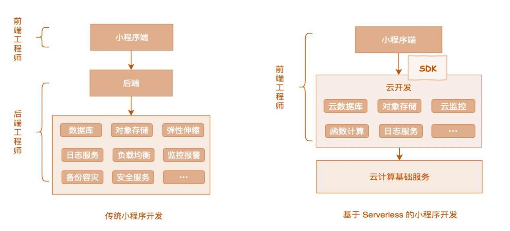

云开发:

- 一种新的开发模式 使得开发者更加专注于业务逻辑

- 个人的项目 不想开发服务器 使用云开发 个人的毕业设计

和传统的开发模式有什么区别

- 开发模式
  - 云开发包含云数据库 云存储 云函数 
  - 传统开发模式 包含数据库 对象存储 弹性伸缩 负载均衡 日志服务 安全服务...
- 项目流程 
  - 传统开发 需要进行部署 前后端接口对接 测试 上线 
  - 云开发 只需要进行设计 开发 测试

> 使用云开发需要的基础配置

进行目录结构的配置 在 app.json中 默认已经完成

```js
// app.js
App({
  onLaunch: function () {
    if (!wx.cloud) {
      console.error('请使用 2.2.3 或以上的基础库以使用云能力');
    } else {
      // 使用 wx.cloud.init方法完成云能力初始化
      wx.cloud.init({
        // env 参数决定接下来小程序发起的云开发调用（wx.cloud.xxx）会默认请求到哪个云环境的资源
        // 参数的值为环境 id
        env: "yun-0gbo8j050d5f62c0",
        // 是否跟踪用户, 是否将用户访问记录到用户管理中
        traceUser: true
      });
    }
  }
});
```

一个环境对应一整套独立的云开发资源，包括数据库、存储空间、云函数等资源


### 1. 数据库

云开发提供了一个 JSON 数据库，顾名思义，数据库中的每条记录都是一个 `JSON 格式的对象`。一个数据库可以有多个集合（相当于关系型数据中的表），集合可看做一个 JSON 数组，数组中的每个对象就是一条记录，记录的格式是 JSON 对象。

每条记录都有一个 `_id` 字段用以唯一标志一条记录、一个 `_openid` 字段用以标志记录的创建者，即小程序的用户。

需要特别注意的是，在管理端（控制台和云函数）中创建的不会有 `_openid` 字段，因为这是属于管理员创建的记录。开发者可以自定义 `_id`，但不可自定义和修改 `_openid` 。`_openid` 是在文档创建时由系统根据小程序用户默认创建的，开发者可使用其来标识和定位文档。

| 关系型          | 文档型            |
| :-------------- | :---------------- |
| 数据库 database | 数据库 database   |
| 表 table        | 集合 collection   |
| 行 row          | 记录 record / doc |
| 列 column       | 字段 field        |

```js
// 获取云数据库
const db = wx.cloud.database()
// 获取 student 集合
const stuCollection = db.collection('student')
// 获取查询指令
// 传统的查询语句就无法满足了 数据库就提供了多种查询指令 在 db.command对象上
const cmd = db.command
Page({
  
  // 添加操作
  onAddDataBind() {
    stuCollection.add({
      data: {
        name: 'ximingx',
        age: 18
      },
      success: res => {
        console.log(res)
      }
    })
  },

  // 删除操作
  onRemoveDataBind() {
    // 1. 删除特定 docid 的数据
    stuCollection.doc('e175419b6358fe6c00326a8f5eee36f7').remove()
    // 2. 条件查询需要使用查询指令
    stuCollection.where({
      age: cmd.gt(1)
    }).remove()
  },

  // 查询操作
  onQueryDataBind() {
    // 1. docid
    stuCollection.doc('e175419b6358fe6c00326a8f5eee36f7').get().then(res => {
      console.log(res)
    })

    // 2. 条件查询
    // lt gt gte in nin
    stuCollection.where({
      name: 'ximingx'
    }).get().then(res => {
      console.log(res)
    })

    stuCollection.where({
      age: cmd.gt(1)
    }).get().then(res => {
      console.log(res)
    })

    // 3. 指定的全部数据
    stuCollection.get({
      success: res => {
        console.log(res)
      }
    })

    // 4. 正则查询
    stuCollection.where({
      name: db.RegExp({
        regexp: 'x',
        options: 'i'
      })
    })

    // 5. 分页过滤查询字段排序
    stuCollection.field({
      name: true
    }).skip(0).limit(10).orderBy("rid", "asc").get({
      success: res => {
        console.log(res)
      }
    })
  },
  
  // 修改操作
  onUpdateDataBind() {
    stuCollection.doc('e175419b6358fe6c00326a8f5eee36f7').update({
      data: {
        age: 20
      }
    })
    stuCollection.where({
      age: cmd.lt(18)
    }).update({
      data: {
        age: 20
      }  
    })
  },
  
  // 覆盖数据
  onSetDataBind() {
    stuCollection.doc('e175419b6358fe6c00326a8f5eee36f7').set({
      data: {
        age: 20
      }
    }) 
  }
  
})
```

### 2.云存储


```js
Page({
  // 上传
  async onUploadTap() {
    const MediaResource = await wx.chooseMedia({
      mediaType: ['image', 'video'],
      sourceType: ['album', 'camera'],
    })
    const fileSource = MediaResource.tempFiles[0].tempFilePath
    const time = new Date().getTime()
    const openid = "openid"
    const extension = fileSource.split('.').pop()
    const name = `${time}_${openid}.${extension}`
        wx.cloud.uploadFile({
      filePath: fileSource,
      cloudPath: name,
      success: res => {
        console.log('上传成功', res)
      }
    })
  },
  // 下载
  async onDownloadTap() {
    const res = await wx.cloud.downloadFile({
      fileID: 'cloud://yun-0gbo8j050d5f62c0.7975-yun-0gbo8j050d5f62c0-1304854446/abc.png',
    })
  },
  // 删除
  onDeleteTap() {
    wx.cloud.deleteFile({
      fileList: [
          "cloud://yun-0gbo8j050d5f62c0.7975-yun-0gbo8j050d5f62c0-1304854446/abc.png"
      ]
    })
  },
  // 获取临时文件
  async onFileTap() {
    const res = await wx.cloud.getTempFileURL({
      fileList: [
          "cloud://yun-0gbo8j050d5f62c0.7975-yun-0gbo8j050d5f62c0-1304854446/abc.png"
      ]
    })
  }
})
```

### 3. 云函数

- 云函数即在云端（服务器端）运行的函数
  - 在物理设计上，一个云函数可由多个文件组成，占用一定量的 CPU 内存等计算资源
  - 各云函数完全独立
  - 可分别部署在不同的地区
  - 开发者无需购买、搭建服务器，只需编写函数代码并部署到云端即可在小程序端调用
  - 同时云函数之间也可互相调用
- 一个云函数的写法与一个在本地定义的 JavaScript 方法无异，代码运行在云端 Node.js 中
  - 当云函数被小程序端调用时，定义的代码会被放在 Node.js 运行环境中执行
  - 我们可以如在 Node.js 环境中使用 JavaScript 一样在云函数中进行网络请求等操作
  - 而且我们还可以通过云函数后端 SDK 搭配使用多种服务
  - 比如使用云函数 SDK 中提供的数据库和存储 API 进行数据库和存储的操作
- 云开发的云函数的独特优势在于与微信登录鉴权的无缝整合
  - 当小程序端调用云函数时，云函数的传入参数中会被注入小程序端用户的 openid
  - 开发者无需校验 openid 的正确性因为微信已经完成了这部分鉴权，开发者可以直接使用该 openid


```js
// 云函数入口文件
const cloud = require('wx-server-sdk')

cloud.init({ env: cloud.DYNAMIC_CURRENT_ENV }) // 使用当前云环境

// 云函数入口函数
exports.main = async (event, context) => {
  const wxContext = cloud.getWXContext()
  const {num1, num2} = event
	res = num1+ num2
  return {
    res,
    // 获取openid
    openid: wxContext.OPENID,
    appid: wxContext.APPID,
    unionid: wxContext.UNIONID,
  }
}
```


```JS
// num 云函数
// 云函数入口文件
const cloud = require('wx-server-sdk')

cloud.init() // 使用当前云环境

// 云函数入口函数
exports.main = async (event, context) => {
  const {num1, num2} = event
  return num1 + num2
}
```


```js
Page({
  onTest() {
    wx.cloud.callFunction({
      // 云函数名称
      name: 'num',
      // 传递参数
      data: {
        num1: 1,
        num2: 2
      },
      success: function (res) {
        console.log(res)
      }
    })
  }
})
```

> 获取小程序码

```js
const cloud = require('wx-server-sdk')
cloud.init()
exports.main = async () => {
  const result1 = await cloud.openapi.wxacode.createQRCode({
    path: "page/01database/database",
    with: 430
  })

  const extensionName = result1.contentType.split("/").pop()
  const result = await cloud.uploadFile({
    cloudPath: "image/minicode." + extensionName,
    fileContent: result1.buffer
  })

  return result
}
```


```json
{
  "permissions": {
    "openapi": [
      "wxacode.createQRCode"
    ]
  }
}
```


```js
async onGetQRCode() {
  const res = await wx.cloud.callFunction({
    name: "getQRCode"
  })
  this.setData({ src: res.result.fileID })
}
```

## 9. 打包部署

### 1. 分包

[使用分包](https://developers.weixin.qq.com/miniprogram/dev/framework/subpackages/basic.html)

#### 1. 项目目录

```text
├── app.js
├── app.json
├── app.wxss
├── packageA
│   └── pages
│       ├── cat
│       └── dog
├── packageB
│   └── pages
│       ├── apple
│       └── banana
├── pages
│   ├── index
│   └── logs
└── utils
```

#### 2. JSON 配置分包

```json
{
  "pages":[
    "pages/index",
    "pages/logs"
  ],
  "subpackages": [
    {
      "root": "packageA",
      "pages": [
        "pages/cat",
        "pages/dog"
      ]
    }, {
      "root": "packageB",
      "name": "pack2",
      "pages": [
        "pages/apple",
        "pages/banana"
      ]
    }
  ]
}
```

| 字段        | 类型        | 说明                                                         |
| :---------- | :---------- | :----------------------------------------------------------- |
| root        | String      | 分包根目录                                                   |
| name        | String      | 分包别名，[分包预下载](https://developers.weixin.qq.com/miniprogram/dev/framework/subpackages/preload.html)时可以使用 |
| pages       | StringArray | 分包页面路径，相对于分包根目录                               |
| independent | Boolean     | 分包是否是[独立分包](https://developers.weixin.qq.com/miniprogram/dev/framework/subpackages/independent.html) |

- 声明 `subpackages` 后，将按 `subpackages` 配置路径进行打包，`subpackages` 配置路径外的目录将被打包到主包中
- `tabBar` 页面必须在主包内


### 2. 组件库引入

> 删除无依赖文件

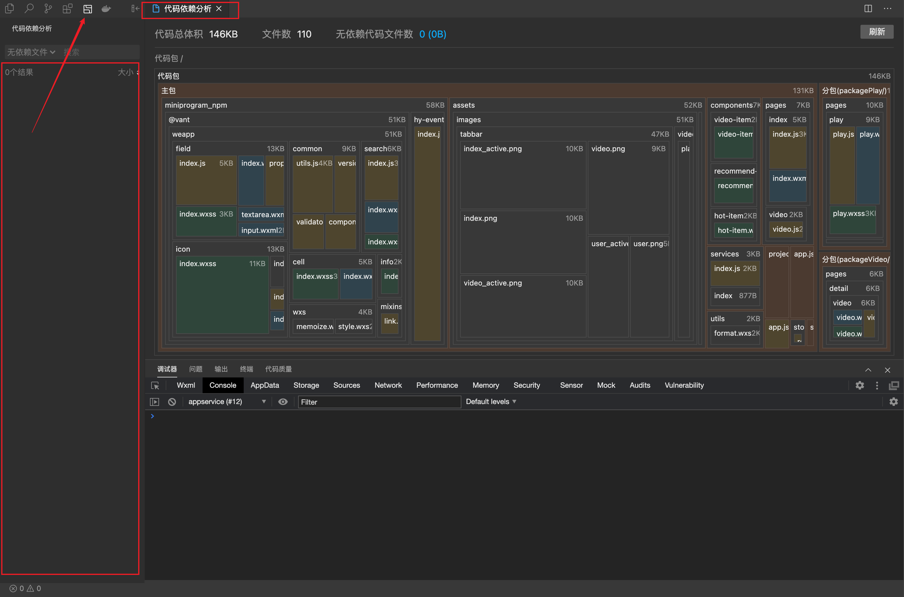

### 3. 项目成员


### 4. 发布上线

一个小程序从开发完到上线一般要经过 预览-> 上传代码 -> 提交审核 -> 发布等步骤

#### 1. 上传代码

同预览不同，上传代码是用于提交体验或者审核使用的。

点击开发者工具顶部操作栏的上传按钮，填写版本号以及项目备注，需要注意的是，这里版本号以及项目备注是为了方便管理员检查版本使用的，开发者可以根据自己的实际要求来填写这两个字段。

上传成功之后，登录[小程序管理后台](https://mp.weixin.qq.com/) - 版本管理 - 开发版本 就可以找到刚提交上传的版本了。

可以将这个版本设置 体验版 或者是 提交审核

#### 2. 提交审核

为了保证小程序的质量，以及符合相关的规范，小程序的发布是需要经过审核的。

在开发者工具中上传了小程序代码之后，登录 [小程序管理后台](https://mp.weixin.qq.com/) - 版本管理 - 开发版本 找到提交上传的版本。

在开发版本的列表中，点击 **提交审核** 按照页面提示，填写相关的信息，即可以将小程序提交审核。

需要注意的是，**请开发者严格测试了版本之后，再提交审核**， 过多的审核不通过，可能会影响后续的时间。

#### 3.  发布

审核通过之后，管理员的微信中会收到小程序通过审核的通知，此时登录 [小程序管理后台](https://mp.weixin.qq.com/) - 开发管理 - 审核版本中可以看到通过审核的版本。

点击发布后，即可发布小程序。小程序提供了两种发布模式：全量发布和分阶段发布。全量发布是指当点击发布之后，所有用户访问小程序时都会使用当前最新的发布版本。分阶段发布是指分不同时间段来控制部分用户使用最新的发布版本，分阶段发布我们也称为灰度发布。一般来说，普通小程序发布时采用全量发布即可，当小程序承载的功能越来越多，使用的用户数越来越多时，采用分阶段发布是一个非常好的控制风险的办法

## @ 网易云音乐项目


